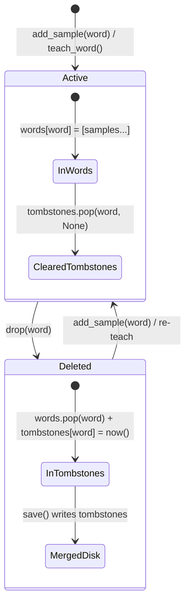

# Data Model: Scalability, Correctness, and CI Hardening

**Feature**: `003-scalability-correctness-hardening`
**Date**: 2026-09-29
**Status**: Completed

## 1. Entities & Data Structures

### 1.1 Bank Data Dictionary (`bank_dict`)
The root dictionary serialized to gzip-compressed JSON (`chu_cua_ban.json.gz`).

| Field | Type | Required | Description | Validation Rule |
|-------|------|----------|-------------|-----------------|
| `schema_version` | `int` | Yes | Format schema version (currently `2`) | `1 <= schema_version <= CURRENT_VERSION` |
| `xh` | `float` | Yes | Corpus x-height baseline in mm/units | Finite float $> 0$ |
| `line` | `float` | Yes | Line spacing | Finite float $> 0$ |
| `width` | `float` | Yes | Canvas width reference | Finite float $> 0$ |
| `x0` | `float` | Yes | Left margin reference | Finite float $\ge 0$ |
| `wgaps` | `list[float]` | Yes | Word gap distribution | Non-empty list of finite floats $> 0$ |
| `dgaps` | `list[float]` | Yes | Digit gap distribution | Non-empty list of finite floats $> 0$ |
| `ratio` | `float` | Yes | Handwriting width/height aspect ratio | Finite float $> 0$ |
| `v` | `int` | Yes | Variant identifier | Integer |
| `pen` | `dict` | Yes | Pen configuration | See Section 1.3 |
| `words` | `dict[str, list[Sample]]` | Yes | Word glyph collection | Map of word string to list of valid samples |
| `digits` | `dict[str, list[Sample]]` | Yes | Digit glyph collection | Map of single digit string to list of samples |
| `punct` | `dict[str, list[Sample]]` | Yes | Punctuation glyph collection | Map of punctuation string to list of samples |
| `tombstones` | `dict[str, float]` | Optional | Deletion records preventing resurrection | Map of word string to UTC timestamp of deletion |

---

### 1.2 Handwriting Sample (`Sample`)
An individual drawing instance of a word, digit, or punctuation mark.

| Field | Type | Required | Description | Invariants & Constraints |
|-------|------|----------|-------------|--------------------------|
| `w` | `float` | Words/Digits: Yes; Punct: Optional | Sample width in bank units | Finite float $> 0$. Optional for `punct` (legacy compatibility where width is dynamic). |
| `s` | `list[Stroke]` | Yes | List of continuous stroke paths | Non-empty list of strokes. Each stroke has $\ge 2$ coords, even count, finite floats. |
| `T` | `str` | Optional | Vietnamese tone diacritic | Empty string `""` or recognized tone diacritic (`\u0300`, `\u0301`, `\u0303`, `\u0309`, `\u0323`) |
| `vi` | `int` | Optional | Index of vowel character carrying the tone mark | Integer $\ge -1$. If $T \ne ""$ and label given, $vi < \text{len}(\text{label})$. |
| `ti` | `int` | Optional | Index of stroke in `s` corresponding to tone mark | Integer $\ge -1$. Strict invariant: $-1 \le ti < \text{len}(s)$. |

---

### 1.3 Pen Settings (`PenConfig`)
Visual appearance and styling for SVG and XOPP generation.

| Field | Type | Required | Description | Invariant & Format |
|-------|------|----------|-------------|--------------------|
| `tool` | `str` | Yes | Tool name (e.g. `"pen"`) | Non-empty string (`len(tool.strip()) > 0`) |
| `color` | `str` | Yes | Pen stroke color in hex | Valid hex color: `^#[0-9a-fA-F]{6}([0-9a-fA-F]{2})?$` |
| `width` | `float \| str` | Yes | Pen stroke line width | Numeric value $> 0$ and finite |
| `capStyle` | `str` | Optional | Stroke cap style (e.g. `"round"`) | String |

---

### 1.4 Internal Index State (`BankIndex`)
In-memory structures maintained by `Bank` to power fast document rendering.

| Property | Type | Lifecycle | Description |
|----------|------|-----------|-------------|
| `tl` | `dict[str, list[tuple[str, dict]]]` | Recomputed / Incremental | Map of stripped-tone root to available sample candidates |
| `_raw_marks` | `dict[str, list[dict]]` | Append / Rebuild | Unfiltered collection of all harvested tone marks. Never drops outliers. |
| `marks` | `dict[str, list[dict]]` | Filtered cache | Query-optimized tone marks (10th-90th percentiles applied to `_raw_marks`). |
| `_tombstones` | `dict[str, float]` | Loaded / Mutated | Active deletion tombstones tracking deleted words and timestamps. |
| `_readded_words` | `set[str]` | Mutated | Words explicitly added in current process session, overriding older disk tombstones. |
| `_last_synced_mtime` | `float` | Set on load/save | File modification time on disk used for concurrency change detection. |
| `_last_synced_size` | `int` | Set on load/save | File size on disk used for concurrency change detection. |

---

## 2. State Transitions & Invariants

### 2.1 Word Lifecycle & Deletion Tombstone State


### 2.2 Incremental Index vs Full Rebuild Invariant
```
For any Bank state with words W:
rebuild(W) => (tl_rebuild, marks_rebuild)
incremental_sequence(W) => (tl_inc, marks_inc)

INVARIANT:
tl_inc == tl_rebuild
marks_inc == marks_rebuild
_raw_marks_inc == _raw_marks_rebuild
```

### 2.3 Concurrency Synchronization Rules
During `Bank.save()` under file lock:
1. If `disk.mtime == _last_synced_mtime` and `disk.size == _last_synced_size`:
   - No external modifications occurred.
   - Skip reading and parsing disk file.
   - Skip merging.
   - Skip re-indexing.
   - Directly persist current in-memory dictionary.
2. If `disk.mtime != _last_synced_mtime` or `disk.size != _last_synced_size`:
   - External modification detected!
   - Load disk dictionary safely.
   - Merge disk into memory respecting tombstones:
     - Merge `tombstones`: union of base and disk tombstones.
     - For words in tombstones: if no samples were added after deletion timestamp, drop word from `words`.
     - For words not in tombstones: union sample lists using `_sample_signature(s, w, T, vi, ti)`.
   - Update in-memory indexes.
   - Persist merged dictionary and update `_last_synced_mtime` and `_last_synced_size`.
