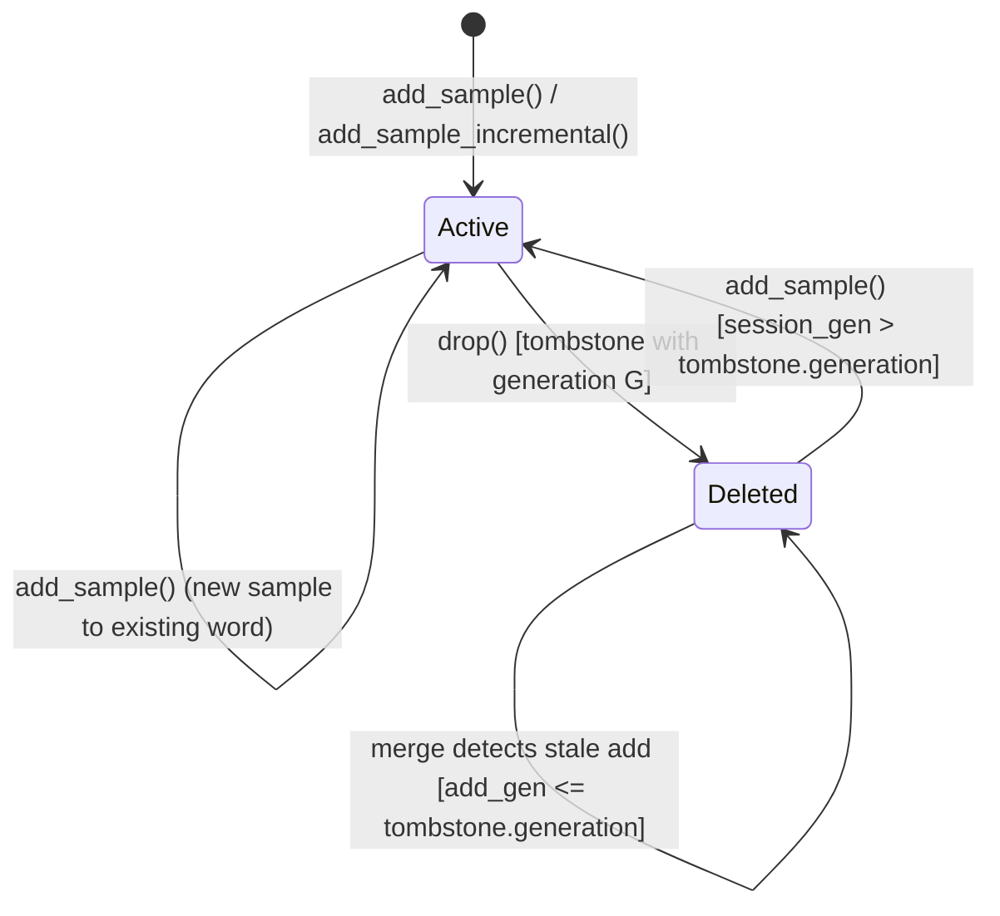
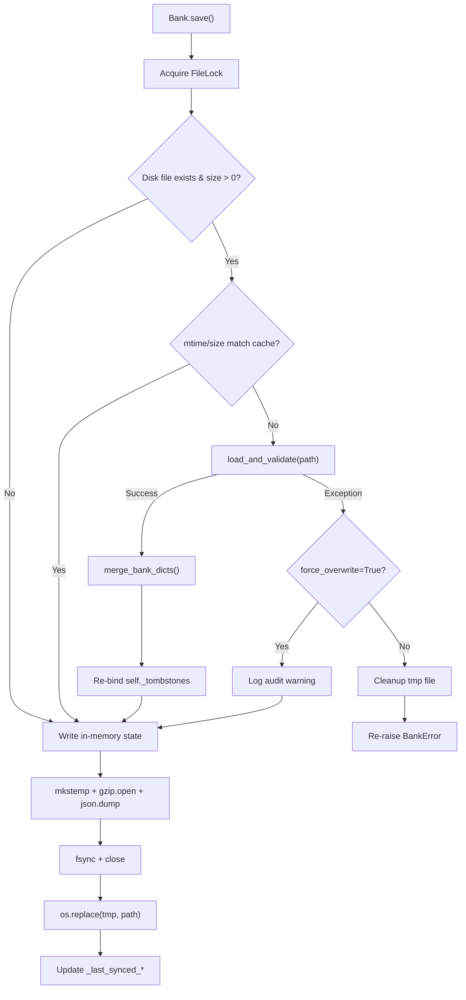
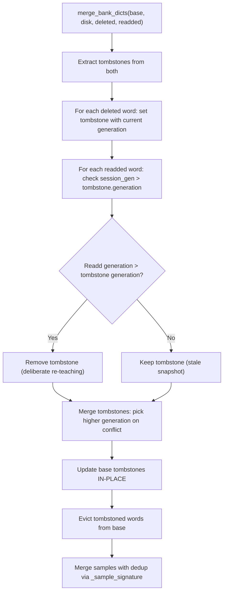
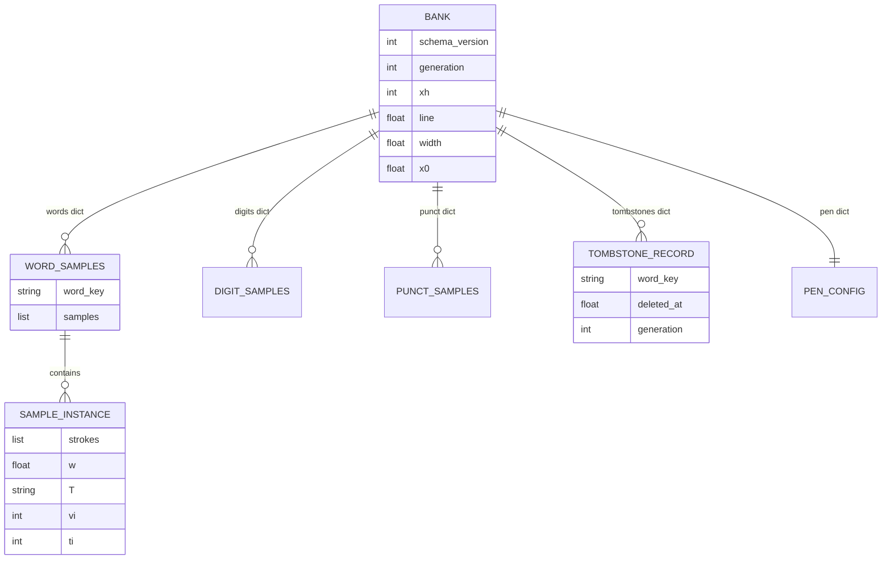

# Data Model: Concurrency Data Integrity, Tombstone Versioning, and Robust Persistence

**Feature**: 004-concurrency-data-integrity | **Date**: 2026-09-29

---

## Entity: Bank (chuviettay/model/bank.py)

The central persistence container for handwriting samples, metrics, and indexes.

### Fields (Existing — Modified)

| Field | Type | Description | Change |
|---|---|---|---|
| `d` | `dict[str, Any]` | Root in-memory dictionary, serialized to gzip JSON | No change |
| `path` | `str` | Filesystem path to `.json.gz` file | No change |
| `words` | `dict[str, list[dict]]` | Word → list of sample instances | No change |
| `tl` | `dict[str, list[tuple]]` | Tone-stripped key → `[(word, inst), ...]` lookup | **Pruned by `drop()`** |
| `marks` | `dict[str, list[dict]]` | Tone `T` → filtered percentile marks | **Refreshed by `drop()`** |
| `_raw_marks` | `dict[str, list[dict]]` | Tone `T` → all harvested marks (unfiltered) | **Pruned by `drop()`; marks gain `_src` field** |
| `_tombstones` | `dict[str, dict]` | Word → structured tombstone record | **Changed from `dict[str, float]` to `dict[str, dict]`** |
| `_deleted_words` | `set[str]` | Words deleted in current session | No change |
| `_readded_words` | `set[str]` | Words re-added after deletion in current session | **Gains generation tracking** |
| `_last_synced_mtime_ns` | `int` | Last known disk file mtime (nanoseconds) | No change |
| `_last_synced_size` | `int` | Last known disk file size (bytes) | No change |

### Fields (New)

| Field | Type | Default | Description |
|---|---|---|---|
| `_generation` | `int` | `0` | Monotonically increasing counter, incremented on each mutation (add/delete). Persisted in `d["generation"]`. |
| `_session_start_gen` | `int` | `0` | Generation value captured at `__init__` time. Used to detect stale snapshots during merge. |
| `_sorted_dy` | `dict[str, list[float]]` | `{}` | Tone `T` → sorted `dy` values for O(1) percentile lookup |
| `_sorted_dx` | `dict[str, list[float]]` | `{}` | Tone `T` → sorted `dx` values for O(1) percentile lookup |

### Validation Rules

1. `_generation >= 0` (non-negative integer)
2. `_tombstones[word]` must be either:
   - Legacy: `float` (finite, non-bool) — normalized on load to `{"deleted_at": float, "generation": 0}`
   - Structured: `dict` with `{"deleted_at": float, "generation": int}` where both values are finite
3. `_raw_marks[T][i]["_src"]` is transient (in-memory only, never serialized to disk)
4. `_sorted_dy[T]` and `_sorted_dx[T]` are transient (rebuilt from `_raw_marks` on load)

---

## Entity: Tombstone Record (structured dict within `d["tombstones"]`)

Represents a deletion event for a word.

### Fields

| Field | Type | Required | Description |
|---|---|---|---|
| `deleted_at` | `float` | Yes | Unix timestamp of deletion (`time.time()`) |
| `generation` | `int` | Yes | Bank generation counter at time of deletion |

### Schema Representation (in JSON)

```json
{
  "tombstones": {
    "foo": {"deleted_at": 1719700000.0, "generation": 42},
    "bar": {"deleted_at": 1719700100.0, "generation": 45}
  }
}
```

### Backward Compatibility

Legacy format (feature 003):
```json
{
  "tombstones": {
    "foo": 1719700000.0
  }
}
```

On load, normalized to:
```json
{
  "tombstones": {
    "foo": {"deleted_at": 1719700000.0, "generation": 0}
  }
}
```

### Validation Rules

1. `deleted_at` must be a finite float or int (not `bool`, not `NaN`, not `Inf`)
2. `generation` must be a non-negative int
3. Key must be a non-empty string

---

## Entity: Tone Mark (dict within `_raw_marks[T]`)

Represents a harvested tone mark from a sample, used for tone synthesis.

### Fields (Modified)

| Field | Type | Required | Serialized | Description |
|---|---|---|---|---|
| `s` | `list[list[float]]` | Yes | Yes | Isolated tone stroke, translated to origin |
| `dx` | `float` | Yes | Yes | Horizontal offset from vowel center |
| `dy` | `float` | Yes | Yes | Vertical offset from vowel body |
| `_src` | `str` | Yes | **No** | Originating word label (transient, for selective removal in `drop()`) |

### Validation Rules

1. `_src` is stripped before serialization (never written to disk)
2. `s`, `dx`, `dy` validation unchanged from feature 003

---

## Entity: Bank Root Dictionary (`d`)

Top-level schema for the gzip JSON file.

### Fields (Modified)

| Field | Type | Required | Description | Change |
|---|---|---|---|---|
| `schema_version` | `int` | Yes | Currently `2` | No change |
| `words` | `dict[str, list[dict]]` | Yes | Word samples | No change |
| `digits` | `dict[str, list[dict]]` | Yes | Digit samples | No change |
| `punct` | `dict[str, list[dict]]` | Yes | Punctuation samples | No change |
| `xh` | `int` | Yes | Calibration reference height | No change |
| `pen` | `dict` | Yes | Pen configuration | No change |
| `line` | `float` | Yes | Baseline offset | No change |
| `width` | `float` | Yes | Default stroke width | No change |
| `x0` | `float` | Yes | Left margin offset | No change |
| `wgaps` | `list[float]` | Yes | Word gap calibration | No change |
| `tombstones` | `dict[str, dict\|float]` | No | Deletion records | **Values changed from `float` to structured `dict`; legacy `float` accepted on read** |
| `generation` | `int` | No | Global mutation counter | **New field** |

---

## State Transitions

### Word Lifecycle



### Save Flow (Modified)



### Merge Resolution (Modified)



---

## Relationships


