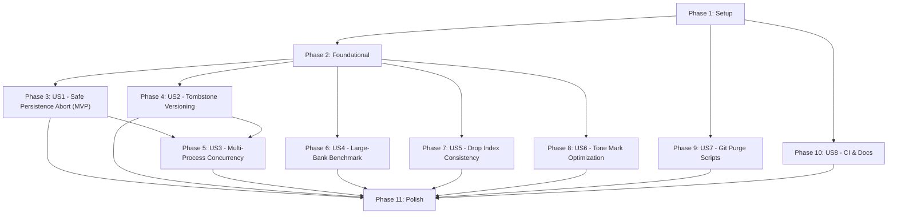

# Tasks: Concurrency Data Integrity, Tombstone Versioning, and Robust Persistence

**Feature**: `004-concurrency-data-integrity`  
**Input**: [spec.md](spec.md), [plan.md](plan.md), [research.md](research.md), [data-model.md](data-model.md), [quickstart.md](quickstart.md)

---

## Phase 1: Setup (Shared Infrastructure)

**Purpose**: Development toolchain and test dependency preparation.

- [x] T001 Add `ruff>=0.4.0` dependency to `requirements-dev.txt` for automated code quality and linting
- [x] T002 [P] Verify or add test helpers and fixtures for corrupt/damaged gzip and JSON files in `tests/conftest.py`

---

## Phase 2: Foundational (Blocking Prerequisites)

**Purpose**: Core schema validation and error types required before implementing user stories.

**⚠️ CRITICAL**: Must complete before starting User Story implementation.

- [x] T003 Update `validate_bank_dict` in `chuviettay/model/bank_schema.py` to accept structured tombstone records `{"deleted_at": float, "generation": int}` in addition to legacy float timestamps
- [x] T004 [P] Add unit tests in `tests/test_schema.py` verifying structured tombstone validation and rejection of invalid tombstone types/values

**Checkpoint**: Schema accepts both legacy and structured tombstones. User story tasks can now proceed.

---

## Phase 3: User Story 1 - Safe Persistence Abort on Corrupted Disk State (Priority: P1) 🎯 MVP

**Goal**: Prevent `Bank.save()` from overwriting an unreadable, corrupted, or incompatible disk file during merge, while supporting `force_overwrite=True`.

**Independent Test**: Simulate corrupt/damaged file on disk; call `Bank.save()`; verify `BankError` is raised, no `.tmp` file remains, and the disk file remains byte-identical.

### Tests for User Story 1

- [x] T005 [P] [US1] Add test for `Bank.save()` aborting on corrupt gzip/JSON on disk in `tests/test_bank.py`
- [x] T006 [P] [US1] Add test for `Bank.save(force_overwrite=True)` successfully replacing corrupt disk file in `tests/test_bank.py`

### Implementation for User Story 1

- [x] T007 [US1] Refactor merge error handling in `Bank.save()` in `chuviettay/model/bank.py`: catch `(BankError, OSError, ValueError, KeyError)`, re-raise `BankError` subclasses directly, wrap `OSError/ValueError/KeyError` into `BankCorruptedError`, and abort before temporary file creation
- [x] T008 [US1] Add `force_overwrite: bool = False` parameter to `Bank.save()` in `chuviettay/model/bank.py` to bypass `needs_merge` check and disk re-reading when explicitly requested

**Checkpoint**: `Bank.save()` never silently overwrites corrupt files. MVP criteria satisfied.

---

## Phase 4: User Story 2 - Generation-Aware Deletion Tombstones & Anti-Resurrection (Priority: P1)

**Goal**: Record timestamps/generations on tombstones and re-additions to prevent stale pre-deletion snapshots from resurrecting deleted words, while allowing deliberate post-deletion additions.

**Independent Test**: Load bank at $T_0$ in Process A and B. Process A deletes "foo" at $T_1$ and saves. Process B adds a sample to "foo" from its $T_0$ snapshot and saves. Verify "foo" remains deleted on disk. Then in a session at $T_2 > T_1$, explicitly teach "foo" and verify it is restored.

### Tests for User Story 2

- [x] T009 [P] [US2] Add unit tests in `tests/test_bank_tombstones.py` for stale snapshot addition suppression versus deliberate post-deletion re-teaching
- [x] T010 [P] [US2] Add test in `tests/test_bank_tombstones.py` verifying `bank._tombstones is bank.d["tombstones"]` reference identity is preserved after merge

### Implementation for User Story 2

- [x] T011 [US2] Update `add_sample()` in `chuviettay/model/bank.py` to ONLY add `label` to `self._readded_words` if `label in self._tombstones` (prevent active words from wiping disk tombstones)
- [x] T012 [US2] Update `drop()` in `chuviettay/model/bank.py` to store structured tombstone `{"deleted_at": time.time(), "generation": self._generation}` and increment `self._generation`
- [x] T013 [US2] Update `_readded_words` to record `{word: readded_timestamp}` and update `merge_bank_dicts()` in `chuviettay/model/bank.py` to only revoke tombstones when `readded_at > deleted_at`
- [x] T014 [US2] Fix tombstone dictionary aliasing in `merge_bank_dicts()` in `chuviettay/model/bank.py`: update `base["tombstones"]` in-place (`clear()` + `update()`) and re-bind `self._tombstones = self.d["tombstones"]` in `Bank.save()`

**Checkpoint**: Deletion tombstones resist stale snapshot races and dictionary reference identity is maintained.

---

## Phase 5: User Story 3 - Multi-Process Concurrency Verification (Priority: P1)

**Goal**: Validate cross-process `FileLock`, concurrent saves, and tombstone resolution across separate operating system processes on Windows and POSIX.

**Independent Test**: Launch multiple OS worker processes via `multiprocessing.Process` (with module-level functions) or `subprocess` writing to the same `.json.gz` file; verify zero corruption and expected conflict resolution.

### Implementation and Tests for User Story 3

- [x] T015 [US3] Create `tests/test_bank_multiprocess.py` containing picklable module-level worker functions and barriers for cross-process synchronization on Windows (`spawn`) and POSIX
- [x] T016 [US3] Implement test case in `tests/test_bank_multiprocess.py` verifying concurrent multi-process writes under `FileLock` without lock contention failure or file corruption
- [x] T017 [US3] Implement test case in `tests/test_bank_multiprocess.py` verifying concurrent delete vs add race condition between two separate OS processes

**Checkpoint**: Multi-process concurrency validated across independent OS processes.

---

## Phase 6: User Story 4 - Large-Bank Persistence Benchmarks (Priority: P2)

**Goal**: Measure and assert persistence latency and fast-path cache validation against synthetic banks with $\ge 5,000$ samples.

**Independent Test**: Run benchmark with 5,000 samples and 20 consecutive additions; assert per-word save latency < 1.0s (or batch < 15s) with fast-path active.

### Implementation and Tests for User Story 4

- [x] T018 [US4] Implement helper function `generate_large_synthetic_bank_dict(n_samples=5000)` in `tests/conftest.py`
- [x] T019 [US4] Implement `test_large_bank_persistence_benchmark_5000_samples` in `tests/test_bank.py` measuring 20 consecutive `add_sample_incremental()` + `save()` operations and verifying sub-second latency

**Checkpoint**: Performance scaling characteristics on large profiles empirically measured and validated.

---

## Phase 7: User Story 5 - In-Memory Invariant Consistency on Drop (Priority: P2)

**Goal**: Ensure `Bank.drop(word)` immediately cleans up `self.tl`, harvested tone marks in `self._raw_marks`, and refreshes `self.marks` so `can(word)` returns `False`.

**Independent Test**: Call `bank.drop("bà")` on a bank containing "bà"; verify `bank.can("bà")` immediately returns False, `tl` has no "bà", and `_raw_marks` no longer contains tone marks from "bà".

### Tests for User Story 5

- [x] T020 [P] [US5] Add unit tests in `tests/test_bank.py` verifying `drop()` cleans `self.tl`, `self._raw_marks`, `self.marks`, and affects `can()` immediately without `rebuild()`

### Implementation for User Story 5

- [x] T021 [US5] Update `_harvest(key, inst)` in `chuviettay/model/bank.py` to record `"_src": key` in the harvested mark dict
- [x] T022 [US5] Update `drop(word)` in `chuviettay/model/bank.py` to prune `self.tl[strip_tone(word)]`, remove marks with `_src == word` from `self._raw_marks[T]`, and call `self._refresh_tone_marks(T)`

**Checkpoint**: `Bank.drop()` leaves zero stale entries in lookup indexes.

---

## Phase 8: User Story 6 - Efficient Tone Mark Percentile Maintenance (Priority: P2)

**Goal**: Optimize `_refresh_tone_marks(T)` by eliminating redundant duplicate sorting passes.

**Independent Test**: Add 30 tone marks incrementally; assert `marks` matches `rebuild()` 100% while sorting only once per coordinate axis.

### Tests for User Story 6

- [x] T023 [P] [US6] Add test in `tests/test_bank_indexing.py` verifying parity between optimized `_refresh_tone_marks` and `rebuild()` across varying mark counts (< 10, == 10, > 10)

### Implementation for User Story 6

- [x] T024 [US6] Refactor `_refresh_tone_marks(T)` in `chuviettay/model/bank.py` to sort `dy` coordinates once and `dx` coordinates once (`dy_vals = sorted(...)`, `dx_vals = sorted(...)`) instead of 4 separate generator sorts

**Checkpoint**: Incremental tone mark filtering runs with 50% fewer sort operations and zero auxiliary sync overhead.

---

## Phase 9: User Story 7 - Git History Purge Scripts & Remote Mirror Guidance (Priority: P2 / Operational)

**Goal**: Update purge automation scripts to recommend `git push --force --mirror origin` and document operational instructions.

**Independent Test**: Run `scripts/purge_git_history.ps1 -CheckOnly`; verify output detects sensitive blobs and displays `--force --mirror` push guidance.

### Implementation and Verification for User Story 7

- [x] T025 [P] [US7] Update `scripts/purge_git_history.ps1` to recommend `git push --force --mirror origin` and clarify backup bundle instructions
- [x] T026 [P] [US7] Update `scripts/purge_git_history.sh` to recommend `git push --force --mirror origin` and clarify backup bundle instructions
- [x] T027 [US7] Execute `scripts/purge_git_history.ps1 -CheckOnly` to verify blob detection and operational readiness

**Checkpoint**: Git history purge tooling updated with mirror guidance and verified in safe mode.

---

## Phase 10: User Story 8 - CI Lint, Metadata, and Documentation Alignment (Priority: P3)

**Goal**: Integrate automated Ruff linting in CI workflow, update test counts (262+ passed), and align documentation.

**Independent Test**: Inspect `.github/workflows/ci.yml` for dedicated lint job; review `CHANGELOG.md` and `quickstart.md` for updated numbers.

### Implementation for User Story 8

- [x] T028 [P] [US8] Add dedicated `lint` job running `ruff check .` on `ubuntu-latest` in `.github/workflows/ci.yml`
- [x] T029 [P] [US8] Update `CHANGELOG.md` to remove obsolete single-process overwrite warnings and describe cross-process atomic merge semantics
- [x] T030 [P] [US8] Update `specs/003-scalability-correctness-hardening/quickstart.md` and `specs/003-scalability-correctness-hardening/spec.md` to reflect status "Implemented" and 262+ passed tests
- [x] T031 [P] [US8] Update `specs/004-concurrency-data-integrity/spec.md` status to "In Progress"

**Checkpoint**: CI workflow enforces linting; documentation and test counts are synchronized.

---

## Phase 11: Polish & Cross-Cutting Concerns

**Purpose**: Full regression testing, linter execution, and release verification.

- [x] T032 Run `ruff check .` across the repository to verify clean lint status
- [x] T033 Run complete pytest regression suite (`pytest -v`) across all test modules (expecting 270+ passed)
- [x] T034 Execute `specs/004-concurrency-data-integrity/quickstart.md` validation scenarios end-to-end

---

## Dependencies & Execution Order

### Phase Dependencies



### User Story Dependencies

- **US1 (P1)**: Depends on Foundational (Phase 2). Self-contained in `Bank.save()`.
- **US2 (P1)**: Depends on Foundational (Phase 2). Interacts with `add_sample()`, `drop()`, and `merge_bank_dicts()`.
- **US3 (P1)**: Depends on US1 and US2 implementation completion for testing multi-process lock and tombstone resolution.
- **US4 (P2)**: Depends on Foundational (Phase 2). Independent benchmark test.
- **US5 (P2)**: Depends on Foundational (Phase 2). Interacts with `_harvest()` and `drop()`.
- **US6 (P2)**: Depends on Foundational (Phase 2). Isolated to `_refresh_tone_marks()`.
- **US7 (P2)**: Independent script modifications. Can execute in parallel.
- **US8 (P3)**: Independent CI workflow and documentation updates. Can execute in parallel.

---

## Parallel Execution Examples

### User Story 1
```bash
# Tests can be written in parallel:
Task T005: "Add test for Bank.save() aborting on corrupt gzip/JSON in tests/test_bank.py"
Task T006: "Add test for Bank.save(force_overwrite=True) in tests/test_bank.py"
```

### User Story 2 & 5
```bash
# Model tasks across different areas:
Task T011: "Update add_sample() conditional readd in chuviettay/model/bank.py"
Task T021: "Update _harvest() to record _src in chuviettay/model/bank.py"
```

### Operational & Documentation (US7 & US8)
```bash
Task T025: "Update scripts/purge_git_history.ps1"
Task T026: "Update scripts/purge_git_history.sh"
Task T028: "Add lint job in .github/workflows/ci.yml"
Task T029: "Update CHANGELOG.md"
```

---

## Implementation Strategy

### MVP First (Phases 1-3)
1. Complete Phase 1 (Setup) and Phase 2 (Foundational schema).
2. Complete Phase 3 (US1 - Safe Persistence Abort).
3. **Verify MVP**: Corrupted files are never overwritten; tests pass.

### Incremental Delivery
1. Foundation + US1 (MVP complete)
2. Add US2 (Tombstone versioning & anti-resurrection)
3. Add US3 (Multi-process concurrency verification)
4. Add US4 (Large-bank benchmarks)
5. Add US5 & US6 (Drop index consistency & tone optimization)
6. Add US7 & US8 (Purge scripts, CI Ruff, docs)
7. Phase 11 (Full regression & validation)
