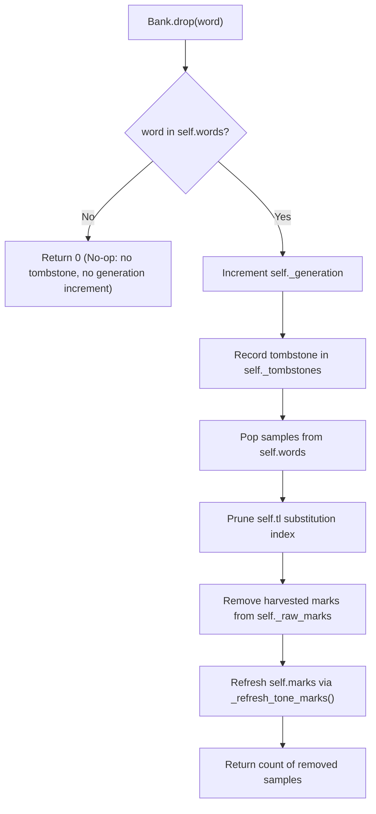
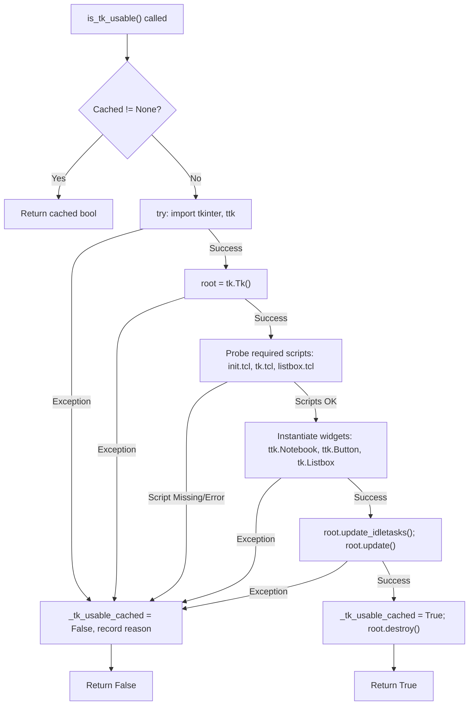

# Data Model: CI Environment Hardening, Tk/Tcl Probing, and Data Integrity Alignment

**Feature Branch**: `005-ci-tk-and-integrity-alignment` | **Date**: 2026-09-29

---

## Entity: Bank Model Mutations & Drop Invariants

### Fields

| Field | Type | Description | Invariant / Behavior in Feature 005 |
|---|---|---|---|
| `words` | `dict[str, list[dict]]` | Active word samples | Target of `drop(word)`. Only words present in `words` trigger tombstone creation. |
| `_generation` | `int` | Monotonic mutation counter | Incremented **only** when an existing word is actually dropped (`len(samples) > 0`). Never incremented on non-existent drops. |
| `_tombstones` | `dict[str, dict]` | Structured tombstone records | Keyed by word label. Values: `{"deleted_at": float, "generation": int}`. Unaltered when dropping non-existent words. |
| `pen.color` | `str` | Hex color string | Strictly validated via `re.fullmatch(r"#[0-9a-fA-F]{6}([0-9a-fA-F]{2})?")`. |

---

## State Transition: `Bank.drop(word)`

---

## Entity: Tk/Tcl Runtime Diagnostic State (`conftest.py`)

| Field | Type | Description |
|---|---|---|
| `_tk_usable_cached` | `bool \| None` | Cached result of the deep runtime probe (`None` before probe, `True`/`False` after). |
| `_tk_unusable_reason` | `str` | Detailed failure reason (exception string or missing script filename) if unusable. |

### Probe Lifecycle

