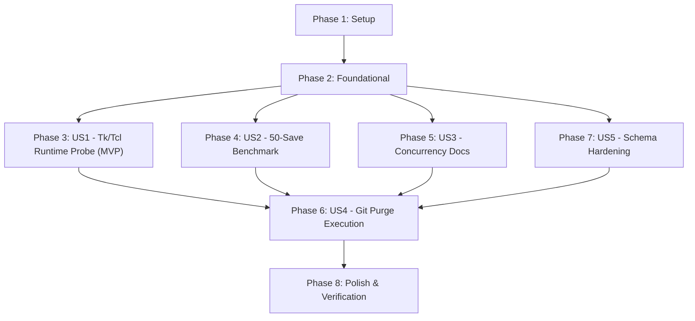

# Tasks: CI Environment Hardening, Tk/Tcl Probing, and Data Integrity Alignment

**Feature Branch**: `005-ci-tk-and-integrity-alignment` | **Date**: 2026-09-29 | **Spec**: [spec.md](spec.md) | **Plan**: [plan.md](plan.md)

---

## Phase 1: Setup & Shared Diagnostics

**Purpose**: Verify repository environment, validate preconditions, and set up test cases for schema hardening.

- [x] T001 Inspect working directory state and test suite baseline via `pytest --collect-only`
- [x] T002 [P] Add test cases in `tests/test_schema.py` testing strict `pen.color` matching with `re.fullmatch` (rejecting trailing garbage characters)

---

## Phase 2: Foundational (Model & Schema Refinements)

**Purpose**: Core model invariants and schema validation hardening before user stories.

- [x] T003 Update `pen.color` validation in `chuviettay/model/bank_schema.py` to use `re.fullmatch(r"#[0-9a-fA-F]{6}([0-9a-fA-F]{2})?", color_val)`
- [x] T004 Refine `Bank.drop(word)` in `chuviettay/model/bank.py` to check `if word not in self.words: return 0` before incrementing `self._generation` or mutating `self._tombstones`
- [x] T005 [P] Add unit test in `tests/test_bank.py` verifying that calling `drop()` on a non-existent word returns 0 and leaves `_tombstones` and `_generation` untouched

**Checkpoint**: Core model invariants clean — non-existent drops do not pollute metadata.

---

## Phase 3: User Story 1 - Comprehensive Tk/Tcl Runtime Verification & Clean CI Skipping (Priority: P1) ⭐ MVP

**Goal**: Provide a deep, non-destructive probe of Tk/Tcl runtime in `tests/conftest.py` that verifies library script sourcing (specifically `listbox.tcl`, `init.tcl`, `tk.tcl`) and widget lifecycle, guaranteeing clean skips on partial/headless runners like Windows Python 3.11.

**Independent Test**: Simulate an environment where Tk library files are missing or raise TclError; run `pytest tests/test_gui.py`; verify all GUI tests are cleanly skipped with 0 failures.

### Implementation for User Story 1

- [x] T006 [US1] Refactor `is_tk_usable()` in `tests/conftest.py` to perform deep script-level probing: check `$tk_library`, verify/source `listbox.tcl`, create `ttk.Notebook`, `tk.Listbox`, and execute `root.update_idletasks()` + `root.update()`
- [x] T007 [US1] Add try-except guard around `MainWindow` initialization in `tests/test_gui.py` (`test_khoi_dong_voi_duong_dan_bank_sai_khong_tu_tao_file`) to skip gracefully if Tk runtime initialization fails
- [x] T008 [P] [US1] Verify GUI test execution across headless and GUI modes via `pytest tests/test_gui.py -v`

**Checkpoint**: Tk runtime probe is bulletproof. Environments missing `listbox.tcl` skip cleanly without crashing.

---

## Phase 4: User Story 2 - Reconciled 50-Word Large-Bank Persistence Benchmark (Priority: P2)

**Goal**: Align benchmark test with specification SC-004 by measuring 50 consecutive interactive saves on $\ge 5,000$ samples.

**Independent Test**: Run `pytest tests/test_bank.py -k "benchmark_large" -v -s`; verify 50 saves complete with average latency $< 1.0\text{s}$ and total runtime $< 30.0\text{s}$.

### Implementation for User Story 2

- [x] T009 [US2] Update `test_large_bank_persistence_benchmark_5000_samples` in `tests/test_bank.py` to execute 50 sequential additions (`num_incremental = 50`), asserting average latency $< 1.0\text{s}$, max latency $< 2.0\text{s}$, and total runtime $< 30.0\text{s}$
- [x] T010 [US2] Execute benchmark test locally and verify that latency profile satisfies SC-004 criteria

**Checkpoint**: Large-bank persistence benchmark matches SC-004 100%.

---

## Phase 5: User Story 3 - Concurrency Documentation & Semantics Alignment (Priority: P2)

**Goal**: Accurately describe the concurrency architecture across project documentation, eliminating misleading claims of distributed consensus.

**Independent Test**: Review `README.md` and `CHANGELOG.md`; confirm accurate explanation of atomic file locking with timestamped tombstones and sequential generation auditing.

### Implementation for User Story 3

- [x] T011 [P] [US3] Update `README.md` to describe the concurrency architecture accurately (atomic file locking with timestamped tombstones and monotonic generation counters for audit logging)
- [x] T012 [P] [US3] Update `CHANGELOG.md` to document the refined `drop()` behavior and accurate concurrency mechanics
- [x] T013 [US3] Synchronize `specs/004-concurrency-data-integrity/spec.md` and `specs/005-ci-tk-and-integrity-alignment/spec.md` with standardized terminology

**Checkpoint**: Documentation perfectly matches implementation semantics.

---

## Phase 6: User Story 4 - Git History Purge Scripts & Local Execution (Priority: P2 / Operational)

**Goal**: Support fallback to `git filter-branch` in purge scripts, create backup bundle, and execute local history rewrite to purge historical blobs.

**Independent Test**: Run `scripts/purge_git_history.ps1 -CheckOnly`; execute purge; verify `git log --all -- chu_cua_ban.json.gz` returns 0 commits.

### Implementation for User Story 4

- [x] T014 [US4] Update `scripts/purge_git_history.ps1` and `scripts/purge_git_history.sh` to include a built-in fallback to `git filter-branch` when `git-filter-repo` is not installed
- [ ] T015 [US4] Commit all working tree changes to satisfy the clean working directory requirement for history rewriting
- [ ] T016 [US4] Execute `scripts/purge_git_history.ps1` to purge sensitive blobs from historical commits, create external bundle backup, and verify clean history with zero references

**Checkpoint**: Local git history is completely sanitized of historical blobs.

---

## Phase 7: User Story 5 - Schema Validation Hardening (Priority: P3)

**Goal**: Ensure `pen.color` strictly validates hex format without allowing trailing garbage characters.

**Independent Test**: Run `pytest tests/test_schema.py -k "pen_color" -v`; verify all test cases pass.

### Implementation for User Story 5

- [x] T017 [US5] Verify `re.fullmatch` schema validation tests pass via `pytest tests/test_schema.py -k "pen_color" -v`

**Checkpoint**: Strict color format validation confirmed.

---

## Phase 8: Polish & Cross-Cutting Verification

**Purpose**: Full regression suite, lint check, and release verification.

- [ ] T018 Run `ruff check .` across the repository to verify 0 lint errors
- [ ] T019 Run complete pytest regression suite (`pytest -v`) across all test modules
- [ ] T020 Execute `specs/005-ci-tk-and-integrity-alignment/quickstart.md` validation scenarios end-to-end
- [ ] T021 Update `specs/005-ci-tk-and-integrity-alignment/spec.md` status to "Implemented"

---

## Dependencies & Execution Order

### Phase Dependencies

### User Story Dependencies

- **US1 (P1)**: Can start after Phase 2. Focuses on `tests/conftest.py` and `tests/test_gui.py`.
- **US2 (P2)**: Can start after Phase 2. Focuses on `tests/test_bank.py`.
- **US3 (P2)**: Can start after Phase 2. Focuses on `README.md`, `CHANGELOG.md`, `specs/`.
- **US4 (P2)**: Must run after code changes are complete and committed, so working tree is clean.
- **US5 (P3)**: Completed during Phase 2 foundational work and validated in Phase 7.

### Parallel Opportunities

- T002 (schema test) and T005 (drop test) can run in parallel.
- T011 and T012 (documentation updates) can run in parallel.
- US1, US2, US3, US5 can be developed in parallel before US4 (git history purge).

---

## Implementation Strategy

### MVP First (User Story 1 Only)
1. Complete Phase 1: Setup
2. Complete Phase 2: Foundational
3. Complete Phase 3: User Story 1 (Tk/Tcl deep probe)
4. Verify GUI tests skip cleanly without crashing
5. This immediately unblocks CI on Windows Python 3.11.

### Incremental Delivery
1. Add US2 (50-word benchmark) -> Prove SC-004.
2. Add US3 (Doc alignment & clean drop) -> Reconcile architectural description.
3. Add US5 (re.fullmatch) -> Solidify schema boundary.
4. Execute US4 (Local Git purge) -> Rewrite history safely with backup bundle.
5. Polish (Phase 8) -> 100% green linter and full test regression suite.
