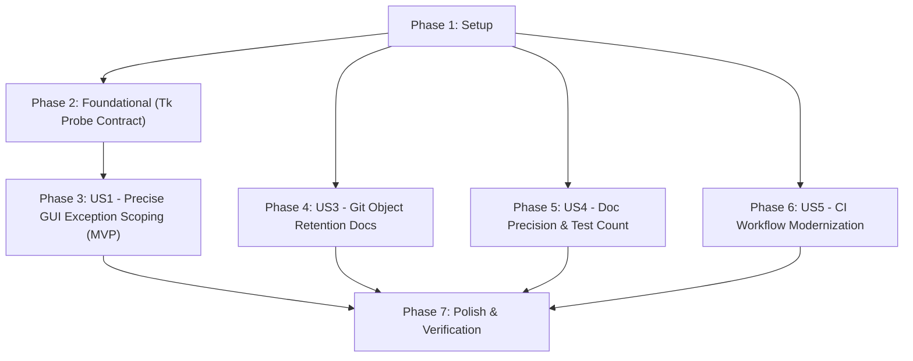

# Tasks: GUI Test Exception Scope Refinement, Tk Probe Contract Alignment, Server-Side Object Clarification, and CI Maintenance

**Feature Branch**: `006-test-quality-and-maintenance` | **Date**: 2026-09-29 | **Spec**: [spec.md](spec.md) | **Plan**: [plan.md](plan.md)

---

## Phase 1: Setup & Shared Infrastructure

**Purpose**: Verify repository state, baseline test collection, and CI workflow configuration.

- [x] T001 Inspect working directory state and test suite baseline via `pytest --collect-only`
- [x] T002 [P] Inspect current GitHub Actions workflow configurations in `.github/workflows/ci.yml`

---

## Phase 2: Foundational (Tk Probe Contract Alignment)

**Purpose**: Align Tk/Tcl probe contract with specification by probing both `$tcl_library/init.tcl` and `$tk_library`.

- [x] T003 [US2] Update `is_tk_usable()` in `tests/conftest.py` to directly probe `$tcl_library/init.tcl` alongside `$tk_library/{tk.tcl, listbox.tcl, button.tcl, entry.tcl}`
- [x] T004 [P] [US2] Add unit test in `tests/test_gui_resilience.py` verifying that missing `init.tcl` causes `is_tk_usable()` to return False with diagnostic reason

**Checkpoint**: Tk runtime probe explicitly validates both Tcl core (`init.tcl`) and Tk widget libraries 1:1 with spec contract.

---

## Phase 3: User Story 1 - Precise GUI Test Exception Scoping to Prevent False Greens (Priority: P1) ⭐ MVP

**Goal**: Narrow exception handling around `MainWindow` creation in `tests/test_gui.py` strictly to `tkinter.TclError` so that application and controller bugs cause test failures instead of being masked as skipped tests.

**Independent Test**: Introduce an application error during `MainWindow` initialization; run `pytest tests/test_gui_resilience.py`; verify that the test fails (`FAILED`) rather than skipping (`SKIPPED`).

### Implementation for User Story 1

- [x] T005 [P] [US1] Add anti-regression test in `tests/test_gui_resilience.py` asserting that non-Tk application exceptions (`AttributeError`, `BankError`) raised during `MainWindow` initialization propagate and fail the test rather than being skipped
- [x] T006 [US1] In `tests/test_gui.py`, import `TclError` from `tkinter` and replace `except Exception as e:` with `except TclError as e:` in `test_khoi_dong_that_bai_van_co_cua_so_va_sau_do_chon_kho_thi_dung_tab` and `test_khoi_dong_voi_duong_dan_bank_sai_khong_tu_tao_file`
- [x] T007 [US1] In `tests/test_gui.py`, replace `except Exception as e:` with `except TclError as e:` in the `app` fixture
- [x] T008 [US1] Verify GUI test execution and exception propagation via `pytest tests/test_gui_resilience.py tests/test_gui.py -v`

**Checkpoint**: GUI tests skip only on genuine `TclError`; application regressions fail loudly with 0 false-green skips.

---

## Phase 4: User Story 3 - Transparent Git Object Retention & Server Cache Documentation (Priority: P2)

**Goal**: Document that while branch ref history is 100% sanitized, remote platforms like GitHub retain loose commit objects by SHA until backend GC or a GitHub Support request.

**Independent Test**: Run `scripts/purge_git_history.ps1 -CheckOnly`; inspect script output and documentation to verify accurate explanation.

### Implementation for User Story 3

- [x] T009 [P] [US3] Update `scripts/purge_git_history.ps1` to display notice about remote GitHub object database retention (unreachable loose objects by SHA) and GitHub Support contact instructions
- [x] T010 [P] [US3] Update `scripts/purge_git_history.sh` to display notice about remote GitHub object database retention and GitHub Support contact instructions
- [x] T011 [US3] Update `README.md` and `CHANGELOG.md` to document the distinction between branch history sanitization and remote platform object caching

**Checkpoint**: Documentation and script outputs clearly explain local branch cleanliness vs remote server-side caching.

---

## Phase 5: User Story 4 - Documentation Precision and Numbering Reconciliation (Priority: P3)

**Goal**: Fix documentation discrepancies in criterion references and test counts.

**Independent Test**: Check `quickstart.md` for SC-003 benchmark reference and `README.md` for test count.

### Implementation for User Story 4

- [x] T012 [P] [US4] Fix SC-004 typo in `specs/005-ci-tk-and-integrity-alignment/quickstart.md` to reference SC-003 for 50-save benchmark
- [x] T013 [P] [US4] Update test count in `README.md` to "Hơn 240 ca kiểm thử tự động"

**Checkpoint**: All documentation references and test metrics are synchronized.

---

## Phase 6: User Story 5 - Continuous Integration Workflow Maintenance & Upgrades (Priority: P3)

**Goal**: Modernize GitHub Actions in `.github/workflows/ci.yml` while preserving pip caching and matrix integrity.

**Independent Test**: Inspect `.github/workflows/ci.yml` action versions; verify YAML syntax and parameter compatibility.

### Implementation for User Story 5

- [x] T014 [US5] Audit and update GitHub Actions versions in `.github/workflows/ci.yml` (`actions/checkout`, `actions/setup-python`) for compatibility with latest runner standards

**Checkpoint**: CI workflow modernized and aligned with upstream best practices.

---

## Phase 7: Polish & Cross-Cutting Verification

**Purpose**: Full regression suite, lint check, and release verification.

- [x] T015 Run `ruff check .` across the repository to verify 0 lint errors
- [x] T016 Run complete pytest regression suite (`pytest -v`) across all test modules
- [x] T017 Execute `specs/006-test-quality-and-maintenance/quickstart.md` validation scenarios end-to-end
- [x] T018 Update `specs/006-test-quality-and-maintenance/spec.md` status to "Implemented"

---

## Dependencies & Execution Order

### Phase Dependencies

### User Story Dependencies

- **US1 (P1)**: Focuses on `tests/test_gui.py` and `tests/test_gui_resilience.py`. Depends on Foundational probe contract.
- **US2 (P2)**: Foundational phase. Focuses on `tests/conftest.py`.
- **US3 (P2)**: Focuses on `scripts/purge_git_history.*`, `README.md`, `CHANGELOG.md`. Can run in parallel with US1.
- **US4 (P3)**: Focuses on `specs/005-*/quickstart.md` and `README.md`.
- **US5 (P3)**: Focuses on `.github/workflows/ci.yml`.

### Parallel Opportunities

- T003 (probe update) and T005 (anti-regression test) can be developed in parallel.
- T009, T010, T012, T013 can be updated in parallel (different documentation and script files).
- US3, US4, US5 can proceed concurrently with US1.

---

## Implementation Strategy

### MVP First (User Story 1 Only)
1. Complete Phase 1: Setup
2. Complete Phase 2: Foundational (Probe contract alignment)
3. Complete Phase 3: User Story 1 (Narrow GUI exception handling to `TclError`)
4. Verify application bugs fail loudly while Tk errors skip cleanly.
5. This immediately eliminates the "false-green CI" vulnerability.

### Incremental Delivery
1. Add US3 (Git object retention documentation) -> Transparency on remote storage.
2. Add US4 (Doc precision & test count) -> Accurate metrics.
3. Add US5 (CI workflow modernization) -> Modernized GitHub Actions.
4. Polish (Phase 7) -> 100% green linter and full regression test suite.
