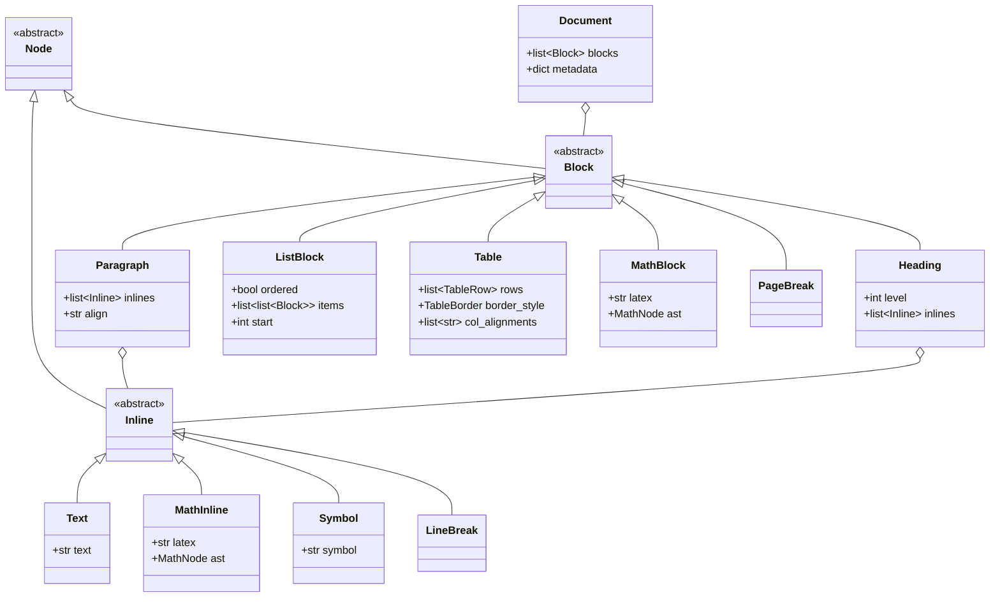
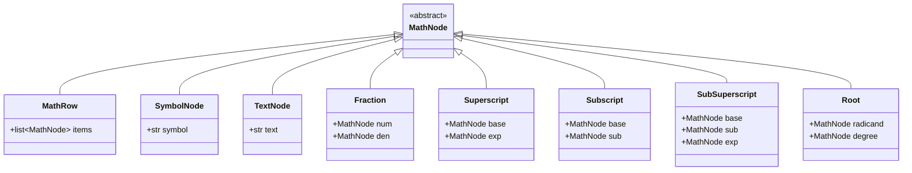

# Data Model: Document IR, Multi-Format Importers, Layout Engine, and Math/Table Rendering

**Feature**: `007-document-ir-and-importers`  
**Date**: 2026-09-29  
**Status**: Completed  

---

## 1. Document Intermediate Representation (IR)

The Document IR lives in `chuviettay/document/ir.py` and represents formatted documents independently of source file format or rendering target.



### 1.1 IR Node Specifications

#### `Document`
- `blocks`: `list[Block]` — Ordered sequence of block elements.
- `metadata`: `dict[str, Any]` — Key-value pairs for document title, author, source filename, etc.

#### `Paragraph`
- `inlines`: `list[Inline]` — Ordered sequence of inline tokens.
- `align`: `str` — `"left"` (default), `"center"`, `"right"`, or `"justify"`.

#### `Heading`
- `level`: `int` — Heading hierarchy from 1 (largest) to 6 (smallest).
- `inlines`: `list[Inline]` — Heading content tokens.

#### `ListBlock`
- `ordered`: `bool` — `True` for numbered lists (`1.`, `2.`), `False` for bullet lists.
- `items`: `list[list[Block]]` — Each item contains a list of child blocks (supporting nested paragraphs/sub-lists).
- `start`: `int` — Starting ordinal for ordered lists (default: 1).

#### `Table`
- `rows`: `list[TableRow]` — Sequence of table rows.
- `border_style`: `TableBorder` — Enum (`NONE`, `OUTER`, `ALL`, `HORIZONTAL`).
- `col_alignments`: `list[str]` — List of column alignments (`"left"`, `"center"`, `"right"`).

#### `TableRow`
- `cells`: `list[TableCell]` — Sequence of cells in this row.

#### `TableCell`
- `blocks`: `list[Block]` — Content inside the cell (typically single Paragraph with inlines).
- `colspan`: `int` — Column span (default: 1).
- `rowspan`: `int` — Row span (default: 1).

#### `MathBlock`
- `latex`: `str` — Mathematical expression in LaTeX format (e.g. `\frac{a}{b}`).
- `ast`: `MathNode | None` — Parsed mathematical abstract syntax tree (computed during parsing or layout).

#### `Text`
- `text`: `str` — Literal text characters.

#### `MathInline`
- `latex`: `str` — Inline math expression (e.g. `x^2 + y^2 = r^2`).
- `ast`: `MathNode | None` — Parsed AST for layout positioning.

#### `Symbol`
- `symbol`: `str` — Discrete typographic or mathematical symbol (e.g. `≤`, `∑`, `π`).

#### `LineBreak`
- Explicit hard break within a paragraph or cell.

---

## 2. Mathematical AST (MathNode)

The Math AST lives in `chuviettay/math/ast.py` and represents 2D spatial relationships between mathematical elements.



### 2.1 MathNode Specifications
- `MathRow`: Linear sequence of neighboring math nodes.
- `SymbolNode`: Math operator or Greek glyph (`+`, `-`, `=`, `\alpha`, `\sum`, `\int`).
- `TextNode`: Alphanumeric token inside a formula (`x`, `sin`, `123`).
- `Fraction`: Numerator and denominator separated by horizontal division bar.
- `Superscript`: Base element with raised exponent at top right.
- `Subscript`: Base element with lowered index at bottom right.
- `SubSuperscript`: Base element with both index and exponent aligned vertically.
- `Root`: Radicand enclosed under radical sign, optional degree.

---

## 3. Typographic & Layout Metrics

The geometry definitions live in `chuviettay/layout/metrics.py`.

```python
@dataclass(frozen=True)
class Size:
    """Typographic bounding box and alignment metrics."""
    width: float
    height: float
    ascent: float       # Distance from baseline up to top edge
    descent: float      # Distance from baseline down to bottom edge (positive downwards)
    baseline: float     # Offset from top edge to the baseline

@dataclass
class PositionedGlyph:
    """A handwriting sample or symbol placed at absolute coordinates."""
    strokes: list[list[float]]
    x: float
    y: float
    scale: float

@dataclass
class PositionedStroke:
    """Vector line stroke (table border, fraction bar, radical line)."""
    points: list[tuple[float, float]]
    width: float
    color: str | None
```

---

## 4. Importer Models

The importer abstractions live in `chuviettay/importer/base.py`.

```python
@dataclass
class ImportResult:
    """Bundles the parsed Document IR with import diagnostics."""
    document: Document
    warnings: list[str] = field(default_factory=list)
    unsupported: list[str] = field(default_factory=list)
```

- `warnings`: Non-fatal issues (e.g., malformed markdown table padded with empty cells).
- `unsupported`: Document elements that cannot be rendered to handwriting strokes (e.g. `["Hình ảnh (drawing/image1.png)", "Biểu đồ SmartArt"]`).

---

## 5. Bank Schema v3 Data Structure

Stored in gzip-compressed JSON format:

```json
{
  "schema_version": 3,
  "words": {
    "xin": [
      {
        "s": [[0, 0, 5, 2, ...]],
        "w": 25.4,
        "h": 18.0
      }
    ]
  },
  "digits": {
    "0": [{ "s": [...], "w": 12.0 }]
  },
  "punct": {
    ",": [{ "s": [...], "w": 4.5 }]
  },
  "symbols": {
    "≤": [{ "s": [...], "w": 15.0 }],
    "∑": [{ "s": [...], "w": 22.0 }],
    "π": [{ "s": [...], "w": 16.5 }]
  },
  "xh": 20.0,
  "pen": {
    "tool": "pen",
    "color": "#000000ff",
    "width": "1.41"
  },
  "line": 32.0,
  "width": 540.0,
  "x0": 50.0,
  "wgaps": [11.0],
  "dgaps": [3.5],
  "ratio": 6.6,
  "v": 1
}
```

### Validation Rules
1. `symbols` must be a dictionary.
2. Each key in `symbols` must be a non-empty string.
3. Each value in `symbols[key]` must be a list of valid sample dicts containing `s` (coordinates list) and `w` (finite positive number), identical to `words` and `digits`.
4. Upgrading from v2 to v3 assigns `"schema_version": 3` and initializes `"symbols": {}` if not present.
