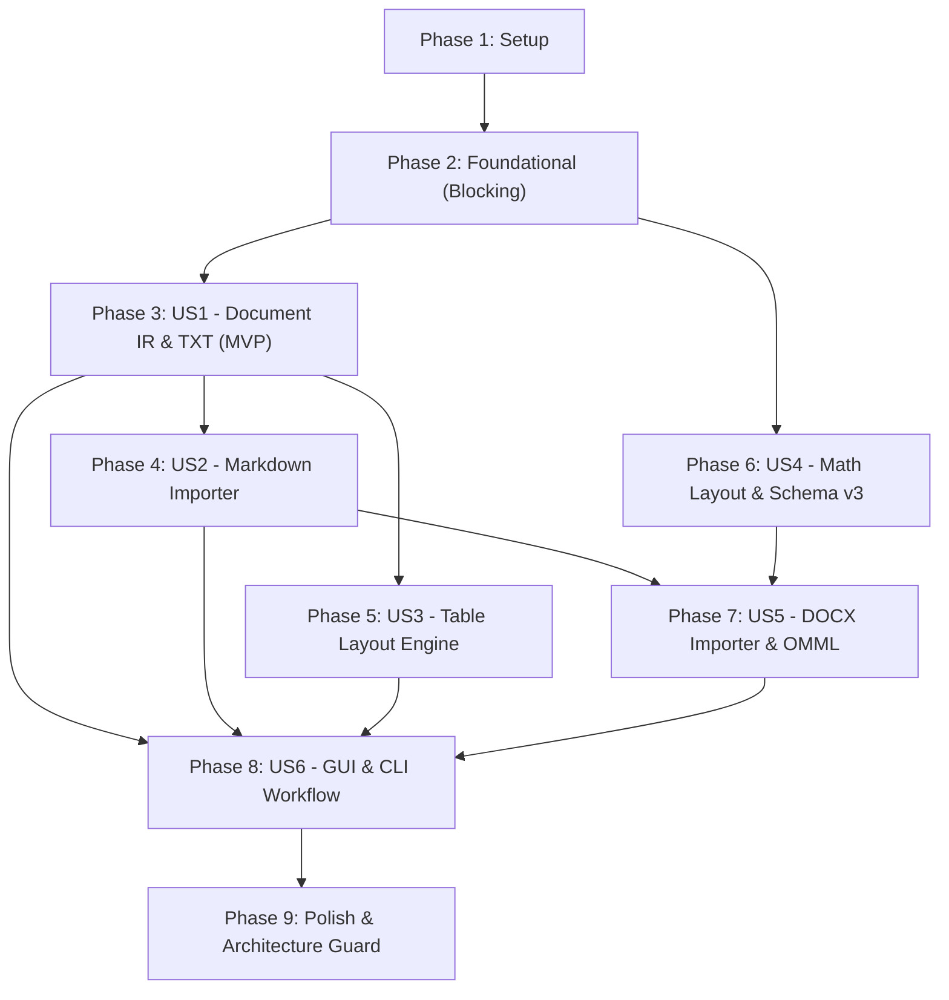

# Tasks: Document IR, Multi-Format Importers (TXT/MD/DOCX), Layout Engine, and Math/Table Rendering

**Feature**: `007-document-ir-and-importers`  
**Plan**: [specs/007-document-ir-and-importers/plan.md](file:///d:/viet/app/specs/007-document-ir-and-importers/plan.md)  
**Spec**: [specs/007-document-ir-and-importers/spec.md](file:///d:/viet/app/specs/007-document-ir-and-importers/spec.md)  
**Status**: Ready for Implementation  

---

## Phase 1: Setup (Shared Infrastructure)

**Purpose**: Project initialization, optional dependencies configuration, and package skeletons.

- [X] T001 Configure optional dependencies for document parsers (`[project.optional-dependencies] docs = [...]`) in `pyproject.toml`
- [X] T002 [P] Implement optional dependency guard helper and `OptionalDependencyError` in `chuviettay/importer/dependency.py`
- [X] T003 [P] Create package skeleton and `__init__.py` files for `chuviettay/document/`, `chuviettay/importer/`, `chuviettay/math/`, and `chuviettay/layout/`

---

## Phase 2: Foundational (Blocking Prerequisites)

**Purpose**: Core infrastructure, Document IR dataclasses, Bank Schema v3, and layout metrics that MUST be complete before ANY user story can be implemented.

> **CRITICAL**: No user story work can begin until this phase is complete.

- [X] T004 Define core Document IR dataclasses (`Node`, `Block`, `Inline`, `Document`, `Paragraph`, `Heading`, `ListBlock`, `Table`, `TableRow`, `TableCell`, `MathBlock`, `Text`, `MathInline`, `Symbol`, `LineBreak`, `TableBorder`) in `chuviettay/document/ir.py`
- [X] T005 [P] Define `BaseImporter` abstract interface and `ImportResult` dataclass in `chuviettay/importer/base.py`
- [X] T006 [P] Define typographic metrics and geometry dataclasses (`Size`, `TypographicMetrics`, `PositionedGlyph`, `PositionedStroke`) in `chuviettay/layout/metrics.py`
- [X] T007 [P] Define mathematical AST dataclasses (`MathNode`, `MathRow`, `SymbolNode`, `TextNode`, `Fraction`, `Superscript`, `Subscript`, `SubSuperscript`, `Root`) in `chuviettay/math/ast.py`
- [X] T008 Implement Bank Schema v3 migration (`CURRENT_VERSION = 3`, `"symbols": {}`, `_migrate_v2_to_v3`) and validation in `chuviettay/model/bank_schema.py`
- [X] T009 Update `Bank` initialization, empty dict, and multi-process `merge_bank_dicts()` to handle `"symbols"` in `chuviettay/model/bank.py`
- [X] T010 [P] Add unit tests for Schema v3 validation, v2->v3 migration, and multi-process symbol merging in `tests/test_schema_v3.py`

**Checkpoint**: Foundation ready — user story implementation can now begin.

---

## Phase 3: User Story 1 - Document IR, Plaintext Importer & Backward-Compatible Pipeline (Priority: P1) ⭐ MVP

**Goal**: Establish Document IR pipeline for plaintext input while protecting legacy `ctl.write_text(...)` golden-master SHA-256 compatibility.

**Independent Test**: Assert `ctl.write_text(...)` produces byte-identical output to legacy golden-master files (`tests/test_golden_master.py`), and assert `ctl.write_document(...)` renders matching handwriting pages for `.txt` input.

### Tests for User Story 1
- [X] T011 [P] [US1] Create unit tests for `TxtImporter` verifying line normalization and paragraph structure in `tests/test_importer_txt.py`
- [X] T012 [P] [US1] Create integration tests in `tests/test_document_pipeline.py` verifying `ctl.write_document` renders `.xopp` matching `test_golden_master.py` stroke expectations while `ctl.write_text` remains 100% byte-identical

### Implementation for User Story 1
- [X] T013 [US1] Implement `TxtImporter` parsing plain text and raw strings into `Document` IR in `chuviettay/importer/txt_importer.py`
- [X] T014 [US1] Implement basic document flow layout and page break calculation in `chuviettay/layout/engine.py`
- [X] T015 [US1] Implement `ctl.write_document(document, opts, out_path)` coordinating layout and stroke rendering in `chuviettay/controller/app_controller.py`

**Checkpoint**: User Story 1 complete. Core MVP functionality verified with 100% golden-master test pass.

---

## Phase 4: User Story 2 - Markdown Document Import with GFM Tables and Math Blocks (Priority: P1)

**Goal**: Parse `.md` and `.markdown` files into Document IR with headings, lists, GFM tables, and math syntax, neutralizing raw HTML.

**Independent Test**: Import markdown files with headings, lists, tables, and math, verifying `MarkdownImporter` creates corresponding IR nodes with raw HTML stripped/sanitized.

### Tests for User Story 2
- [X] T016 [P] [US2] Create unit tests for Markdown importing (headings 1-6, bullet/numbered lists, GFM tables, math syntax, and raw HTML stripping) in `tests/test_importer_markdown.py`

### Implementation for User Story 2
- [X] T017 [US2] Implement `MarkdownImporter` with `markdown-it-py` and `dollarmath` plugin in `chuviettay/importer/markdown_importer.py`
- [X] T018 [US2] Implement HTML sanitization and tag stripping in `chuviettay/importer/markdown_importer.py` to ensure raw HTML tokens are ignored and do not produce handwriting strokes

**Checkpoint**: User Story 2 complete. Markdown files parse into Document IR without HTML script vulnerabilities.

---

## Phase 5: User Story 3 - Layout Engine Decoupling, Table Sizing & Multi-Border Stroke Rendering (Priority: P2)

**Goal**: Layout engine measures table columns, wraps cell text, generates vector border strokes (`NONE`, `OUTER`, `ALL`, `HORIZONTAL`), and paginates across pages cleanly.

**Independent Test**: Create Table IR with varying cell text lengths, run table layout engine, and verify column widths adapt to content, text wraps, and output `.xopp` contains crisp border strokes framing cell handwriting.

### Tests for User Story 3
- [X] T019 [P] [US3] Create unit tests for table column width computation, cell wrapping, and border stroke generation in `tests/test_table_layout.py`

### Implementation for User Story 3
- [X] T020 [US3] Implement table column sizing, multiline text wrapping, and jagged row padding in `chuviettay/layout/table_layout.py`
- [X] T021 [US3] Implement vector stroke border generation for styles `NONE`, `OUTER`, `ALL`, and `HORIZONTAL` in `chuviettay/layout/table_layout.py`
- [X] T022 [US3] Implement table pagination across page boundaries, including line-splitting fallback for single cells taller than page height in `chuviettay/layout/table_layout.py`
- [X] T023 [US3] Integrate `TableLayout` into `DocumentLayoutEngine` in `chuviettay/layout/engine.py`

**Checkpoint**: User Story 3 complete. Multi-column tables render with crisp pen strokes and clean page breaking.

---

## Phase 6: User Story 4 - Math Symbol Schema v3, Inline/Block Math AST & Baseline-Aligned Layout (Priority: P2)

**Goal**: Parse LaTeX math into `MathNode` AST, compute typographic metrics with baseline alignment, and reserve bounding boxes for missing symbols.

**Independent Test**: Parse math expressions (`\frac{a}{b}`, `x^2`, `\sqrt{x}`) into AST, compute typographic metrics (`width`, `height`, `ascent`, `descent`, `baseline`), and verify missing symbols render with sized placeholders (`[ symbol ]`) without breaking layout geometry.

### Tests for User Story 4
- [x] T024 [P] [US4] Create unit tests for LaTeX math parsing, baseline metric alignment, and missing symbol placeholder fallback in `tests/test_math_layout.py`

### Implementation for User Story 4
- [x] T025 [US4] Implement pure-Python LaTeX math tokenizer and AST generator (with max depth guard 10) in `chuviettay/math/parser.py`
- [x] T026 [US4] Implement recursive math layout calculating typographic baseline, ascent, descent, and minimum scale 0.5x in `chuviettay/layout/math_layout.py`
- [x] T027 [US4] Implement vector stroke generation for fraction division lines and radical vinculums in `chuviettay/layout/math_layout.py`
- [x] T028 [US4] Implement missing symbol placeholder bounding box (`[ symbol ]`) and missing symbols tracking in `chuviettay/layout/math_layout.py`
- [x] T029 [US4] Update `Writer.token()` and `Writer.symbol()` in `chuviettay/model/writer.py` to look up glyphs from `bank.symbols`
- [x] T030 [US4] Integrate math rendering into `DocumentLayoutEngine` in `chuviettay/layout/engine.py`

**Checkpoint**: User Story 4 complete. Math formulas align typographically on the handwriting baseline without layout distortion.

---

## Phase 7: User Story 5 - DOCX Document Importer with OMML Translation & Unsupported Content Diagnostics (Priority: P3)

**Goal**: Import `.docx` files preserving exact paragraph and table sequence via `iter_inner_content()`, convert OMML equations, and report unsupported elements.

**Independent Test**: Import sample `.docx` with text, table, OMML equation, and image, verifying text/table/math in Document IR and image in `ImportResult.unsupported`.

### Tests for User Story 5
- [x] T031 [P] [US5] Create unit tests for DOCX parsing (sequential paragraphs/tables order, OMML equation extraction, and unsupported element warnings) in `tests/test_importer_docx.py`

### Implementation for User Story 5
- [x] T032 [US5] Implement `DocxImporter` using `iter_inner_content()` with fallback iteration over `doc.element.body` child tags (`w:p`, `w:tbl`) in `chuviettay/importer/docx_importer.py`
- [x] T033 [US5] Implement OMML XML parser translating `m:oMath`, `m:f`, `m:sSup`, `m:sSub`, and `m:rad` into `MathNode` AST in `chuviettay/importer/docx_importer.py`
- [x] T034 [US5] Implement detection of unsupported DOCX elements (drawings, images, SmartArt, comments) recording into `ImportResult.unsupported` in `chuviettay/importer/docx_importer.py`

**Checkpoint**: User Story 5 complete. Word documents import with faithful element sequencing and transparent diagnostics.

---

## Phase 8: User Story 6 - Document-Centric GUI & Smart CLI Workflow (Priority: P3)

**Goal**: Enable "Mở tài liệu..." in GUI with multi-format file picker and structural diagnostics, and add format auto-detection (`--format auto`) to CLI.

**Independent Test**: Select `.md` or `.docx` in GUI file picker, assert status panel updates with structural metrics, and run CLI `hw-note write baitap.docx -o ra.xopp` with `--format auto`.

### Tests for User Story 6
- [x] T035 [P] [US6] Create unit and integration tests for CLI format auto-detection and GUI document statistics in `tests/test_cli_format.py` and `tests/test_gui_document.py`

### Implementation for User Story 6
- [x] T036 [US6] Add `import_document(file_path)` factory and format auto-detection in `chuviettay/controller/app_controller.py`
- [x] T037 [US6] Update `chuviettay/cli.py` to add `--format {auto,txt,md,docx}` with extension auto-detection and structural metrics reporting
- [x] T038 [US6] Update `WriteTab` in `chuviettay/view/write_tab.py`: replace "Mở file .txt..." with "Mở tài liệu...", support multi-format filters, and display document structural stats
- [x] T039 [US6] Update `WriteResult` and `chuviettay/model/xopp.py` to include missing symbols in `_thieu.xopp` grid generation for interactive learning

**Checkpoint**: User Story 6 complete. Both GUI and CLI provide a seamless, multi-format workflow.

---

## Phase 9: Polish & Cross-Cutting Concerns

**Purpose**: Multi-page streaming memory management, architecture test enforcement, documentation, and final end-to-end verification.

- [x] T040 [P] Implement streaming `PageBuffer` for multi-page documents (up to 50+ pages) in `chuviettay/layout/stream.py`
- [x] T041 Update `tests/test_architecture.py` to enforce strict import boundaries for `document/`, `importer/`, `layout/`, and `math/` packages
- [x] T042 Run quickstart validation scenarios from `specs/007-document-ir-and-importers/quickstart.md`
- [x] T043 [P] Update `README.md` and user guide with new document formats and optional dependencies installation guide

---

## Dependencies & Execution Order

### Phase Dependencies

### User Story Dependencies

- **User Story 1 (P1)**: Depends on Phase 2 (Foundational). Blocks all other stories. Delivers MVP.
- **User Story 2 (P1)**: Depends on US1 (Document IR).
- **User Story 3 (P2)**: Depends on US1 (Document IR & Layout Engine).
- **User Story 4 (P2)**: Depends on Foundational (Schema v3 & Math AST).
- **User Story 5 (P3)**: Depends on US2 (Markdown/Table structures) and US4 (Math AST).
- **User Story 6 (P3)**: Depends on US1 through US5 (integrates GUI/CLI).

---

## Parallel Opportunities

- **Setup & Foundational**:
  - `T002` (dependency guard), `T003` (skeletons), `T005` (base importer), `T006` (metrics), `T007` (math AST), `T010` (schema v3 tests) can all run in parallel.
- **User Story 1**:
  - `T011` (test) and `T012` (pipeline test) can run in parallel before implementation.
- **User Story 2**:
  - `T016` (markdown test) can run in parallel.
- **User Story 3**:
  - `T019` (table layout test) can run in parallel.
- **User Story 4**:
  - `T024` (math layout test) can run in parallel.
- **User Story 5**:
  - `T031` (docx test) can run in parallel.
- **User Story 6**:
  - `T035` (CLI/GUI test) can run in parallel.
- **Polish**:
  - `T040` (streaming buffer) and `T043` (README) can run in parallel.

---

## Implementation Strategy

### MVP First (Phases 1, 2, and 3)
1. Complete Phase 1: Setup (`T001`–`T003`).
2. Complete Phase 2: Foundational (`T004`–`T010`).
3. Complete Phase 3: User Story 1 (`T011`–`T015`).
4. **STOP and VALIDATE**: Verify that `ctl.write_text(...)` matches 100% of golden-master SHA-256 hashes (`tests/test_golden_master.py`) and that `ctl.write_document(...)` successfully writes a plain text `.xopp` document.

### Incremental Delivery
1. Phase 4: Enable Markdown import (`.md`, `.markdown`).
2. Phase 5: Enable table layout with crisp pen strokes (`NONE`, `OUTER`, `ALL`, `HORIZONTAL`).
3. Phase 6: Enable math formula rendering and Schema v3 symbols.
4. Phase 7: Enable Word import (`.docx`) with OMML formulas.
5. Phase 8: Deliver unified GUI ("Mở tài liệu...") and CLI (`--format auto`).
6. Phase 9: Polish, streaming pagination for 50+ pages, and architectural import auditing.
