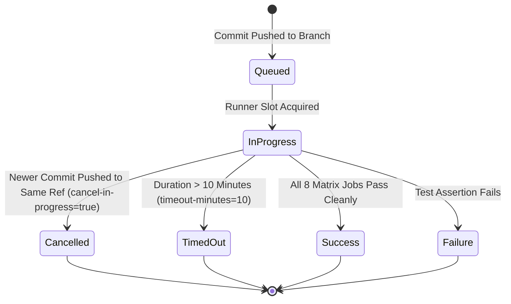
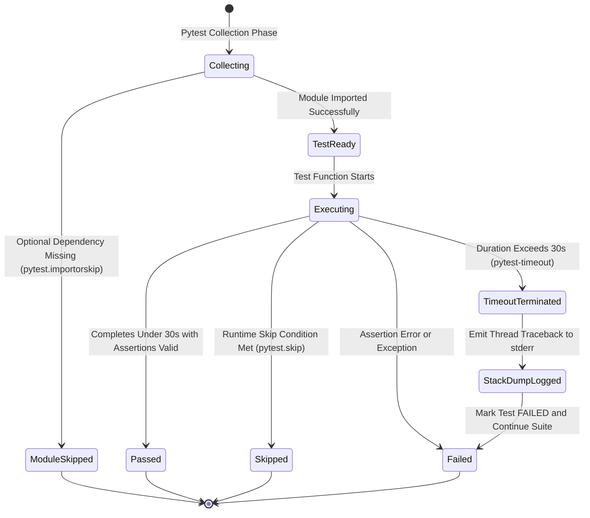

# Data Model & State Transitions: CI Timeout Hardening & Test Resilience

**Feature**: `008-ci-test-hang-prevention`
**Date**: 2026-09-30

---

## 1. Entities

### 1.1 `CIWorkflowRun`
Represents an execution instance of the continuous integration pipeline triggered by a Git push or pull request event.

| Field | Type | Description | Validation Rule |
|---|---|---|---|
| `workflow_id` | `str` | Name or ID of workflow (`CI`) | Must equal `'CI'` |
| `ref` | `str` | Git branch or PR ref | Non-empty Git ref |
| `commit_sha` | `str` | Commit hash being tested | 40-character hex string |
| `concurrency_group` | `str` | Group key for queue preemption | `${{ github.workflow }}-${{ github.ref }}` |
| `cancel_in_progress` | `bool` | Auto-cancel older runs on same group | **Must be `true`** |
| `matrix_jobs` | `list[JobExecution]` | Matrix permutations (8 jobs) | 2 OS × 4 Python versions |
| `status` | `str` | Lifecycle state of workflow run | Enum: `queued`, `in_progress`, `cancelled`, `timed_out`, `success`, `failure` |

### 1.2 `JobExecution`
Represents a single matrix job execution on an isolated virtual machine runner.

| Field | Type | Description | Validation Rule |
|---|---|---|---|
| `job_id` | `str` | Job identifier (e.g. `test`) | Must equal `'test'` |
| `runner_os` | `str` | Operating system environment | Enum: `'ubuntu-latest'`, `'windows-latest'` |
| `python_version` | `str` | Python runtime version | Enum: `'3.10'`, `'3.11'`, `'3.12'`, `'3.13'` |
| `timeout_minutes` | `int` | Hard ceiling for job duration | **Must be $\le 10$ minutes** |
| `display_mode` | `str` | Display subsystem for GUI testing | Linux: `xvfb-run -a`; Windows: native |
| `installed_extras` | `list[str]` | Optional package groups installed | **Must include `['docs']`** |
| `status` | `str` | Job termination state | Enum: `in_progress`, `cancelled`, `timed_out`, `success`, `failure` |

### 1.3 `TestExecutionSession`
Represents the pytest invocation executing the full test suite.

| Field | Type | Description | Validation Rule |
|---|---|---|---|
| `cli_args` | `list[str]` | Arguments passed to `pytest` | **Must include `['-vv', '-s', '--timeout=30']`** |
| `collection_status` | `str` | Result of pytest collection phase | Enum: `success` (0 errors), `error` |
| `default_timeout` | `float` | Per-test execution watchdog | **30.0 seconds** |
| `total_collected` | `int` | Total tests discovered | $\ge 370$ tests |
| `collection_errors` | `int` | Tests failing during import | **Must be strictly 0** |

### 1.4 `TestCaseWatchdog`
Monitors the execution duration of an individual test function.

| Field | Type | Description | Validation Rule |
|---|---|---|---|
| `node_id` | `str` | Pytest test identifier (path::name) | Valid pytest test node ID |
| `timeout_seconds` | `float` | Watchdog timeout for this test | Default 30.0s, or `@pytest.mark.timeout(N)` |
| `interrupted` | `bool` | Whether the watchdog killed test | `true` if duration $> \text{timeout\_seconds}$ |
| `traceback_dump` | `str | None` | Call-stack snapshot if interrupted | Captured thread traceback on timeout |

### 1.5 `DependencySkipGuard`
Encapsulates test collection and runtime protection for optional package dependencies.

| Field | Type | Description | Validation Rule |
|---|---|---|---|
| `package_name` | `str` | Package required by test module | e.g. `'docx'`, `'markdown_it'`, `'mdit_py_plugins'` |
| `guard_level` | `str` | Stage at which protection applies | Enum: `'module_collection'`, `'test_function'` |
| `mechanism` | `str` | Skip mechanism used | Enum: `pytest.importorskip`, `pytest.skip` |
| `outcome_when_missing`| `str` | Recorded pytest result | **Must be `'SKIPPED'` (never `'ERROR'` or `'FAILED'`)** |

---

## 2. State Transitions

### 2.1 CI Workflow Concurrency Lifecycle

### 2.2 Test Case Watchdog Lifecycle

