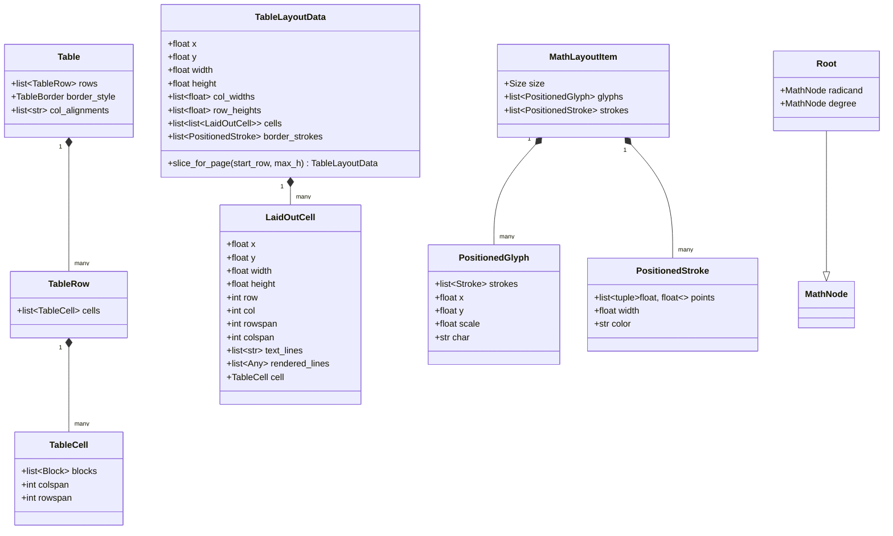

# Data Model: Table Merged-Cell Occupancy, Layout Geometry, and Math Root Glyphs

**Feature Branch**: `009-table-and-math-layout-fixes`
**Date**: 2026-09-30
**Spec**: [spec.md](spec.md)

## Overview

This document describes the core entities, geometric contracts, and data structures for table occupancy layout, pagination slicing, and mathematical root glyph representations.

---

## 1. Table Layout Entities

### 1.1 `TableCell` (Input IR)
Represents a logical cell within a table row in the Document Intermediate Representation.
- **Attributes**:
  - `blocks`: `list[Block]` — rich content contained within the cell (e.g., `Paragraph`, `MathBlock`).
  - `colspan`: `int` (default: 1) — number of horizontal columns this cell spans.
  - `rowspan`: `int` (default: 1) — number of vertical rows this cell spans.
- **Validation Rules**:
  - `colspan >= 1`: clamped defensively if $\le 0$.
  - `rowspan >= 1`: clamped defensively if $\le 0$.

### 1.2 `TableOccupancyGrid` (Algorithmic Structure)
A 2D matrix structure used during layout computation to track occupied physical grid coordinates.
- **Schema**: `list[list[LaidOutCell | None]]`
  - Dimensions: $R \times C$, where $R = \text{len(rows)}$ and $C = \text{number of columns}$.
- **Invariant**:
  - A cell placed at grid origin $(r, c)$ with `rowspan` $R_{\text{span}}$ and `colspan` $C_{\text{span}}$ occupies all coordinates $(r + i, c + j)$ for $0 \le i < R_{\text{span}}$ and $0 \le j < C_{\text{span}}$.
  - A grid coordinate is either `None` (vacant) or points to the unique `LaidOutCell` occupying it.

### 1.3 `LaidOutCell` (Output Geometry)
Represents the exact spatial dimensions, position, and pre-formatted line items of a cell.
- **Attributes**:
  - `x`: `float` — absolute horizontal position (top-left corner).
  - `y`: `float` — absolute vertical position (top-left corner).
  - `width`: `float` — total width covering all spanned columns ($\sum_{k=c}^{c+C_{\text{span}}-1} \text{col\_widths}[k]$).
  - `height`: `float` — total height covering all spanned rows ($\sum_{k=r}^{r+R_{\text{span}}-1} \text{row\_heights}[k]$).
  - `row`: `int` — primary 0-indexed row position.
  - `col`: `int` — primary 0-indexed column position.
  - `rowspan`: `int` — effective row span.
  - `colspan`: `int` — effective column span.
  - `text_lines`: `list[str]` — fallback wrapped plain text lines.
  - `rendered_lines`: `list[list[tuple[float, list[Stroke], float]]]` — pre-measured and wrapped vector stroke items for rich inlines (text + math).
  - `cell`: `TableCell | None` — back-reference to the source IR cell.

### 1.4 `TableLayoutData` (Composite Layout)
Represents the complete layout of a table (or a multi-page slice of a table).
- **Attributes**:
  - `x`: `float` — table left origin coordinate.
  - `y`: `float` — table top origin coordinate.
  - `width`: `float` — total bounding width ($\sum \text{col\_widths}$).
  - `height`: `float` — total bounding height ($\sum \text{row\_heights}$).
  - `col_widths`: `list[float]` — individual column widths.
  - `row_heights`: `list[float]` — individual row heights.
  - `cells`: `list[list[LaidOutCell]]` — primary cells arranged by row.
- **Methods**:
  - `slice(start_row: int, end_row: int, new_y: float) -> TableLayoutData`: produces an isolated sub-table for a single page during streaming pagination.

---

## 2. Mathematical Root Entities

### 2.1 `Root` (Input AST)
Represents a radical expression in LaTeX Math AST (e.g., $\sqrt{x^2+1}$ or $\sqrt[3]{n}$).
- **Attributes**:
  - `radicand`: `MathNode` — the inner expression beneath the radical sign.
  - `degree`: `MathNode | None` (default: `None`) — optional root degree (index).

### 2.2 `MathLayoutItem` (Layout Output)
- **Attributes**:
  - `size`: `Size(width, height, ascent, descent, baseline)`
  - `glyphs`: `list[PositionedGlyph]` — positioned characters (handwriting tokens).
  - `strokes`: `list[PositionedStroke]` — vector strokes (radical sign lines, fraction bar, etc.).
- **Deduplication Invariant**:
  - $\text{glyphs}_{\text{root}} = \text{glyphs}_{\text{degree}} + \text{glyphs}_{\text{radicand}}$ (each shifted by their respective horizontal/vertical offsets).
  - $\text{strokes}_{\text{root}} = \text{strokes}_{\text{radical\_hook}} + \text{strokes}_{\text{degree}} + \text{strokes}_{\text{radicand}}$.
  - The number of radicand glyphs in `Root` layout item MUST strictly equal the number of radicand glyphs in `rad_item` (0 duplicate glyphs).
