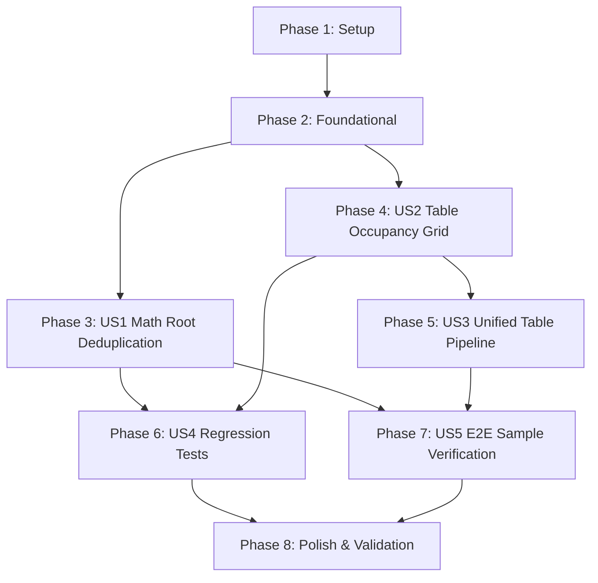

# Tasks: Table Merged-Cell Occupancy Grid Layout, Single-Pipeline Architecture, and Math Root Stroke Deduplication

**Feature Branch**: `009-table-and-math-layout-fixes` | **Spec**: [spec.md](spec.md) | **Plan**: [plan.md](plan.md)

---

## Phase 1: Setup (Shared Infrastructure)

**Purpose**: Verify repository state and ensure environment readiness.

- [X] T001 Verify git branch `009-table-and-math-layout-fixes` and clean working directory in repository root
- [X] T002 Verify development dependencies and test tools in `requirements-dev.txt`

---

## Phase 2: Foundational (Blocking Prerequisites)

**Purpose**: Core prerequisites required before user stories can execute cleanly.

- [X] T003 Guard Tkinter import in `tests/test_gui_document.py` to prevent collection crash on headless environments
- [X] T004 [P] Verify or populate multi-format sample fixtures (`sample.txt`, `sample.md`, `sample.docx`) in `tests/fixtures/`

**Checkpoint**: Foundation ready — headless test runner collects cleanly without `ModuleNotFoundError`.

---

## Phase 3: User Story 1 - Clean Mathematical Root Rendering Without Duplicate Strokes or Glyphs (Priority: P1) 🎯 MVP

**Goal**: Eliminate character and stroke double-rendering in `Root` expressions (e.g. $\sqrt{x^2+1}$), supporting optional degree ($\sqrt[3]{x}$) cleanly.

**Independent Test**: Measure $\sqrt{x^2+1}$ and assert that radicand glyphs/strokes are appended exactly once with $x \ge \text{sign\_w}$ (zero duplicate glyphs).

### Tests for User Story 1
- [X] T005 [P] [US1] Add unit tests for `Root` stroke deduplication and degree placement in `tests/test_math_layout.py`

### Implementation for User Story 1
- [X] T006 [US1] Refactor `Root` measurement to initialize empty glyphs/strokes and append shifted radicand (and optional degree) in `chuviettay/layout/math_layout.py`

**Checkpoint**: User Story 1 delivers clean, non-duplicated math roots.

---

## Phase 4: User Story 2 - Accurate Multi-Row Table Merged Cells (Rowspan) via Occupancy Grid (Priority: P1)

**Goal**: Implement canonical 2D cell occupancy grid in `TableLayoutEngine` to properly place cells with `rowspan > 1` and `colspan > 1` without overlapping.

**Independent Test**: Layout a table with cell (0, 0) having `rowspan=2`; assert row 1's cell is assigned to column 1 and does not collide with column 0.

### Tests for User Story 2
- [X] T007 [P] [US2] Add unit tests for 2D occupancy grid, rowspan placement, and interior border suppression in `tests/test_table_layout.py`

### Implementation for User Story 2
- [X] T008 [US2] Implement 2D occupancy grid `grid[row][col]` in `TableLayoutEngine.layout_table()` in `chuviettay/layout/table_layout.py`
- [X] T009 [US2] Refactor `compute_column_widths` and row padding to use occupancy grid in `chuviettay/layout/table_layout.py`
- [X] T010 [US2] Update `generate_border_strokes` and `LaidOutCell` height summation for spanned rows in `chuviettay/layout/table_layout.py`

**Checkpoint**: User Story 2 ensures all table cells with `colspan` and `rowspan` occupy exact non-overlapping coordinates.

---

## Phase 5: User Story 3 - Unified Table Layout Pipeline & Single Source of Truth (Priority: P1)

**Goal**: Unify table layout so `DocumentLayoutEngine.render()` consumes `TableLayoutData` directly from `TableLayoutEngine` with rowspan-aware page cohesion.

**Independent Test**: Render a multi-row table in `DocumentLayoutEngine`; verify cell coordinates, row heights, and borders match `TableLayoutData` without duplicate calculation.

### Tests for User Story 3
- [X] T011 [P] [US3] Add unit tests for table pagination slicing with multi-row cell group cohesion in `tests/test_table_layout.py`

### Implementation for User Story 3
- [X] T012 [US3] Add `slice_page()` method to `TableLayoutData` in `chuviettay/layout/table_layout.py`
- [X] T013 [US3] Refactor table block rendering in `DocumentLayoutEngine.render()` in `chuviettay/layout/engine.py` to delegate to `TableLayoutEngine`

**Checkpoint**: Single source of truth for table layout across the entire codebase.

---

## Phase 6: User Story 4 - Rigorous Regression Testing of Math Handwriting Strokes & Merged Cell Geometry (Priority: P1)

**Goal**: Expand regression suite asserting non-empty vector strokes (`total_glyph_strokes > 0`) for math and exact bounds for merged cells.

**Independent Test**: Run `pytest tests/test_math_layout.py tests/test_table_layout.py` and verify all assertions pass.

### Tests for User Story 4
- [X] T014 [P] [US4] Add assertions verifying `total_glyph_strokes > 0` for expressions $x^2+1$, $\sqrt{x}$, $\sqrt{x^2+1}$, $\frac{x+1}{2}$, $x_i^2$ in `tests/test_math_layout.py`
- [X] T015 [P] [US4] Add comprehensive tests for `colspan=2`, `rowspan=2`, and combined $2 \times 2$ merged cells with border suppression in `tests/test_table_layout.py`

**Checkpoint**: Regression safety net protects both math stroke synthesis and table geometry.

---

## Phase 7: User Story 5 - Real-World End-to-End Document Conversion & Xournal++ Verification (Priority: P2)

**Goal**: Convert representative `sample.txt`, `sample.md`, and `sample.docx` documents to `.xopp` and verify vector stroke and layout validity.

**Independent Test**: Execute CLI conversion on all three sample files and assert zero errors and valid `.xopp` gzip archive structure.

### Implementation & Verification for User Story 5
- [X] T016 [P] [US5] Add end-to-end integration tests for multi-format sample document conversion in `tests/test_cli_format.py`
- [X] T017 [US5] Verify generated `.xopp` documents for valid XML stroke output and visual layout integrity

**Checkpoint**: Real-world documents convert cleanly to `.xopp`.

---

## Phase 8: Polish & Cross-Cutting Concerns

**Purpose**: Final quality gates, validation execution, and documentation.

- [X] T018 Run entire automated test suite with `pytest -v` across all modules
- [X] T019 Execute validation scenarios from `specs/009-table-and-math-layout-fixes/quickstart.md`
- [X] T020 Update project changelog in `CHANGELOG.md` with table occupancy grid and math root deduplication fixes

---

## Dependencies & Execution Order

### Phase Dependencies
- **Setup (Phase 1)**: Independent, can run immediately.
- **Foundational (Phase 2)**: Depends on Phase 1, unblocks clean test collection.
- **User Story 1 (Phase 3)**: Independent of table layout, can run immediately after Foundational.
- **User Story 2 (Phase 4)**: Independent of math layout, can run immediately after Foundational.
- **User Story 3 (Phase 5)**: Depends on User Story 2 (`TableLayoutEngine` occupancy grid and `TableLayoutData`).
- **User Story 4 (Phase 6)**: Validates User Story 1 and User Story 2.
- **User Story 5 (Phase 7)**: Validates the integrated pipeline (User Stories 1–3).
- **Polish (Phase 8)**: Runs after all User Stories are completed.

### Parallel Opportunities
- T003 (Tkinter guard) and T004 (Fixtures) can run in parallel.
- User Story 1 (T005, T006) and User Story 2 (T007, T008) touch completely different files (`math_layout.py` vs `table_layout.py`) and can run concurrently.
- T014 (Math tests) and T015 (Table tests) can run in parallel.

---

## Implementation Strategy

### MVP First (User Story 1 & User Story 2)
1. Complete Phase 1 & 2 (Setup & Foundational collection safety).
2. Implement User Story 1: Fix math root duplicate glyphs/strokes.
3. Validate User Story 1 independently with `pytest tests/test_math_layout.py`.
4. Implement User Story 2: Fix table rowspan occupancy grid in `table_layout.py`.
5. Validate User Story 2 independently with `pytest tests/test_table_layout.py`.

### Incremental Delivery
1. Unify table pipeline in `engine.py` (User Story 3).
2. Add regression tests (User Story 4).
3. Test sample files (User Story 5).
4. Run full test suite & update changelog (Phase 8).
