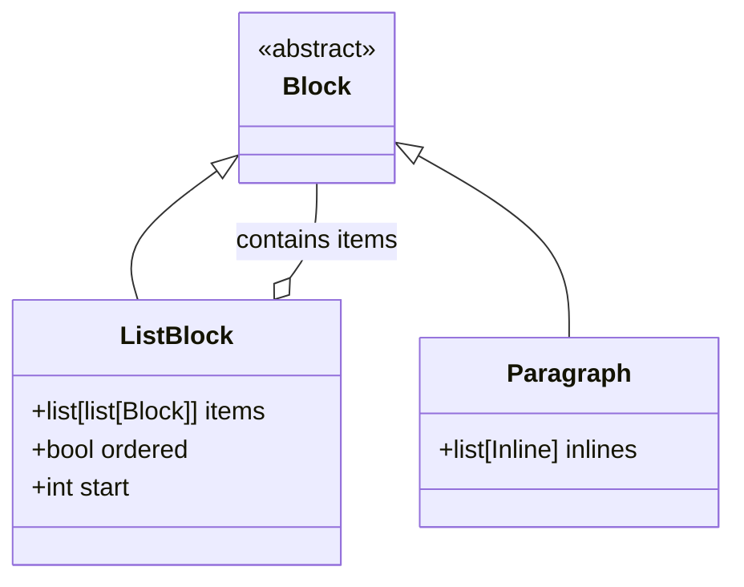
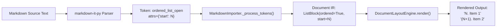

# Data Model: Markdown List Numbering & Document IR

**Feature Branch**: `010-markdown-ordered-list-start`
**Date**: 2026-09-30
**Spec**: [spec.md](spec.md)

---

## 1. Document IR Entity: `ListBlock`

The `ListBlock` class in `chuviettay.document.ir` encapsulates an ordered or unordered list of items.

### Fields
| Field | Type | Default | Description |
|---|---|---|---|
| `items` | `list[list[Block]]` | Required | List of item content blocks. Each item can contain one or more blocks (typically `Paragraph`). |
| `ordered` | `bool` | `False` | Whether the list is numbered (`True`) or bulleted (`False`). |
| `start` | `int` | `1` | The starting integer for item numbering when `ordered=True`. |

### Invariants
1. For an ordered list with $K$ items starting at $S = \text{start}$, item $i \in [0, K-1]$ is prefixed with $(S + i)$.
2. If `ordered == False`, `start` has no effect on rendering (bullet `- ` is always used).
3. `start` can be any integer ($\ge 0$, or negative if explicitly declared in source).

---

## 2. Token Stream Mapping

### Token to Entity Translation
| Markdown Syntax | `markdown-it-py` Token | Token Attributes | Resulting `ListBlock` | Rendered Line Prefix |
|---|---|---|---|---|
| `1. A` `2. B` | `ordered_list_open` | `{}` (or `None`) | `ListBlock(ordered=True, start=1)` | `1. A` `2. B` |
| `4. D` `5. E` | `ordered_list_open` | `{'start': 4}` | `ListBlock(ordered=True, start=4)` | `4. D` `5. E` |
| `0. Zero` | `ordered_list_open` | `{'start': 0}` | `ListBlock(ordered=True, start=0)` | `0. Zero` |
| `- A` `- B` | `bullet_list_open` | `{}` | `ListBlock(ordered=False, start=1)` | `- A` `- B` |
