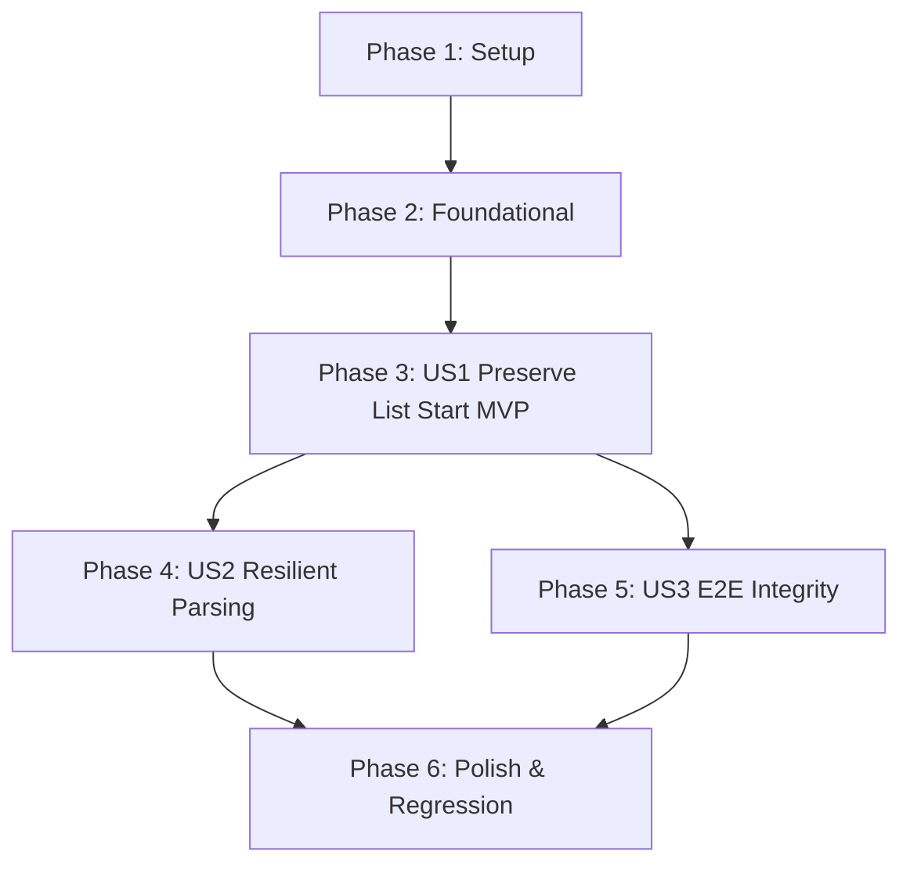

# Tasks: Preserve Markdown Ordered List Start Numbering

**Feature Branch**: `010-markdown-ordered-list-start` | **Spec**: [spec.md](spec.md) | **Plan**: [plan.md](plan.md)

---

## Phase 1: Setup (Shared Infrastructure)

**Purpose**: Verify repository state and ensure environment readiness.

- [X] T001 Verify git branch `010-markdown-ordered-list-start` and clean working directory in repository root
- [X] T002 Verify markdown parsing dependencies (`markdown-it-py`, `mdit-py-plugins`) in Python environment

---

## Phase 2: Foundational (Blocking Prerequisites)

**Purpose**: Establish helper infrastructure before user stories begin.

- [X] T003 Implement `_extract_list_start(tok)` helper method signature and logic in `chuviettay/importer/markdown_importer.py`

**Checkpoint**: Foundation ready — token attribute extraction helper is available for list block processing.

---

## Phase 3: User Story 1 - Preserve Start Number for Ordered Lists Split by Unindented Blocks (Priority: P1) 🎯 MVP

**Goal**: Preserve starting index when an ordered list starts at a number other than 1 (e.g. `4. D`) or is interrupted by an unindented block (e.g. `1..3` -> Table -> `4..5`).

**Independent Test**: Parse a Markdown document with an interrupted list and assert that the second `ListBlock.start == 4`.

### Tests for User Story 1
> **NOTE: Write these tests FIRST, ensure they fail before implementation**
- [X] T004 [P] [US1] Add unit tests for custom list start and table-interrupted lists in `tests/test_importer_markdown.py`

### Implementation for User Story 1
- [X] T005 [US1] Update `MarkdownImporter.import_text()` to extract `start` on `ordered_list_open` and instantiate `ListBlock(ordered=is_ordered, items=items, start=start)` in `chuviettay/importer/markdown_importer.py`
- [X] T006 [US1] Verify that `DocumentLayoutEngine.render()` produces correct prefixes `4. `, `5. ` for `ListBlock(start=4)` in `chuviettay/layout/engine.py`

**Checkpoint**: User Story 1 delivers correct start numbering for split lists in Markdown.

---

## Phase 4: User Story 2 - Resilient Parsing of Token Attributes (Priority: P2)

**Goal**: Safely parse attributes regardless of token representation (dictionary, list of tuples, helper method) and handle malformed attributes without exceptions.

**Independent Test**: Pass tokens with dict, list-of-tuples, None, and non-integer attribute values into `_extract_list_start()`; verify fallback to 1 with zero crashes.

### Tests for User Story 2
- [X] T007 [P] [US2] Add unit tests for diverse token attribute structures (dict, list-of-pairs, None, malformed strings) in `tests/test_importer_markdown.py`

### Implementation for User Story 2
- [X] T008 [US2] Harden `_extract_list_start()` with defensive checks and `(ValueError, TypeError)` exception handling in `chuviettay/importer/markdown_importer.py`

**Checkpoint**: User Story 2 guarantees 100% crash-free parsing for all attribute variants.

---

## Phase 5: User Story 3 - End-to-End Multi-Block Document Integrity (Priority: P3)

**Goal**: Validate full pipeline from Markdown source to handwriting strokes and `.xopp` file, ensuring sequential numbering integrity end-to-end.

**Independent Test**: Run CLI conversion on Markdown containing an interrupted list and verify output XML stroke prefixes.

### Tests for User Story 3
- [X] T009 [P] [US3] Add integration test asserting rendered line prefixes for split lists in `tests/test_document_pipeline.py`
- [X] T010 [P] [US3] Add CLI test converting Markdown fixture with split list to `.xopp` in `tests/test_cli_format.py`

**Checkpoint**: User Story 3 confirms end-to-end document conversion maintains sequential numbering fidelity.

---

## Phase 6: Polish & Cross-Cutting Concerns

**Purpose**: Quality gates, static analysis, full regression run, and documentation.

- [X] T011 Run linter `ruff check chuviettay tests` and resolve any warnings
- [X] T012 Run full automated test suite with `pytest -v --timeout=30` across all modules
- [X] T013 Execute validation scenario from `specs/010-markdown-ordered-list-start/quickstart.md`
- [X] T014 Update project changelog in `CHANGELOG.md` with markdown ordered list start preservation

---

## Dependencies & Execution Order

### Phase Dependencies
- **Setup (Phase 1)**: Independent, can run immediately.
- **Foundational (Phase 2)**: Depends on Setup.
- **User Story 1 (Phase 3)**: Depends on Foundational. Delivers MVP.
- **User Story 2 (Phase 4)**: Enhances attribute resilience in `markdown_importer.py`.
- **User Story 3 (Phase 5)**: Depends on User Story 1 (validates integrated pipeline).
- **Polish (Phase 6)**: Runs after all user stories are complete.

### Parallel Opportunities
- T004 (US1 tests) and T007 (US2 tests) can be drafted together.
- T009 (pipeline integration test) and T010 (CLI test) can run in parallel.
- Polish tasks T011 (ruff) and T012 (pytest) run sequentially as final validation.

---

## Implementation Strategy

### MVP First (User Story 1)
1. Write failing test in `tests/test_importer_markdown.py` reproducing the table-interrupted list numbering bug.
2. Implement `_extract_list_start()` and pass `start=start` to `ListBlock` in `chuviettay/importer/markdown_importer.py`.
3. Validate User Story 1: `pytest tests/test_importer_markdown.py -v`.

### Incremental Delivery
1. Harden attribute parsing with edge cases (User Story 2).
2. Add end-to-end pipeline and CLI tests (User Story 3).
3. Run lint, full test suite (334+ tests), and update changelog (Phase 6).
