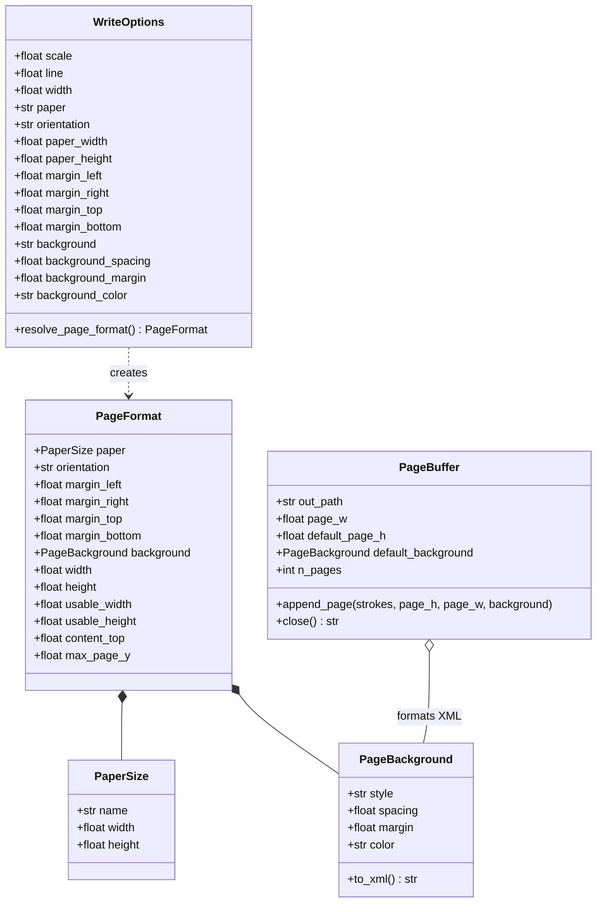

# Data Model: Paper Sizes, Page Margins & Native Backgrounds

**Feature Branch**: `011-paper-size-and-background` | **Date**: 2026-09-30 | **Spec**: [spec.md](spec.md)

---

## 1. Entities Overview



---

## 2. Entity Details

### 2.1 `PaperSize`
An immutable representation of physical sheet dimensions in PostScript points ($1\text{ pt} = 1/72\text{ in}$, $1\text{ mm} \approx 2.83464567\text{ pt}$).

```python
@dataclass(frozen=True)
class PaperSize:
    name: str
    width: float   # in PostScript points
    height: float  # in PostScript points
```

**Predefined Standard Library (`PAPER_SIZES`)**:
- `"a5"`: `PaperSize("A5", 419.53, 595.28)`
- `"a4"`: `PaperSize("A4", 595.28, 841.89)`
- `"a3"`: `PaperSize("A3", 841.89, 1190.55)`
- `"letter"`: `PaperSize("US Letter", 612.00, 792.00)`
- `"legal"`: `PaperSize("US Legal", 612.00, 1008.00)`
- `"16:9"`: `PaperSize("16:9", 841.89, 473.56)`
- `"4:3"`: `PaperSize("4:3", 792.00, 594.00)`

### 2.2 `PageBackground`
Specifies native Xournal++ page background styling.

```python
VALID_BACKGROUND_STYLES = {
    "plain", "lined", "ruled", "graph", "dotted", "iso_graph", "iso_dotted", "music"
}

@dataclass(frozen=True)
class PageBackground:
    style: str = "plain"               # must be in VALID_BACKGROUND_STYLES
    spacing: float | None = None       # grid/line interval in pt (e.g. 14.17 pt = 5mm)
    margin: float | None = None        # vertical left margin line offset in pt (for ruled paper)
    color: str = "#ffffffff"           # 8-char RGBA hex string (default solid white)

    def to_xml(self) -> str:
        """Sinh chuỗi XML thẻ <background> theo chuẩn XOPP."""
```

**Security & Sanitization**:
- `style`: validated against whitelist `VALID_BACKGROUND_STYLES` (fallback to `"plain"` if unrecognized).
- `color`: validated against regex `^#[0-9a-fA-F]{6}([0-9a-fA-F]{2})?$` (raises `ValueError` or normalizes).
- `config` attribute:
  - If `spacing is not None`: `parts.append(f"r1={fmt(self.spacing)}")`
  - If `margin is not None`: `parts.append(f"m1={fmt(self.margin)}")`
  - Formatted safely as `config="..."`.

### 2.3 `PageFormat`
The fully resolved layout geometry governing a document or individual page.

```python
@dataclass(frozen=True)
class PageFormat:
    paper: PaperSize
    orientation: str = "portrait"      # "portrait" | "landscape"
    margin_left: float = 36.0          # in pt
    margin_right: float = 36.0         # in pt
    margin_top: float = 40.0           # in pt
    margin_bottom: float = 40.0        # in pt
    background: PageBackground = field(default_factory=PageBackground)

    @property
    def width(self) -> float:
        w, h = self.paper.width, self.paper.height
        if self.orientation == "landscape":
            return max(w, h)
        return min(w, h)

    @property
    def height(self) -> float:
        w, h = self.paper.width, self.paper.height
        if self.orientation == "landscape":
            return min(w, h)
        return max(w, h)

    @property
    def usable_width(self) -> float:
        return max(20.0, self.width - self.margin_left - self.margin_right)

    @property
    def usable_height(self) -> float:
        return max(20.0, self.height - self.margin_top - self.margin_bottom)

    @property
    def content_top(self) -> float:
        return self.margin_top

    @property
    def max_page_y(self) -> float:
        return self.height - self.margin_bottom
```

### 2.4 `WriteOptions` (Model Layer Extension)
Carries paper and background configurations alongside text synthesis parameters.

```python
@dataclass
class WriteOptions:
    # Existing synthesis fields
    scale: float = 1.0
    line: float | None = None
    width: float | None = None
    space: float = 1.0
    jitter: float = 1.0
    wscale: float = 1.0
    color: str | None = None
    seed: int | None = None
    strict_case: bool = False

    # New paper & background fields
    paper: str = "a4"
    orientation: str = "portrait"
    paper_width: float | None = None
    paper_height: float | None = None
    margin_left: float = 36.0
    margin_right: float = 36.0
    margin_top: float = 40.0
    margin_bottom: float = 40.0
    background: str = "plain"
    background_spacing: float | None = None
    background_margin: float | None = None
    background_color: str = "#ffffffff"

    def resolve_page_format(self) -> PageFormat:
        """Resolve concrete PageFormat based on options."""
```

### 2.5 `PageBuffer` (Streaming XML Layer)

```python
class PageBuffer:
    def __init__(
        self,
        out_path: str,
        page_w: float,
        default_page_h: float = MAXH,
        default_background: PageBackground | None = None,
    ): ...

    def append_page(
        self,
        page_strokes: list[str],
        page_h: float | None = None,
        page_w: float | None = None,
        background: PageBackground | None = None,
    ) -> None:
        """Ghi một trang hoàn chỉnh với kích thước và nền XML tương ứng."""
```

---

## 3. Unit Conversion Utility

### `parse_length(val: str | float | int, default_unit: str = "pt") -> float`
Handles conversions:
- `pt`: $1.0\text{ pt}$
- `mm`: $72.0 / 25.4 \approx 2.83464567\text{ pt}$
- `cm`: $10 \times (72.0 / 25.4) \approx 28.3464567\text{ pt}$
- `in`, `inch`: $72.0\text{ pt}$

**Validation**:
- Rejects negative lengths with `ValueError`.
- Strips whitespace and handles units case-insensitively (`5MM` == `5mm`).
- Defaults unannotated numbers to points (`pt`).
