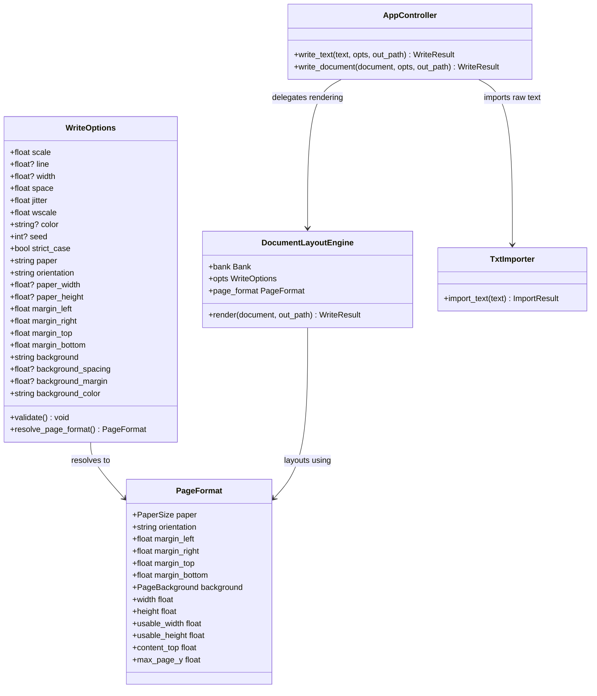

# Data Model: Unified Document IR Pipeline & Margin Boundaries

**Feature**: `012-unify-write-text-pipeline` | **Date**: 2026-09-30

---

## 1. Domain Entities & Data Structures



---

## 2. Validation Rules & Constraints

### Margin Boundary Validation
Inside `WriteOptions.validate()`:
1. `pf = self.resolve_page_format()`
2. Compute `effective_width = pf.width` and `effective_height = pf.height`.
3. **Horizontal Bound**: If `self.margin_left + self.margin_right >= effective_width`:
   - Raise `ValueError(f"Tổng lề trái ({self.margin_left} pt) và lề phải ({self.margin_right} pt) phải nhỏ hơn bề ngang trang ({effective_width} pt).")`.
4. **Vertical Bound**: If `self.margin_top + self.margin_bottom >= effective_height`:
   - Raise `ValueError(f"Tổng lề trên ({self.margin_top} pt) và lề dưới ({self.margin_bottom} pt) phải nhỏ hơn bề dọc trang ({effective_height} pt).")`.

---

## 3. Pipeline Flow Comparison

### Legacy Flow (Deprecated)
```text
GUI Direct Text -> ctl.write_text() -> composer.write_document() -> composer.compose_document()
(Uses fixed MAXH=3000, bank.d['x0'], xopp.PAGE_OPEN - Ignores paper/background options!)
```

### Unified Modern Flow
```text
GUI Direct Text \
CLI -t / -f / stdin -> TxtImporter().import_text(text).document \
Markdown / DOCX /                                                -> DocumentLayoutEngine.render() -> PageBuffer -> XOPP
(Strictly applies PaperFormat, PageBackground, exact dimensions per page, 0 artificial strokes)
```
