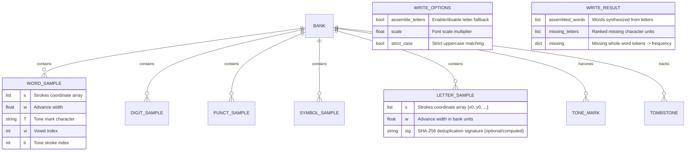

# Data Model: Letter-Level Handwriting Assembly & Fallback Synthesis

**Feature**: `016-letter-assembly-synthesis`  
**Date**: 2026-09-30  
**Status**: Final  

---

## 1. Entities & Data Structures



---

## 2. Entity Details

### 2.1. Letter Sample (`LETTER_SAMPLE`)
A single handwritten sample of an individual character unit (e.g. `'a'`, `'b'`, `'đ'`, `'A'`).
- **Fields**:
  - `s: list[list[float]]`: List of strokes. Each stroke is a flat list of alternating coordinates `[x0, y0, x1, y1, ...]`.
  - `w: float`: Positive finite float representing the advance width of the letter in bank units (relative to x-height `xh`).
  - `_sig: str | None`: Optional SHA-256 hash string derived from normalized coordinates for fast in-memory deduplication.
- **Validation Rules**:
  - `s` must be non-empty list of strokes.
  - Each stroke must contain an even number of coordinates ($\ge 2$).
  - All coordinates must be finite real numbers.
  - `w` must be a strictly positive finite number ($w > 0$).
  - Baseline alignment: coordinates are normalized such that the letter's baseline rests at $y = 0$ and the leftmost stroke coordinate starts at $x = 0$.

### 2.2. Letter Bank (`bank.letters`)
A top-level container in the `Bank` dictionary mapping character labels to arrays of letter samples.
- **Type**: `dict[str, list[dict]]`
- **Key**: Single character string in NFC (e.g., `'a'`, `'ă'`, `'â'`, `'b'`, ..., `'A'`, `'B'`).
- **Value**: List of `LETTER_SAMPLE` dictionaries. Multiple samples per letter allow rotation to avoid visual repetition (`Writer.pick`).

### 2.3. Missing Letter Descriptor (`MissingLetterInfo`)
A descriptor representing a missing letter or tone unit identified during document analysis.
- **Fields**:
  - `char: str`: Character or tone mark name (e.g., `'a'`, `'đ'`, or tone mark character `\u0300`).
  - `unlock_count: int`: Number of unlearned words that depend on this letter.
  - `unlocked_words: list[str]`: List of specific unlearned words unlocked by teaching this letter.

### 2.4. WriteOptions Extension
- `assemble_letters: bool`: Default `False`.
  - When `True`: Enables letter-level assembly fallback in `Writer.word()`.
  - When `False`: Bypasses letter assembly; preserves 100% byte parity with golden master outputs.

### 2.5. WriteResult Extension
- `assembled_words: list[str]`: Default empty list `[]`. Contains the list of word tokens successfully synthesized via letter assembly during the render run.
- `missing_letters: list[str]`: Default empty list `[]`. Contains the list of missing base letters (ordered by greedy coverage) needed by remaining unlearned words.

---

## 3. Storage Schema Evolution (Schema v4)

### Schema v4 Structure
```json
{
  "schema_version": 4,
  "xh": 7.0,
  "line": 24.0,
  "width": 500.0,
  "x0": 78.0,
  "wgaps": [11.0],
  "dgaps": [3.5],
  "ratio": 6.6,
  "v": 1,
  "pen": {
    "tool": "pen",
    "color": "#000000ff",
    "width": "1.2",
    "capStyle": "round"
  },
  "words": {},
  "digits": {},
  "punct": {},
  "symbols": {},
  "letters": {},
  "tombstones": {},
  "generation": 0
}
```

### Migration Specification
1. **From v1 to v2**: Adds `schema_version = 2`, populates missing metrics (`line`, `width`, `x0`, etc.).
2. **From v2 to v3**: Adds `schema_version = 3`, initializes `"symbols": {}`.
3. **From v3 to v4**:
   - Sets `d["schema_version"] = 4`.
   - Ensures `"letters": {}` exists.
   - Preserves all existing `words`, `digits`, `punct`, `symbols`, `tombstones`, and `generation`.

### Concurrency & Tombstone Rules
- **Category set**: `"letters"` participates alongside `"words"`, `"digits"`, `"punct"`, `"symbols"`.
- **Deletion**: When `drop(label)` or `drop_letter(label)` is called:
  - Samples are removed from `bank.letters[label]`.
  - `generation` increments.
  - `tombstones[label] = {"deleted_at": time.time(), "generation": bank._generation}`.
- **Merging**: During `merge_bank_dicts()`:
  - If a label exists in `disk["letters"]` but has a tombstone in `base` or `disk` with timestamp $\ge$ disk timestamp, it is excluded.
  - New samples from disk are deduplicated via `_sample_signature()`.
