# Tasks: High-Fidelity Letter Assembly & Handwriting Synthesis Quality

**Input**: Design artifacts from `specs/017-letter-assembly-quality/` (`spec.md`, `plan.md`, `data-model.md`, `research.md`, `contracts/`, `quickstart.md`)  
**Branch**: `017-letter-assembly-quality`  
**Status**: Ready for Execution  

---

## Phase 1: Setup (Baseline & Quality Infrastructure)

**Purpose**: Establish test baseline, verify repository invariants, and initialize measurement tooling.

- [X] T001 Verify active development environment dependencies via `requirements-dev.txt` and record initial test baseline (1008 passed, 7 skipped).
- [X] T002 [P] Create standard acceptance text fixture in `tests/data/accept_sample.txt` matching error case document.
- [X] T003 [P] Ensure `.gitignore` explicitly excludes private handwriting directories (`local_data/` and `local data/`).

---

## Phase 2: Foundational — Phase 0: Measurement & Baseline Diagnostics

**Purpose**: Build objective measurement tools, establish target handwriting profile from authentic note, and resolve data anomalies before any algorithm modifications.

**CRITICAL**: Must stop and report to user after Phase 0 before starting Phase 1 implementation.

- [X] T004 Implement standalone vector renderer `tools/render_xopp.py` using `xml.etree.ElementTree` and Pillow to render `.xopp` pages to PNG with stroke widths, colors, and crop support.
- [X] T005 [P] Implement quantitative ink measurement tool `tools/measure_ink.py` to calculate x-height distributions, stroke-thickness-to-x-height ratios, inter-letter gaps, adjacent bbox overlap, and group variance.
- [X] T006 Measure authentic handwriting baseline from `local data/2026-09-20-Note-17-02.xopp` and document target values in `docs/do_luong_ban_goc.md`.
- [X] T007 Run pre-fix baseline measurement on current synthesis output of `tests/data/accept_sample.txt` and document defect metrics in `docs/do_luong_ban_goc.md`.
- [X] T008 Document verification findings for prompt item 3.6 in `docs/do_luong_ban_goc.md` confirming dual-path root cause (precomposed vs decomposed marks).

**Checkpoint**: STOP AND REPORT Phase 0 measurement targets to user for numerical sign-off before proceeding to Phase 1. (COMPLETED - WAITING FOR USER CONFIRMATION)


---

## Phase 3: User Story 5 - Non-Destructive Bank Migration & Diagnostics (Priority: P2)

**Goal**: Upgrade legacy v3 single-character banks to Schema v3/v4 with normalized metrics, side bearings, and extracted tone marks without modifying source files.

**Independent Test**: Migrate `local data/kho_mau_ky_tu.json.gz` to `local data/kho_mau_v4.json.gz`; verify all 178 initial keys are preserved, normalized, and schema-valid.

### Tests for User Story 5
- [X] T009 [P] [US5] Add unit tests for bank migration and non-destructive output in `tests/test_migrate_letter_bank.py`.
- [X] T010 [P] [US5] Add tests for side bearing calculations and glyph contour classification in `tests/test_letter_metrics.py`.

### Implementation for User Story 5
- [X] T011 [US5] Implement pure mathematical functions in `chuviettay/model/text_utils.py` for computing left/right side bearings (`lsb`, `rsb`), advance width, and edge contour classification (`CURVED`, `STRAIGHT`, `OPEN`).
- [X] T012 [US5] Implement letter normalization logic in `chuviettay/model/text_utils.py` to scale samples uniformly to target x-height and anchor baseline to $y = 0$.
- [X] T013 [US5] Implement grid-aware tone extraction in `scripts/migrate_letter_bank.py` to separate base vowels and tone marks from labeled grid cells using relative height thresholds.
- [X] T014 [US5] Implement CLI migration script `scripts/migrate_letter_bank.py` with atomic write, `--target-xh`, and Schema v3/v4 compatibility.
- [X] T015 [US5] Enhance missing character reporting in `chuviettay/model/text_utils.py` to report missing letters, tone marks, punctuation, and math symbols explicitly.

**Checkpoint**: Bank migration script runs cleanly, producing normalized samples with verified side bearings and decomposed tone marks. (COMPLETED)

---

## Phase 4: User Story 1 - Natural Spacing & Non-Overlapping Letter Assembly (Priority: P1)

**Goal**: Synthesize words with natural optical kerning and strict stroke clearance, eliminating overlapping ink blobs ("pipeline", "penguins").

**Independent Test**: Synthesize words containing varied boundary shapes; assert adjacent bbox overlap $\le 10\%$ and stroke clearance $\ge 0.8 \times \text{pen\_thickness}$.

### Tests for User Story 1
- [X] T016 [P] [US1] Create quality invariant test suite in `tests/test_letter_assembly_quality.py` asserting clearance floor and bounding-box overlap bounds.
- [X] T017 [P] [US1] Add kerning pair test cases in `tests/test_letter_assembly.py` for straight-to-straight, curve-to-curve, and open-to-closed letter pairs.

### Implementation for User Story 1
- [X] T018 [US1] Implement boundary contour pair gap lookup table in `chuviettay/model/text_utils.py` (`contour_pair_gap`).
- [X] T019 [US1] Implement efficient nearest-point stroke clearance calculation in `chuviettay/model/text_utils.py` using boundary point subsets.
- [X] T020 [US1] Rewrite `Writer.assemble_word` advance logic in `chuviettay/model/writer.py` to advance by `w + rsb + pair_gap + lsb` instead of subtracting overlap.
- [X] T021 [US1] Add stroke clearance floor enforcement in `Writer.assemble_word` in `chuviettay/model/writer.py` to nudge letters rightward when minimum distance $< k \times \text{pen\_thickness}$.
- [X] T022 [US1] Ensure jitter in `chuviettay/model/writer.py` is clamped so that randomized displacement never violates the minimum clearance floor.

**Checkpoint**: Words like "pipeline" and "penguins" synthesize with clear white space between strokes and zero ink pooling. (COMPLETED)

---

## Phase 5: User Story 2 - Proportions, x-Height Normalization & Dynamic Stroke Scaling (Priority: P1)

**Goal**: Match handwriting proportions, x-heights, and stroke weights to authentic note writing, eliminating "cục mực" (heavy ink blobs).

**Independent Test**: Synthesize acceptance sample with `--auto-xh` and measure output via `measure_ink.py`; assert median x-height matches note within 10% and stroke-to-xh ratio matches within 15%.

### Tests for User Story 2
- [X] T023 [P] [US2] Add unit tests in `tests/test_letter_assembly_quality.py` for stroke width scaling and group-based x-height normalization.

### Implementation for User Story 2
- [X] T024 [US2] Implement group-based character categorization (`x_height`, `ascender`, `descender`, `uppercase`) in `chuviettay/model/text_utils.py`.
- [X] T025 [US2] Update `WriteOptions` and `Composer` in `chuviettay/model/composer.py` to support `letter_gap`, `target_xh`, `auto_xh`, and `pen_clearance_factor`.
- [X] T026 [US2] Implement dynamic stroke thickness adjustment (`wscale` compensation) in `chuviettay/model/composer.py` and `chuviettay/layout/engine.py` to preserve authentic stroke-to-height ratio.
- [X] T027 [US2] Expose `--letter-gap`, `--target-xh`, `--auto-xh`, and `--pen-clearance` flags in `chuviettay/cli.py` and forward through `app_controller.py`.

**Checkpoint**: Synthesized letters have uniform lowercase heights and stroke weight proportional to authentic note handwriting. (COMPLETED)

---

## Phase 6: User Story 3 - Robust Tone Mark Placement & Vietnamese Diacritic Assembly (Priority: P1)

**Goal**: Render all Vietnamese accented words without omissions, supporting both precomposed glyphs and decomposed tone marks with collision-free placement.

**Independent Test**: Render `tests/data/accept_sample.txt`; verify 100% of accented words ("Lời giải", "Bài", "Chạy", "Điều kiện"...) render complete strokes with proper tone placement and no missing characters.

### Tests for User Story 3
- [X] T028 [P] [US3] Add unit tests in `tests/test_letter_assembly.py` for Dual-Path assembly (precomposed letter match vs decomposed base + mark).
- [X] T029 [P] [US3] Add test cases in `tests/test_letter_assembly.py` verifying `i`/`j` dot removal when upper tones are affixed and collision avoidance with ascenders.

### Implementation for User Story 3
- [X] T030 [US3] Implement Dual-Path character resolution in `Writer.assemble_word` in `chuviettay/model/writer.py`: check for precomposed character sample before falling back to base vowel + tone mark.
- [X] T031 [US3] Implement vowel centroid and bounding box tone placement in `Writer.assemble_word` in `chuviettay/model/writer.py` with ascender collision avoidance.
- [X] T032 [US3] Refactor `i`/`j` tittle suppression in `chuviettay/model/writer.py` using relative bounding-box thresholds instead of hardcoded coordinates.
- [X] T033 [US3] Expand token character lookup cascade in `Writer.assemble_word` to support mixed technical tokens (`_`, `(`, `)`, digits) across `bank.digits`, `bank.punct`, and `bank.symbols`.
- [X] T034 [US3] Implement fallback for math and programming symbols (`_`, `>=`, `<`, `---`) to vector glyphs in `chuviettay/model/writer.py` without violating architectural layer boundaries.

**Checkpoint**: All accented words in the acceptance sample render legibly with proper tone marks, and technical identifiers (`bill_length_mm`, `query(`, `>=`) render without error. (COMPLETED)

---

## Phase 7: User Story 4 - Redesigned Collection Grid (`hw3`) & Instructions (Priority: P2)

**Goal**: Provide a 4-line collection grid template (`hw3`) with vertical margin boundaries and explicit Vietnamese guidelines so users collect high-quality handwriting samples.

**Independent Test**: Generate `hw3` grid sheet to XOPP; verify 4 guide lines, 2 margin lines, clear Vietnamese instructions, and successful ingestion via `learn`.

### Tests for User Story 4
- [X] T035 [P] [US4] Add unit tests in `tests/test_grid_hw3.py` for generating `hw3` grid and validating guide line coordinates.
- [X] T036 [P] [US4] Add ingestion tests in `tests/test_grid_hw3.py` ensuring `learn` successfully parses both `hw3` and legacy `hw2`/`hw2c` grids.

### Implementation for User Story 4
- [X] T037 [US4] Define `hw3` layout constants and metadata tag in `chuviettay/model/xopp.py` without mutating legacy `config.py` constants.
- [X] T038 [US4] Implement `make_letter_grid` in `chuviettay/model/xopp.py` featuring 4 guide lines (baseline, xh, ascender, descender), left/right side margins, and 2-3 cells per letter.
- [X] T039 [US4] Add high-frequency Vietnamese digraphs (`ng, nh, ch, tr, ph, th, kh, gi, qu, ươ, ưa, uy, ay, oa`) to the `hw3` grid generator in `chuviettay/model/xopp.py`.
- [X] T040 [US4] Render grid cell prompt labels using vector strokes or unicode typography in `chuviettay/model/xopp.py` so accented labels (`ă, â, đ, ê, ô, ơ, ư`) never show square boxes (□).
- [X] T041 [US4] Embed explicit Vietnamese user instructions on grid pages explaining letter height, unlinked print style, and writing cadence.
- [X] T042 [US4] Extend grid learning parser in `chuviettay/model/xopp.py` / `chuviettay/controller/app_controller.py` to auto-detect `hw3`, filter guide lines, and extract side bearings.

**Checkpoint**: `hw3` grid exports cleanly with legible Vietnamese instructions and imports accurately into the handwriting bank. (COMPLETED)

---

## Phase 7b: User Story 4 Extension - Standalone Tone Mark Cells on `hw3` Grid (Priority: P2)

**Goal**: Provide dedicated standalone cells for 5 Vietnamese tone marks (sắc, huyền, hỏi, ngã, nặng) on the `hw3` collection grid featuring a faint ghost vowel `o` (`#e8e8e8`) for reference positioning, and ingest them directly into `bank.marks`.

**Independent Test**: Generate `hw3` grid with standalone tone cells; verify ghost `o` guide strokes are rendered in `#e8e8e8`; simulate user hand-drawn accents; verify ingestion filters ghost `o`, calculates $(dx, dy)$ relative to vowel centroid, and stores marks into `bank.marks`.

### Tests for Standalone Tone Mark Cells
- [ ] T049 [P] [US4] Add unit tests in `tests/test_grid_hw3.py` for generating `hw3` grid with standalone tone cells (ghost vowel `o` in `#e8e8e8`) and parsing user strokes into `bank.marks` with proper $(dx, dy)$ offsets.

### Implementation for Standalone Tone Mark Cells
- [ ] T050 [US4] Add `#e8e8e8` to `HW3_GUIDE_COLORS` in `chuviettay/model/xopp.py` so ghost vowel strokes are recognized as guidelines and filtered out during learning.
- [ ] T051 [US4] Refactor `Bank.add_tone_sample` in `chuviettay/model/bank.py` to support `strokes: list[Stroke] | Stroke`, compute collective centroid $(cx, cy)$ across all constituent strokes, and deduplicate identical marks.
- [ ] T052 [US4] Define `HW3_TONE_LABELS` and implement ghost vowel `o` rendering helper in `make_letter_grid` in `chuviettay/model/xopp.py` for standalone tone mark cells.
- [ ] T053 [US4] Implement tone cell routing and size validation guard in `learning.learn_from_files` in `chuviettay/model/learning.py` to extract $(dx, dy)$ relative to ghost vowel centroid/baseline and save into `bank.marks`.
- [ ] T054 [P] [US4] Update `app_controller.py` default grid export to append the 5 standalone tone cells (`dấu sắc`, `dấu huyền`, `dấu hỏi`, `dấu ngã`, `dấu nặng`).
- [ ] T055 Run full regression suite `pytest --timeout=30`, `pytest tests/test_architecture.py`, and `pytest tests/test_golden_master.py` to ensure zero regressions.

---

## Phase 8: Polish, Golden Master Verification & Final Acceptance (Phase 5)

**Purpose**: Run full regression suite, enforce golden-master byte parity, update documentation, and produce final visual acceptance report.

- [X] T043 Verify 100% byte-for-byte SHA-256 parity on `tests/test_golden_master.py` with `assemble_letters=False`.
- [X] T044 [P] Run full test suite `pytest --timeout=30` and ensure zero newly failing tests.
- [X] T045 [P] Run architecture boundary verification via `pytest tests/test_architecture.py`.
- [X] T046 Run `tools/measure_ink.py` on the final synthesized output of `tests/data/accept_sample.txt` and verify all acceptance metrics in `docs/do_luong_ban_goc.md`:
  - Adjacent bbox overlap $\le 10\%$
  - Min stroke clearance $\ge 0.8 \times \text{pen\_thickness}$
  - Median x-height within $10\%$ of note
  - Stroke-to-xh ratio within $15\%$ of note
  - Lowercase x-height standard deviation reduced by $\ge 50\%$
- [X] T047 Render final before/after comparison PNGs using synthetic test bank into `docs/img/` (no private user data committed).
- [X] T048 [P] Update `README.md` and `CHANGELOG.md` with letter assembly quality options, `hw3` grid instructions, and migration guide.

---

## Dependencies & Execution Order

```mermaid
flowchart TD
    subgraph Setup_Phase_0 ["Phase 1 & 2: Setup and Phase 0 Diagnostics"]
        T001["T001: Environment baseline"]
        T002["T002: Acceptance fixture"]
        T003["T003: .gitignore check"]
        T004["T004: render_xopp.py"]
        T005["T005: measure_ink.py"]
        T006["T006: Note baseline measurement"]
        T007["T007: Pre-fix measurement"]
        T008["T008: 3.6 investigation docs"]
        T001 --> T004
        T002 --> T007
        T003 --> T004
        T004 --> T006
        T005 --> T006
        T006 --> T007
        T007 --> T008
    end

    Checkpoint0{"CHECKPOINT 0: Report Phase 0 to User & Confirm Targets"}
    T008 --> Checkpoint0

    subgraph Phase_1_Migration ["Phase 3: US5 - Bank Migration & Diagnostics"]
        T009["T009-T010: Migration & metric tests"]
        T011["T011: LSB/RSB & contour logic"]
        T012["T012: x-height normalization"]
        T013["T013: Grid-aware mark extraction"]
        T014["T014: migrate_letter_bank.py"]
        T015["T015: Missing char report"]
        Checkpoint0 --> T009
        T009 --> T011
        T010 --> T011
        T011 --> T012
        T012 --> T013
        T013 --> T014
        T014 --> T015
    end

    subgraph Phase_2_Assembly ["Phase 4, 5, 6: US1, US2, US3 - Core Assembly Quality"]
        T016["T016-T017: US1 Invariant tests"]
        T018["T018: Contour pair gap table"]
        T019["T019: Nearest point clearance"]
        T020["T020: Writer.assemble_word kerning"]
        T021["T021: Stroke clearance floor"]
        T022["T022: Jitter floor clamping"]
        T015 --> T016
        T016 --> T018
        T017 --> T018
        T018 --> T019
        T019 --> T020
        T020 --> T021
        T021 --> T022

        T023["T023: US2 Scaling tests"]
        T024["T024: Group categorization"]
        T025["T025: WriteOptions extensions"]
        T026["T026: Dynamic wscale scaling"]
        T027["T027: CLI flags wiring"]
        T022 --> T023
        T023 --> T024
        T024 --> T025
        T025 --> T026
        T026 --> T027

        T028["T028-T029: US3 Dual-Path tests"]
        T030["T030: Precomposed letter match"]
        T031["T031: Vowel centroid placement"]
        T032["T032: i/j dot suppression"]
        T033["T033: Identifier & symbol cascade"]
        T034["T034: Vector glyph fallback"]
        T027 --> T028
        T028 --> T030
        T029 --> T030
        T030 --> T031
        T031 --> T032
        T032 --> T033
        T033 --> T034
    end

    subgraph Phase_3_Grid ["Phase 7: US4 - Grid hw3 Template"]
        T035["T035-T036: hw3 tests"]
        T037["T037: hw3 layout constants"]
        T038["T038: make_letter_grid generator"]
        T039["T039: Vietnamese digraph cells"]
        T040["T040: Clean unicode labels"]
        T041["T041: Vietnamese instructions"]
        T042["T042: hw3 ingestion in learn"]
        T034 --> T035
        T035 --> T037
        T036 --> T037
        T037 --> T038
        T038 --> T039
        T039 --> T040
        T040 --> T041
        T041 --> T042
    end

    subgraph Phase_3b_Tones ["Phase 7b: US4 - Standalone Tone Cells"]
        T049["T049: Tone grid & ingestion tests"]
        T050["T050: Guide colors whitelist #e8e8e8"]
        T051["T051: Bank.add_tone_sample multi-stroke"]
        T052["T052: HW3_TONE_LABELS & ghost vowel"]
        T053["T053: Tone routing & size guard"]
        T054["T054: app_controller grid export"]
        T055["T055: Full regression validation"]
        T042 --> T049
        T049 --> T050
        T050 --> T051
        T051 --> T052
        T052 --> T053
        T053 --> T054
        T054 --> T055
    end

    subgraph Final_Phase ["Phase 8: Polish & Acceptance"]
        T043["T043: Golden Master parity"]
        T044["T044: Full pytest suite"]
        T045["T045: Architecture test"]
        T046["T046: Final measurement validation"]
        T047["T047: Synthetic before/after PNGs"]
        T048["T048: Docs & CHANGELOG"]
        T055 --> T043
        T043 --> T044
        T044 --> T045
        T045 --> T046
        T046 --> T047
        T047 --> T048
    end
```



---

## Parallel Execution Opportunities

### Phase 1 & 2 (Setup & Foundational Tools)
```bash
# Can run simultaneously:
Task T002: "Create accept_sample.txt fixture in tests/data/accept_sample.txt"
Task T003: "Ensure .gitignore excludes private local data"
Task T004: "Implement tools/render_xopp.py"
Task T005: "Implement tools/measure_ink.py"
```

### Phase 3 (Bank Migration Tests)
```bash
# Can run simultaneously:
Task T009: "tests/test_migrate_letter_bank.py"
Task T010: "tests/test_letter_metrics.py"
```

### Phase 4, 5, 6 (Assembly Quality Tests)
```bash
# Test authoring in parallel before implementation:
Task T016: "Quality invariant test suite in tests/test_letter_assembly_quality.py"
Task T017: "Kerning pair test cases in tests/test_letter_assembly.py"
Task T023: "Stroke width scaling tests in tests/test_letter_assembly_quality.py"
Task T028: "Dual-Path assembly tests in tests/test_letter_assembly.py"
Task T029: "i/j dot removal and ascender clearance tests in tests/test_letter_assembly.py"
```

---

## Implementation Strategy & Stopping Rule

1. **Phase 0 Execution**: Run T001–T008. Generate measurement report on authentic note and error baseline.
2. **Phase 0 STOP AND REPORT**: Present `docs/do_luong_ban_goc.md` findings and numerical targets to user. **Do not modify algorithm code until user confirms targets**.
3. **Phase 1 Execution (US5)**: Run T009–T015 to establish normalized bank and side bearings.
4. **Phase 2 Execution (US1, US2, US3)**: Run T016–T034 to overhaul `Writer.assemble_word` with contour kerning, clearance floor, dynamic stroke scaling, and dual-path accented resolution.
5. **Phase 3 Execution (US4)**: Run T035–T042 to implement `hw3` collection grid and updated `learn` ingestion.
6. **Phase 4 (Note Harvesting)**: OPTIONAL — skipped unless user explicitly requests it.
7. **Phase 5 Execution (Polish & Final Acceptance)**: Run T043–T048 to assert 100% golden-master byte parity, run full test suite, measure final acceptance sample, and update docs.
