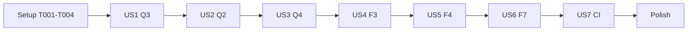

# Tasks: P1 — Core Foundation & Ecosystem Harmonization

**Input**: Design documents from `specs/019-core-foundation/` (`spec.md`, `plan.md`, `research.md`, `data-model.md`, `contracts/`, `quickstart.md`)
**Branch**: `refactor/phase1-foundation` — không push, không mở PR.
**Tests**: BẮT BUỘC (prompt P1 quy tắc 1 + hiến chương). Mỗi mục: viết test → chạy thấy **ĐỎ** (lưu output) → sửa → **XANH** → cổng chất lượng → 1 commit `type(scope): mô tả [mã mục]`.
**Thứ tự bắt buộc**: Q3 → Q2 → Q4 → F3 → F4 → F7 → CI (không song song giữa các story).

## Format: `[ID] [P?] [Story] Description`

- **[P]**: làm song song được (khác file, không phụ thuộc task chưa xong) — chỉ trong cùng một story.
- **[Story]**: US1=Q3, US2=Q2, US3=Q4, US4=F3, US5=F4, US6=F7, US7=CI.

## Cổng chất lượng (gọi là **GATE** trong các task bên dưới)

```powershell
$env:PYTHONUTF8=1
ruff check .
python -m pytest -q --timeout=90 -p no:cacheprovider
python -m pytest -q tests/test_golden_master_real_path.py tests/test_architecture.py -p no:cacheprovider
```

Bất biến không được vi phạm: không sửa `chuviettay/config.py`, ngưỡng `text_utils.find_tone`; `GOLDEN_REAL` trong `tests/test_golden_master_real_path.py` phải giữ nguyên (đổi byte → **DỪNG và báo**); `dependencies = []`.

---

## Phase 1: Setup (Baseline)

- [X] T001 Xác nhận đang ở nhánh `refactor/phase1-foundation`, cây làm việc sạch (ngoài `specs/019-core-foundation/`, `repro_viet_baseline.py`) bằng `git status`
- [X] T002 Chạy `python repro_viet_baseline.py --repo . --only D1a D1b D2 D3 D4a D4b D5` và xác nhận 7/7 `ĐÃ SỬA`; ghi output vào `specs/019-core-foundation/report.md`
- [X] T003 Chạy GATE, ghi số test pass/fail/skip baseline vào `specs/019-core-foundation/report.md`
- [X] T004 Chạy `python repro_viet_baseline.py --repo . --with-pip --only F4` và ghi kết quả `BUG` (bằng chứng tái hiện F4 trước khi sửa) vào `specs/019-core-foundation/report.md`

---

## Phase 2: Foundational

**Không có hạ tầng chặn chung.** Mỗi story tự mang fixture của mình (fixture kho chữ tổng hợp thuộc Q4/US3). Bỏ qua phase này.

---

## Phase 3: User Story 1 — Schema v4 là nguồn sự thật duy nhất (Q3) 🎯 MVP

**Goal**: Mã, docstring, script, CHANGELOG, contract và README thống nhất Schema v4; README mô tả đúng lưới hw3.
**Independent Test**: `python -m pytest -q tests/test_migrate_letter_bank.py tests/test_synthetic_bank.py tests/test_schema.py` xanh; kho do 2 script sinh ra có `schema_version == bank_schema.CURRENT_VERSION` và qua `validate_bank_dict(..., allow_legacy=False)`.

### Tests (viết trước, phải ĐỎ)

- [X] T005 [P] [US1] Thêm test `migrate_bank_dict_letters()` trả về `schema_version == CURRENT_VERSION` và `migrate_bank_file()` qua `validate_bank_dict(..., allow_legacy=False)` trong `tests/test_migrate_letter_bank.py`
- [X] T006 [P] [US1] Thêm test `generate_synthetic_bank()` có `schema_version == CURRENT_VERSION` và qua validate nghiêm ngặt trong `tests/test_synthetic_bank.py`
- [X] T007 [P] [US1] Thêm test tài liệu: docstring `chuviettay/model/bank_schema.py` chứa đúng `CURRENT_VERSION` (không còn "schema_version = 2") trong `tests/test_schema.py`
- [X] T008 [US1] Chạy 3 test trên, lưu output ĐỎ vào `specs/019-core-foundation/report.md`

### Implementation

- [X] T009 [P] [US1] Sửa docstring đầu file theo `CURRENT_VERSION = 4` (không đổi logic migrate) trong `chuviettay/model/bank_schema.py`
- [X] T010 [P] [US1] Đặt `out["schema_version"] = CURRENT_VERSION` trong `migrate_bank_dict_letters()` và đổi `allow_legacy=True` → `False` ở `migrate_bank_file()` trong `scripts/migrate_letter_bank.py`
- [X] T011 [P] [US1] Sinh dict v4 (thêm `letters`, `marks`, `symbols` rỗng theo `contracts/bank-schema-v4.md`, `schema_version = CURRENT_VERSION`) trong `scripts/gen_synthetic_bank.py`; nếu `tests/data/kho_mau_tong_hop.json.gz` được tái sinh, xác nhận kích thước < 100 KB
- [X] T012 [P] [US1] Sửa câu "Ngoài bảng chữ cái và chữ số, lưới bao gồm 14 cụm…" (~dòng 100): 77 ô (58 chữ cái hoa/thường + 14 cụm + 5 dấu thanh), không có chữ số; chữ số/dấu câu dạy qua bộ tối thiểu (`MINIMAL_DIGITS`, `MINIMAL_PUNCT`, nút ở tab Dạy) trong `README.md`
- [X] T013 [P] [US1] Đối chiếu và sửa mục Schema v4 trong `CHANGELOG.md` và `specs/016-*/contracts/bank-schema-v4.md` cho khớp `bank_schema.py` (chỉ sửa chỗ mâu thuẫn)
- [X] T014 [US1] Ghi vào `specs/019-core-foundation/report.md`: "`docs/img/after_fix.png` là ảnh cũ (trước `d17a142`), chủ repo cần sinh lại từ kho riêng" — KHÔNG sinh lại ảnh
- [X] T015 [US1] Chạy test US1 (XANH) + GATE; commit `docs(schema): đồng bộ schema v4 làm nguồn sự thật và sửa tài liệu lưới chữ [Q3]`

**Checkpoint**: Schema v4 thống nhất; golden-master không đổi.

---

## Phase 4: User Story 2 — Chuyển test sang đường thật, dọn composer cũ (Q2)

**Goal**: 12 chỗ gọi `compose_document` chuyển sang `AppController.write_text`; xoá `compose_document`, `composer.write_document`, `tests/test_golden_master.py`; giữ `WriteMode`, `WriteOptions`, `WriteResult`, `parse_color` trong `chuviettay/model/composer.py`.
**Independent Test**: `git grep -n "compose_document\|composer.write_document"` rỗng trong `chuviettay/` và `tests/`; GATE xanh; `GOLDEN_REAL` không đổi.

### Tests (chuyển đổi — ý nghĩa kiểm thử phải giữ nguyên)

- [X] T016 [US2] Thêm helper `_write(ctl, text, tmp_path, **kw) -> (xml: str, result: WriteResult)` (gọi `ctl.write_text`, giải nén gzip) trong `tests/test_composer.py`
- [X] T017 [US2] Chuyển 10 chỗ gọi trong `tests/test_composer.py` sang helper; ánh xạ khẳng định: `parts[0]==HEAD` → XML bắt đầu `<?xml` và kết thúc `</xournal>`; đếm `<page ` trên XML; `test_chia_trang` dùng `line` đủ lớn để A4 (841.89 pt) chia 2 trang và ghi rõ phép tính trong comment; 3 test `composer.write_document` → `ctl.write_text` với `WriteOptions(missing_grid=...)`
- [X] T018 [US2] Chuyển 2 chỗ gọi trong `tests/test_letter_assembly_quality.py` sang `AppController.write_text`, giữ khẳng định `n_strokes > 0` và `width=` được bù theo auto-xh đo trên XML thật
- [X] T019 [US2] Ghi bảng ánh xạ test cũ → test mới (tên test, khẳng định giữ/đổi và lý do) vào `specs/019-core-foundation/report.md`; nếu một khẳng định không giữ được ý nghĩa trên đường thật → DỪNG và báo
- [X] T020 [US2] Thêm test hồi quy (ĐỎ trước khi xoá): `assert not hasattr(composer, "compose_document") and not hasattr(composer, "write_document")` và `WriteOptions`, `WriteResult`, `WriteMode`, `parse_color` vẫn import được, trong `tests/test_composer.py`

### Implementation

- [X] T021 [US2] Xoá `tests/test_golden_master.py` (được thay bởi `tests/test_golden_master_real_path.py`; hằng `GOLDEN` mất theo file — ghi lý do vào report)
- [X] T022 [US2] Xoá `compose_document`, `write_document`, `_missing_grid_path` và import thừa (`random`, `MAXH`, `Writer`, `place`, `fmt`, `Bank`, `xopp`… nếu không còn dùng) trong `chuviettay/model/composer.py`
- [X] T023 [US2] Cập nhật docstring module `chuviettay/model/composer.py` (giờ chỉ chứa hợp đồng tuỳ chọn/kết quả) và mọi tham chiếu tài liệu tới `compose_document` (`git grep -n compose_document -- "*.md"`, trừ `specs/` lịch sử)
- [X] T024 [US2] Chạy GATE (golden-master đường thật phải giữ nguyên hash); commit `refactor(layout): chuyển toàn bộ test sang đường thật và dọn dẹp composer cũ [Q2]`

**Checkpoint**: Chỉ còn một đường kết xuất.

---

## Phase 5: User Story 3 — Kho chữ tổng hợp + test nghiệm thu định lượng (Q4)

**Goal**: `build_synthetic_letter_bank(seed=42)` tất định; `tests/test_acceptance_metrics.py` đo bằng `tools/measure_ink.measure_ink_metrics`.
**Independent Test**: `python -m pytest -q tests/test_acceptance_metrics.py tests/test_synthetic_bank.py` xanh.

### Tests (phải ĐỎ — hàm chưa tồn tại)

- [X] T025 [P] [US3] Thêm test `build_synthetic_letter_bank`: cùng seed → dict bằng nhau; có đủ 29 chữ cái Việt + f/j/w/z (hoa/thường) trong `letters`, 5 dấu trong `marks`; `xh ≈ 7.94`, `pen.width == "1.41"`; qua `validate_bank_dict(..., allow_legacy=False)` trong `tests/test_synthetic_bank.py`
- [X] T026 [P] [US3] Tạo `tests/test_acceptance_metrics.py`: dựng kho từ `build_synthetic_letter_bank()` vào `tmp_path`, `AppController.write_text(open("tests/data/accept_sample.txt").read(), WriteOptions(seed=42, assemble_letters=True, auto_xh=True), out)`, rồi khẳng định: `result.n_missing_tokens == 0` (0 từ thiếu), `min_stroke_clearance_pen >= 0.8`, `max_bbox_overlap_pct <= 10.0`, `7.15 <= median_x_height <= 8.73`, `0.15 <= pen_to_xh_ratio <= 0.20` (tên khoá lấy đúng theo giá trị trả về của `measure_ink_metrics`)
- [X] T027 [US3] Chạy, lưu output ĐỎ vào `specs/019-core-foundation/report.md`

### Implementation

- [X] T028 [US3] Hiện thực `build_synthetic_letter_bank(seed: int = 42) -> dict` (chỉ dùng thư viện chuẩn, `random.Random(seed)`, nét hình học có lsb/rsb, dấu nặng dưới chân chữ) trong `scripts/gen_synthetic_bank.py`; bổ sung chữ số/dấu câu nếu `accept_sample.txt` cần để đạt 0 từ thiếu
- [X] T029 [US3] Chạy test; nếu chỉ số trượt → sửa **hình học kho tổng hợp**, KHÔNG hạ ngưỡng, KHÔNG sửa `config.py`/`find_tone`; nếu chỉ đạt được bằng cách đổi thuật toán ghép → DỪNG và báo
- [X] T030 [US3] Ghi bảng chỉ số đo được vào `specs/019-core-foundation/report.md`; chạy GATE; commit `feat(test): bổ sung kho chữ tổng hợp và bộ test nghiệm thu định lượng [Q4]`

**Checkpoint**: Nghiệm thu định lượng chạy được trong CI không cần kho riêng.

---

## Phase 6: User Story 4 — Lưới hw3 có f, j, w, z (F3)

**Goal**: Lưới 85 ô; học đúng cả lưới 77 ô cũ; `bank.letters` chỉ nhận chữ cái và cụm đã định nghĩa.
**Independent Test**: `python -m pytest -q tests/test_grid_hw3.py tests/test_learning.py` xanh.

### Tests (phải ĐỎ)

- [ ] T031 [P] [US4] Thêm test `AppController.export_letter_grid()` sinh đúng 85 nhãn ô (đếm thẻ `<text>` nhãn), chứa `f F j J w W z Z`, không chứa chữ số, trong `tests/test_grid_hw3.py`
- [ ] T032 [P] [US4] Thêm test tương thích: lưới 77 ô (dựng bằng `xopp.make_letter_grid` với danh sách 58 chữ cũ) có nét giả lập → `learn_from_files` đọc đủ 77 ô, không lệch ô, trong `tests/test_grid_hw3.py`
- [ ] T033 [P] [US4] Thêm test lọc: lưới hw3 có nhãn `"1"`, `","`, `"+"` → không vào `bank.letters` (vẫn vào `digits`/`punct`/`symbols` như hiện tại); cụm trong `xopp.VIETNAMESE_DIGRAPHS` vẫn vào `letters`, trong `tests/test_learning.py`
- [ ] T034 [US4] Chạy, lưu output ĐỎ vào `specs/019-core-foundation/report.md`

### Implementation

- [ ] T035 [P] [US4] Thêm `"f","j","w","z"` và `"F","J","W","Z"` vào `standard_letters` của `export_letter_grid` trong `chuviettay/controller/app_controller.py`
- [ ] T036 [P] [US4] Ở `chuviettay/model/learning.py` dòng ~130, thay điều kiện bằng `(len(r.label) == 1 and r.label.isalpha()) or r.label in xopp.VIETNAMESE_DIGRAPHS` (bỏ tuple digraph lặp lại)
- [ ] T037 [US4] Cập nhật README (77 → 85 ô, thêm f/j/w/z) trong `README.md`; chạy GATE; commit `feat(grid): bổ sung f, j, w, z vào lưới hw3 và lọc ký tự chữ cái khi học [F3]`

**Checkpoint**: Lưới hw3 85 ô, tương thích ngược 77 ô.

---

## Phase 7: User Story 5 — Đường dẫn kho/log chuẩn khi cài bằng pip (F4)

**Goal**: Thứ tự: (1) `--bank`; (2) bản đóng gói (`sys.frozen`) → luôn cạnh `.exe`; (3) chạy từ mã nguồn và file đã tồn tại ở `app_base_dir()` → file đó; (4) còn lại → thư mục dữ liệu người dùng của OS.
**Independent Test**: `python -m pytest -q tests/test_paths_logging.py` xanh; `repro_viet_baseline.py --with-pip --only F4` báo `ĐÃ SỬA`.

### Tests (phải ĐỎ)

- [ ] T038 [P] [US5] Thêm test trong `tests/test_paths_logging.py`, dùng `monkeypatch` cho `sys.platform`, `APPDATA`, `XDG_DATA_HOME`, `HOME`, và `paths.app_base_dir`: (a) không có file cục bộ → Windows `%APPDATA%\chuviettay\chu_cua_ban.json.gz`, macOS `~/Library/Application Support/chuviettay/…`, Linux `$XDG_DATA_HOME/chuviettay/…` và fallback `~/.local/share/chuviettay/…`; (b) có file cục bộ → file cục bộ; (c) `sys.frozen=True` không có file → vẫn cạnh `.exe` (giữ test hiện có)
- [ ] T039 [P] [US5] Thêm test: `default_bank_path()` **không** tạo thư mục (hàm thuần, không side effect); thư mục chỉ được tạo khi lưu kho; thông báo lỗi CLI khi thiếu kho nêu đường dẫn OS thực tế, trong `tests/test_paths_logging.py` (CLI dùng `capsys`)
- [ ] T040 [US5] Điều chỉnh `test_duong_dan_mac_dinh_khi_chay_tu_ma_nguon` trong `tests/test_paths_logging.py`: kết quả phụ thuộc file cục bộ có tồn tại hay không — monkeypatch `app_base_dir` sang `tmp_path` để test tất định (không phụ thuộc `chu_cua_ban.json.gz` thật của dev); chạy, lưu output ĐỎ

### Implementation

- [ ] T041 [US5] Thêm `user_data_dir()` và sửa `default_bank_path()` theo thứ tự 4 tầng trong `chuviettay/paths.py` (chỉ thư viện chuẩn; chuỗi rỗng trong biến môi trường coi như không đặt); cập nhật docstring module
- [ ] T042 [US5] Xác nhận đường lưu kho (`Bank.save` / ghi nguyên tử) tạo thư mục cha nếu chưa có — nếu chưa, thêm `os.makedirs(..., exist_ok=True)` tại điểm ghi trong `chuviettay/model/bank.py`; lỗi quyền ghi phải nổi lên với đường dẫn cụ thể
- [ ] T043 [US5] Sửa thông báo thiếu kho trong `chuviettay/cli.py` để in đường dẫn đã phân giải và gợi ý `--bank`
- [ ] T044 [US5] Đối chiếu `chuviettay/logging_setup.py`: khi `app_base_dir()` không ghi được (site-packages) log rơi về `paths.user_log_dir()`; thêm test nếu chưa có trong `tests/test_paths_logging.py`
- [ ] T045 [US5] Chạy `python repro_viet_baseline.py --repo . --with-pip --only F4` (kỳ vọng `ĐÃ SỬA`), ghi output; GATE; commit `fix(paths): định vị kho mẫu và log chuẩn theo hệ điều hành khi cài bằng pip [F4]`

**Checkpoint**: `pip install` dùng thư mục dữ liệu người dùng; bản portable/mã nguồn không đổi hành vi.

---

## Phase 8: User Story 6 — Kiểu nền theo chuẩn XML Xournal++ (F7)

**Goal**: Ghi `iso_graph→isograph`, `iso_dotted→isodotted`, `music→staves`; nhận cả hai dạng ở đầu vào.
**Independent Test**: `python -m pytest -q tests/test_page_format.py` xanh.

### Tests (phải ĐỎ)

- [ ] T046 [P] [US6] Thêm test tham số hoá trong `tests/test_page_format.py`: `PageBackground(style=s).to_xml()` cho 8 kiểu — 3 kiểu ánh xạ ra tên chuẩn, 5 kiểu `plain/lined/ruled/graph/dotted` giữ nguyên
- [ ] T047 [P] [US6] Thêm test nhận cả hai dạng: `WriteOptions(background="isograph").validate()` hợp lệ và cho cùng XML với `"iso_graph"`; tương tự `isodotted`, `staves`, trong `tests/test_page_format.py`
- [ ] T048 [US6] Chạy, lưu output ĐỎ vào `specs/019-core-foundation/report.md`

### Implementation

- [ ] T049 [US6] Thêm `XOPP_STYLE_NAMES` (tên nội bộ → tên XML) và `normalize_background_style()` (nhận cả hai dạng → tên nội bộ) trong `chuviettay/document/page_format.py`; `to_xml()` dùng ánh xạ; `VALID_BACKGROUND_STYLES` chấp nhận cả alias
- [ ] T050 [US6] Dùng `normalize_background_style()` trong `WriteOptions.validate()`/`resolve_page_format()` ở `chuviettay/model/composer.py`; thêm alias vào `choices` của `--background` trong `chuviettay/cli.py` (GUI `view/write_tab.py` giữ nguyên tên nội bộ)
- [ ] T051 [US6] Ghi nguồn đối chiếu (Xournal++ `PageTypeHandler`, commit `9882ffaaf2`) vào CHANGELOG; GATE; commit `fix(xopp): chuẩn hoá chuỗi kiểu nền theo đặc tả xml của xournal++ [F7]`

**Checkpoint**: File `.xopp` hiển thị đúng nền trong Xournal++.

---

## Phase 9: User Story 7 — CI (CI)

**Goal**: Smoke test cài pip sạch; benchmark tách khỏi lượt chạy chính/độ phủ.
**Independent Test**: YAML parse được; chạy cục bộ các lệnh của job smoke và `pytest -m "not benchmark"` / `-m benchmark` đều xanh.

- [ ] T052 [US7] Đối chiếu cấu hình pytest: cả `pytest.ini` và `[tool.pytest.ini_options]` trong `pyproject.toml` tồn tại (pytest.ini thắng) — xác nhận marker `benchmark` đã đăng ký trong `pytest.ini`; ghi nhận, không gộp cấu hình (ngoài phạm vi)
- [ ] T053 [US7] Thêm job `pip-smoke` vào `.github/workflows/ci.yml`: venv sạch, `pip install .`, `hw-note --help`, tạo kho tạm bằng `scripts/gen_synthetic_bank.py`, `hw-note --bank <tmp> stats`, và `python repro_viet_baseline.py --repo . --with-pip --only F4`
- [ ] T054 [US7] Trong `.github/workflows/ci.yml`: bước test chính chạy `-m "not benchmark"`; thêm bước riêng `-m benchmark` (không coverage); giữ `--timeout` hiện có
- [ ] T055 [US7] Kiểm tra YAML hợp lệ (`python -c "import yaml,sys; yaml.safe_load(open('.github/workflows/ci.yml'))"` nếu có PyYAML, nếu không thì ghi rõ chưa kiểm được); chạy các lệnh smoke cục bộ; ghi vào report rằng CI thật chưa được quan sát (không push); GATE; commit `ci: thêm smoke test cài đặt pip và phân lập kiểm thử benchmark [CI]`

---

## Phase 10: Polish & Báo cáo

- [ ] T056 Chạy GATE cuối + `python repro_viet_baseline.py --repo . --with-pip`; ghi tổng kết vào `specs/019-core-foundation/report.md`
- [ ] T057 Chạy các kịch bản trong `specs/019-core-foundation/quickstart.md`, ghi kết quả
- [ ] T058 Hoàn tất `specs/019-core-foundation/report.md`: mỗi mục có output ĐỎ/XANH, hash commit, quyết định khi mơ hồ, ghi chú `docs/img/after_fix.png`, việc chưa làm/để lại cho P2
- [ ] T059 Đánh dấu `[X]` các task đã xong trong `specs/019-core-foundation/tasks.md`

---

## Dependencies & Execution Order



- Thứ tự story là bắt buộc theo prompt, dù kỹ thuật một số story độc lập.
- Phụ thuộc kỹ thuật thật: US3 dùng `scripts/gen_synthetic_bank.py` đã lên v4 ở US1; US4 (f/j/w/z) có thể làm `accept_sample.txt` cần thêm chữ — kho tổng hợp ở US3 đã chứa f/j/w/z từ đầu nên không phải quay lại; US7 job smoke dùng kết quả F4 (US5).
- Trong mỗi story: test → ĐỎ → sửa → XANH → GATE → commit.

## Parallel Opportunities (trong cùng story)

- US1: T005, T006, T007 song song; T009–T013 song song (khác file).
- US3: T025 ∥ T026.
- US4: T031, T032, T033 song song; T035 ∥ T036.
- US5: T038 ∥ T039.
- US6: T046 ∥ T047.

## Implementation Strategy

- **MVP**: Setup + US1 (Q3) → commit 1.
- Sau đó mỗi story là một commit độc lập, có thể dừng/kiểm tra tại mỗi checkpoint.
- Điểm DỪNG bắt buộc: golden-master đường thật đổi hash; test Q2 mất ý nghĩa khi chuyển; Q4 chỉ đạt khi phải đổi thuật toán/ngưỡng; bất kỳ thay đổi định dạng trên đĩa ngoài phạm vi.
