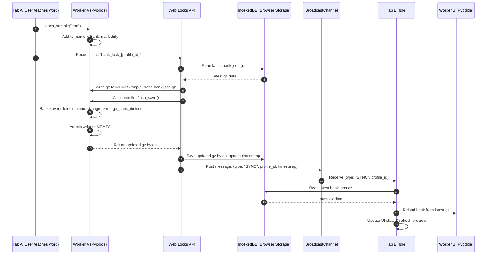

# Contract: Multi-Tab Storage & Concurrency Protocol

**Status**: Defined  
**Version**: 1.0.0  
**Scope**: Client-side IndexedDB persistence, Web Locks concurrency, and BroadcastChannel synchronization.

---

## 1. Mục tiêu & Nguyên tắc
1. **Không mất mát dữ liệu (Zero Data Loss)**: Hai tab cùng mở và thực hiện dạy/xóa trên cùng một kho mẫu sẽ không bao giờ ghi đè làm mất nét vẽ của nhau.
2. **Không hồi sinh nhãn đã xóa**: Tận dụng cơ chế `tombstones` và `readded_at` đã kiểm chứng của `Bank.save` trong lõi Python; không cài đặt lại thuật toán hợp nhất trên tầng JavaScript.
3. **Phản hồi tức thì trên UI**: Mọi thao tác lưu đều được debounce ~2.0s trên tầng JS; hiển thị trạng thái "Đang lưu..." / "Đã lưu vào trình duyệt" / "Lỗi lưu".

---

## 2. Giao thức Đồng bộ Đa Tab (Multi-Tab Protocol)



### 2.1. Quy trình 4 bước khi Lưu dữ liệu (Save Workflow)
Khi bộ đếm debounce (hoặc người dùng chuyển tab/rời trang qua `visibilitychange`) kích hoạt lưu:
1. **Xin cấp quyền khóa (Web Lock)**:
   ```javascript
   await navigator.locks.request(`chuviettay_lock_${profileId}`, async () => {
       // Thao tác độc quyền
   });
   ```
2. **Đồng bộ ảnh trên đĩa (Disk Sync)**:
   - Đọc bản ghi `.json.gz` mới nhất từ IndexedDB bảng `profiles`.
   - Ghi đè vào file `/tmp/current_bank.json.gz` trong MEMFS của Worker (đóng vai trò file trên đĩa).
3. **Thực thi Hợp nhất bằng Lõi Python**:
   - Gọi `controller.flush_save()`.
   - `Bank.save()` so sánh `st_mtime_ns` và `st_size` của file vừa ghi. Vì file bị cập nhật từ IndexedDB, nhánh `needs_merge = True` kích hoạt:
     - Nạp dữ liệu từ file qua `load_and_validate()`.
     - Hợp nhất bộ nhớ hiện tại với bản trên đĩa bằng `merge_bank_dicts()`.
     - Ghi đè nguyên tử trở lại MEMFS.
   - **Ranh giới MVC**: Bridge tuyệt đối KHÔNG can thiệp vào thuộc tính riêng của Model (như `bank._last_synced_mtime_ns`). Ta hoàn toàn dựa vào cơ chế so sánh `mtime`/`size` tự nhiên của `Bank.save()` đã kiểm chứng ở GĐ0.
   - **Rủi ro cùng mili-giây**: Được kiểm thử nghiêm ngặt tại T024 (`test_bank_merge_memfs.mjs`). Nếu trường hợp ghi đè trong cùng mili-giây bị bỏ sót merge dẫn đến test đỏ, dừng lại và hỏi người dùng để kích hoạt thay đổi danh sách đóng 3.4 (bổ sung hàm hợp nhất tường minh ở Controller).
4. **Cập nhật Storage & Phát sóng (Broadcast)**:
   - Đọc file kết quả từ MEMFS, ghi lại vào IndexedDB với `updated_at = Date.now()`.
   - Phát thông điệp qua kênh:
     ```javascript
     broadcastChannel.postMessage({
         type: "BANK_SYNCHRONIZED",
         profileId: profileId,
         timestamp: Date.now()
     });
     ```

### 2.2. Quy trình Xử lý khi Nhận Thông điệp Đồng bộ (Incoming Sync)
Khi Tab B nhận thông điệp `BANK_SYNCHRONIZED`:
1. Nếu `profileId` trùng với hồ sơ đang kích hoạt của Tab B:
   - Đọc bản `.json.gz` mới nhất từ IndexedDB.
   - Gửi sang Worker B để gọi `ctl.load_bank()`.
   - Cập nhật số lượng mẫu trên thanh trạng thái, cập nhật thư viện mẫu và dựng lại trang xem trước (nếu đang ở tab Viết).

---

## 3. Quản lý Bộ nhớ & Cảnh báo An toàn

### 3.1. Xin quyền Lưu trữ Bền vững
Khi ứng dụng khởi tạo lần đầu:
```javascript
if (navigator.storage && navigator.storage.persist) {
    const isPersisted = await navigator.storage.persist();
    console.log("Storage persisted:", isPersisted);
}
```

### 3.2. Cảnh báo Dung lượng & Nhắc nhở Sao lưu
1. **Kiểm tra hạn ngạch**: Gọi `navigator.storage.estimate()` định kỳ. Nếu dung lượng sử dụng vượt quá 80% hạn ngạch hoặc xảy ra lỗi `QuotaExceededError`, hiển thị cảnh báo đỏ và hướng dẫn người dùng xuất file `.json.gz` về máy tính.
2. **Bộ đếm nhắc nhở sao lưu**:
   - Mỗi lần dạy thêm một mẫu, tăng `teach_count_since_backup += 1`.
   - Khi `teach_count_since_backup >= backup_threshold` (mặc định 20 nhãn), hiển thị thanh thông báo (Toast) gợi ý: *"Bạn đã dạy thêm 20 mẫu mới. Hãy bấm Sao lưu kho để tải file về máy."* (có nút Tắt nhắc nhở).
