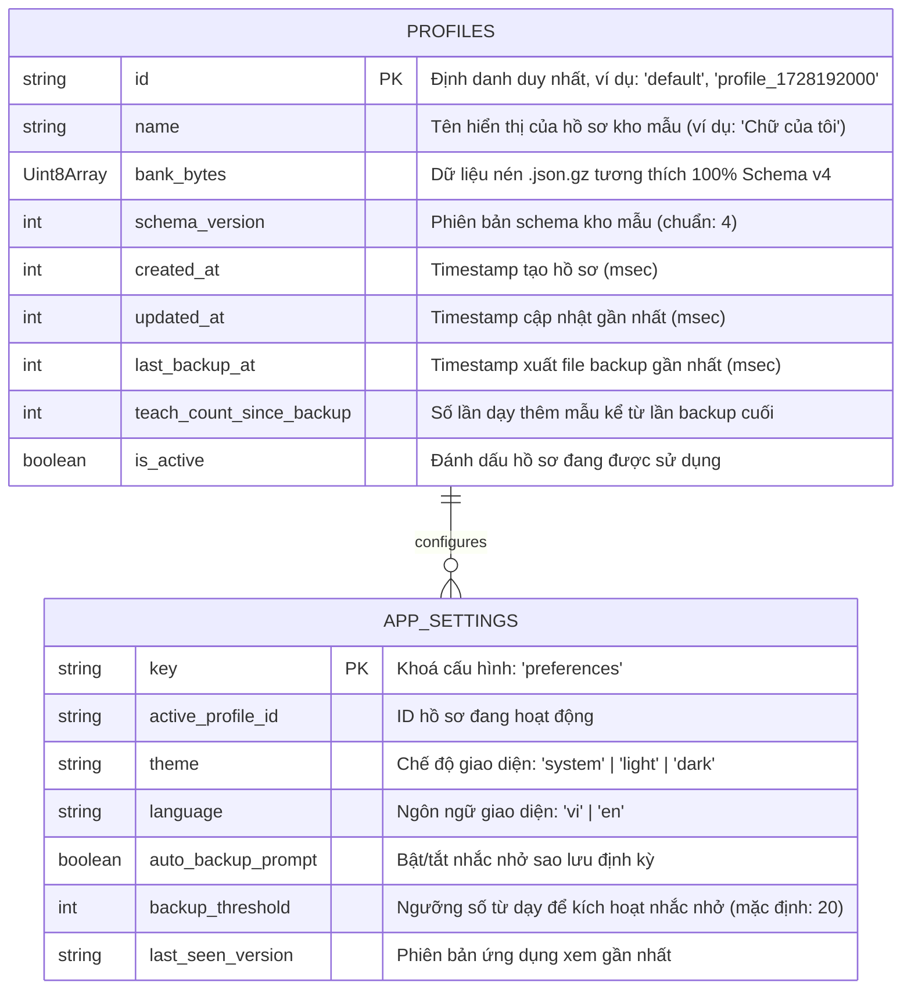

# Phase 1: Data Model — Web Client (020)

**Date**: 2026-10-06  
**Status**: Completed  
**Spec Reference**: [spec.md](spec.md) | [research.md](research.md)

---

## 1. Client Storage Entities (IndexedDB: `chuviettay_db`)

Mọi dữ liệu cá nhân của người dùng được lưu trữ độc quyền trong IndexedDB của trình duyệt máy khách. Không có bất kỳ dữ liệu nào được truyền tải ra ngoài qua mạng.



### 1.1. Bảng `profiles` (Object Store)
- **Primary Key**: `id` (chuỗi string không trùng).
- **Mục đích**: Hỗ trợ đa hồ sơ kho mẫu (multi-profile). Người dùng có thể tạo nhiều kho chữ (ví dụ: "Chữ viết nhanh", "Chữ nắn nót", "Chữ tiếng Anh") và chuyển đổi linh hoạt.
- **Ràng buộc an toàn**: Thao tác tạo kho mới không bao giờ được phép ghi đè lên kho hiện hữu.

### 1.2. Bảng `app_settings` (Object Store)
- **Primary Key**: `key`.
- **Mục đích**: Lưu trữ tùy chọn cá nhân hóa của người dùng trên trình duyệt.

---

## 2. Trạng thái Bộ nhớ Trình duyệt (Runtime Memory Model)

### 2.1. Phiên Soạn thảo Văn bản (`WriteSessionState`)
Trạng thái lưu trữ văn bản hiện tại và tùy chọn kết xuất trên Main Thread JS:

```typescript
interface WriteOptionsState {
  // Toàn bộ giá trị mặc định được khởi tạo động từ get_write_defaults() qua bridge.py
  scale: number;            // Cỡ chữ (hệ số phóng to/thu nhỏ, mặc định: 1.0)
  line: number | null;      // Khoảng cách dòng pt (null = mặc định của kho)
  width: number | null;     // Bề rộng dòng pt (null = mặc định của kho)
  space: number;            // Hệ số giãn cách từ (mặc định: 1.0)
  jitter: number;           // Độ run tự nhiên của tay (mặc định trong lõi: 1.0, 0 = tắt)
  wscale: number;           // Hệ số độ dày nét bút (mặc định: 1.0)
  color: string | null;     // Mã màu mực hex (null = màu mặc định của kho)
  seed: number | null;      // Hạt giống ngẫu nhiên (hiển thị số + nút xúc xắc)
  strict_case: boolean;     // Phân biệt hoa thường nghiêm ngặt (mặc định: false)

  // Khổ giấy và nền
  paper: string;            // 'a4' | 'a5' | 'a3' | 'letter' | 'legal' | '16:9' | '4:3' | 'custom'
  orientation: 'portrait' | 'landscape';
  paper_width: number | null;
  paper_height: number | null;
  margin_left: number;      // pt (mặc định: 36.0)
  margin_right: number;     // pt (mặc định: 36.0)
  margin_top: number;       // pt (mặc định: 40.0)
  margin_bottom: number;    // pt (mặc định: 40.0)
  background: 'plain' | 'lined' | 'ruled' | 'graph' | 'dotted';
  background_spacing: number | null;
  background_margin: number | null;
  background_color: string;

  // Lắp ghép chữ cái & chất lượng
  assemble_letters: boolean;// Ghép chữ rời khi thiếu từ nguyên khối (mặc định: false)
  letter_gap: number;       // Hệ số khoảng cách chữ cái (mặc định: 1.0)
  target_xh: number;        // x-height mục tiêu (mặc định: 7.94)
  auto_xh: boolean;         // Tự động chuẩn hóa x-height (mặc định: false)
  pen_clearance_factor: number; // Hệ số sàn khe hở vật lý (mặc định: 0.8)
  stable_variants: boolean; // Ổn định biến thể khi sửa giữa bài (mặc định web: true)
}

interface WriteSessionState {
  text: string;             // Nội dung văn bản người dùng đang nhập
  mode: 'plain' | 'markdown';// Chế độ nhập liệu
  options: WriteOptionsState;
  activeRequestId: number;  // ID tuần tự để huỷ request cũ khi gõ nhanh
}
```

### 2.2. Kết quả Kết xuất (`WriteResultPayload`)
Dữ liệu do `bridge.py` trong Web Worker trả về cho Main Thread:

```typescript
interface WriteResultPayload {
  requestId: number;
  status: 'ok' | 'error';
  xopp_base64: string;      // Dữ liệu .xopp nhị phân để paper.js dựng SVG
  total_pages: number;
  total_words: number;
  total_chars: number;
  covered_words_count: number;
  missing_sorted: [string, number][]; // Danh sách từ thiếu [từ, số_lần_xuất_hiện]
  missing_boxes?: {         // Tọa độ gạch đỏ khi bật D2
    page: number;
    token: string;
    x: number;
    y: number;
    w: number;
    h: number;
  }[];
  warnings: string[];       // Cảnh báo từ Importer (ví dụ: thẻ markdown chưa hỗ trợ)
  duration_ms: number;
}
```


### 2.3. Quy cách Hình học Vùng vẽ Dạy mẫu (`CanvasSpec`)
Thông số hình học do `AppController` / `bridge.py` cung cấp động cho Canvas JS:

```typescript
interface CanvasSpec {
  logicalWidth: number;     // 760 (cố định để tỉ lệ nét khớp 100% Tkinter)
  logicalHeight: number;    // 230
  baselinePx: number;       // 170 (đường dóng chân chữ)
  zoom: number;             // 10.0 (px màn hình cho 1 đơn vị kho)
  minPointDist: number;     // 2.5 (ngưỡng lọc điểm thô)
  guidelines: {
    baseline: number;       // 170
    xhLine: number;         // baseline - (xh * zoom)
    hw3Lines?: {            // Lưới 4 dòng chuẩn chữ cái
      top: number;          // Đỉnh chữ (ascender)
      mean: number;         // Thân chữ (meanline)
      base: number;         // Chân chữ (baseline)
      bottom: number;       // Đáy đuôi (descender)
    };
  };
}
```

### 2.4. Trạng thái Phiên Dạy mẫu (`TeachSessionState`)

```typescript
interface TeachSessionState {
  currentLabel: string | null;  // Nhãn đang được vẽ (từ, chữ cái, số, dấu)
  queue: string[];              // Hàng đợi các nhãn cần dạy
  existingSamples: {            // Danh sách các mẫu đã có của nhãn hiện tại
    index: number;
    svgThumb: string;
    width: number;
  }[];
  isCalibrating: boolean;       // Có phải đang trong phiên hiệu chỉnh cỡ tay không
  sessionScale: number;         // Hệ số cỡ tay phiên hiện tại (mặc định 1.0)
  canvasSpec: CanvasSpec;
  rawStrokes: number[][][];     // [[[x1, y1], [x2, y2], ...], ...] (tọa độ pixel logic)
}
```

---

## 3. Schema Dữ liệu Kho mẫu (Bank Schema v4)
Dữ liệu lưu trữ trong file `.json.gz` tuân thủ nghiêm ngặt Schema Version 4 của dự án:
- `schema_version`: `4` (bắt buộc).
- `words`: `Record<string, SampleInstance[]>` — Từ nguyên khối hoặc cụm từ.
- `digits`: `Record<string, SampleInstance[]>` — Chữ số từ `0` đến `9`.
- `punct`: `Record<string, SampleInstance[]>` — Dấu câu (`.`, `,`, `!`, `?`, `:`, `;`, `-`, `"`, `'`, `/`, `(`, `)`).
- `symbols`: `Record<string, SampleInstance[]>` — Ký hiệu toán học và kỹ thuật (`>=`, `<=`, `=`, `>`, `<`, `_`, v.v.).
- `letters`: `Record<string, LetterSampleInstance[]>` — Chữ cái đơn lẻ (29 chữ cái TV + `f, j, w, z` hoa/thường).
- `marks`: `Record<string, MarkSampleInstance[]>` — Nét dấu thanh rời (`\`, `/`, `?`, `~`, `.` nặng).
- `tombstones`: `Record<string, number>` — Bản ghi nhãn đã xóa phục vụ đồng bộ đa tab / đa tiến trình.
- Metadata: `xh` (float), `line` (float), `width` (float), `ratio` (float), `pen` (dict).
