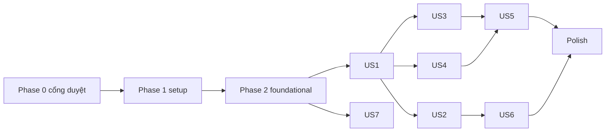

# Tasks: 020 — Web Client tĩnh 100% phía trình duyệt

**Input**: `specs/020-web-client/` — spec.md, plan.md, research.md, data-model.md, contracts/, quickstart.md, report-g0.md
**Tests**: BẮT BUỘC (constitution III "test trước" + spec mục 10). Mỗi thay đổi lõi có test viết trước và phải đỏ trước khi sửa.
**Quy ước**: `- [ ] Txxx [P?] [USn?] mô tả + đường dẫn`. `[P]` = làm song song được. `⛔` = BỊ CHẶN cho tới khi người dùng duyệt mục ghi kèm.
**Commit**: commit nhỏ cho mỗi task/nhóm task; cuối mỗi phase toàn bộ `pytest` xanh + golden 8/8 trong Pyodide.

---

## Phase 0: Cổng duyệt & sửa tài liệu (TRƯỚC mọi dòng code)

**Mục đích**: Các tài liệu plan/research/contracts hiện có chỗ tự quyết thay người dùng, số liệu chưa đo, và mâu thuẫn với mã thật. Sửa trước để task phía sau không xây trên giả định sai.

- [X] T001 ⛔(người dùng) Ghi kết quả duyệt D1–D8 vào bảng "Quyết định chờ duyệt" trong specs/020-web-client/spec.md (Đã duyệt D1-D8)
- [X] T002 ⛔(người dùng) Hỏi và ghi cú pháp ngắt trang: chốt dùng `<!-- pagebreak -->` (kèm `\pagebreak`) tách tại `bridge.py`
- [X] T003 Sửa specs/020-web-client/report-g0.md: hiệu chỉnh các thông số và môi trường Render
- [X] T004 Sửa specs/020-web-client/contracts/bridge-api.md cho khớp mã thật: write_text trả .xopp base64, options khớp WriteOptions, thêm get_write_defaults()
- [X] T005 [P] Sửa specs/020-web-client/data-model.md: WriteOptionsState đọc từ get_write_defaults(), bỏ các trường không có thật
- [X] T006 [P] Sửa specs/020-web-client/contracts/storage-protocol.md: không can thiệp bank._last_synced_mtime_ns, dựa vào mtime/size tự nhiên và test T024
- [X] T007 [P] Sửa specs/020-web-client/contracts/render-blueprint.md: bỏ repo URL, buildCommand dùng npm ci && python scripts/build_web.py, worker-src 'self'
- [X] T008 [P] Sửa specs/020-web-client/plan.md mục Performance Goals: mục tiêu vài giây, xem trước <= 1s, zero long task > 50ms
- [X] T009 [P] Sửa specs/020-web-client/research.md D3: quy định dùng hashlib.sha256 thay vì hash()
- [X] T010 ⛔(Render, cần tài khoản người dùng) Người dùng đã kết nối repository với Render Dashboard; ghi nhận cấu hình môi trường Static Site.

**Checkpoint**: T001, T002, T010 có câu trả lời; tài liệu không còn mâu thuẫn với mã.

---

## Phase 1: Setup (hạ tầng dev, không đụng lõi)

- [X] T011 Thêm `node_modules/` và `webapp/dist/` vào .gitignore (hiện `node_modules/` từ GĐ0 đang untracked)
- [X] T012 [P] Tạo package.json (devDependencies ghim chính xác: `pyodide@314.0.7`, `@playwright/test`), `"private": true`, scripts `test:golden`, `test:e2e`; tạo package-lock.json
- [X] T013 [P] Tạo scripts/vendor_lock.json: tên, phiên bản, URL, sha256 cho `markdown-it-py 4.2.0`, `mdit-py-plugins 0.6.1`, `mdurl 0.1.2` (khởi động) và `python-docx` (phiên bản trong requirements hiện có) + `lxml 6.1.3` wasm từ pyodide-lock.json (nạp lười)
- [X] T014 [P] Tạo .node-version (`24.16.0`) và .python-version (bản đầy đủ, ví dụ `3.13.5` — lấy theo T010)

---

## Phase 2: Foundational (chặn mọi user story)

### Test viết trước

- [X] T015 [P] Viết tests/test_teach_geometry.py: với chuỗi pixel cố định, `controller.teach_geometry.strokes_to_bank_units` cho kết quả giống hệt bản hiện tại trong view/word_canvas.py (chụp kết quả kỳ vọng bằng bản cũ trước khi di chuyển); hằng `ZOOM=10.0, BASE_PX=170, CANVAS_W/H, MIN_POINT_DIST=2.5` khớp
- [X] T016 [P] Viết tests/test_injectable_timer.py: `AppController(bank_path, timer_factory=Fake)` → `schedule_save` gọi `Fake`, không tạo thread; `AppController(bank_path)` mặc định vẫn dùng `threading.Timer` (tests/test_debounced_save.py giữ nguyên xanh)
- [X] T017 [P] Viết tests/test_label_samples_accessor.py: accessor chỉ-đọc trả mẫu của một nhãn cho từng loại words/letters/digits/punct/symbols/marks, trả bản sao (sửa kết quả không đổi kho), danh sách sắp xếp tất định, nhãn không tồn tại → rỗng
- [X] T018 Mở rộng tests/test_architecture.py (KHÔNG nới luật cũ): quét đệ quy `browser/`, `layout/`, `document/`, `importer/`, `math/`; `browser/` cấm import `chuviettay.model`, `chuviettay.view`, `chuviettay.cli`, `chuviettay.gui`, `chuviettay.fidelity`, `tkinter`, `argparse`; `model/` và `controller/` cấm import `js`, `pyodide`, `pyodide_js`, `chuviettay.browser`; thêm `browser/` vào luật no-print/no-sys.exit

### Thay đổi lõi trong danh sách đóng (3.1–3.3)

- [X] T019 Thay đổi 3.2: tạo chuviettay/controller/teach_geometry.py chứa `strokes_to_bank_units`, `ZOOM`, `BASE_PX`, `CANVAS_W`, `CANVAS_H`, `MIN_POINT_DIST`, hàm lọc điểm theo `MIN_POINT_DIST`; chuviettay/view/word_canvas.py import và re-export (Tkinter không đổi hành vi). T015 xanh; tests/test_word_canvas.py xanh trên CI Linux (xvfb)
- [X] T020 Thay đổi 3.1: thêm tham số `timer_factory` (mặc định `threading.Timer`) vào `AppController.__init__` trong chuviettay/controller/app_controller.py. T016 xanh
- [X] T021 Thay đổi 3.3: thêm accessor chỉ-đọc `list_label_samples(label, category)` (tên chốt khi viết) trong chuviettay/controller/app_controller.py. T017 xanh
- [X] T022 D6 ⛔(T001): sửa tests/test_paths_logging.py::test_duong_dan_mac_dinh_khi_chay_tu_ma_nguon bằng monkeypatch/tmp_path phủ cả hai nhánh (có file cục bộ / không có); KHÔNG tạo file kho ở gốc repo

### Golden master trong Pyodide

- [X] T023 Tạo scripts/test_golden_pyodide.mjs (dựa script GĐ0 đã xoá): nạp Pyodide từ node_modules, mount mã nguồn chỉ-đọc, cài 3 wheel từ scripts/vendor_lock.json (kiểm sha256), chạy 8 ca bằng cách import `CASES`/`GOLDEN_REAL` từ tests/test_golden_master_real_path.py (shim `pytest` tối thiểu), exit≠0 nếu lệch; KHÔNG đọc site-packages của máy
- [X] T024 Viết tests/browser/test_bank_merge_memfs.mjs (chạy trong Pyodide-Node): hai `Bank` cùng một file trong MEMFS — dạy/xoá xen kẽ, kể cả trường hợp ghi đè file trong cùng mili-giây với cùng kích thước; kiểm không mất mẫu, không hồi sinh nhãn xoá. Nếu đỏ → DỪNG, hỏi về 3.4

### Cầu nối & build

- [X] T025 Viết tests/test_bridge.py (CPython, kho tạm từ tests/data/kho_mau_tong_hop.json.gz qua fixture `real_bank_path`): mọi hàm bridge trả JSON parse được, không set/tuple, danh sách đã sắp xếp; `write` cùng seed/tuỳ chọn cho bytes `.xopp` trùng `AppController.write_text`
- [X] T026 Tạo chuviettay/browser/__init__.py và chuviettay/browser/bridge.py theo contracts/bridge-api.md (sau T004): chỉ gọi `AppController`; tạo controller với `timer_factory` không-thread; `get_canvas_spec` lấy từ teach_geometry + `config.py` (hw3) qua controller; `get_write_defaults`; `get_latex_symbols` từ `math/symbols.py` (qua controller hoặc accessor — nếu cần thêm accessor ngoài 3.3 → hỏi). T025, T018 xanh
- [X] T027 Tạo scripts/build_web.py: suy danh sách file từ đồ thị import tĩnh (ast) của chuviettay/browser/bridge.py; loại `view/`, `gui`, `cli`, `fidelity`, `formatting`, `logging_setup`; zip gói; copy runtime Pyodide từ node_modules (không CDN lúc chạy); copy wheel theo vendor_lock (kiểm sha256); băm tên file; sinh version.json; FAIL nếu dist chứa `*.json.gz`, `tests/`, `specs/`, `docs/img`
- [X] T028 Viết tests/test_build_web.py: build vào tmp → dist không có file cấm, không có module view/gui/cli/fidelity; tên file băm ổn định với cùng input
- [X] T029 Thêm vào scripts/test_golden_pyodide.mjs (hoặc file riêng scripts/test_bridge_import_pyodide.mjs): nạp ĐÚNG zip gói từ dist, `import chuviettay.browser.bridge`, assert `"tkinter" not in sys.modules`

### Khung frontend

- [X] T030 Tạo webapp/js/worker/py-worker.js: nạp Pyodide tự host, báo tiến trình thật (runtime → stdlib → gói → wheel), giao thức `{id, method, params}` → `{id, ok, result|error}`
- [X] T031 [P] Tạo webapp/js/storage.js: IndexedDB `profiles`/`app_settings` theo data-model.md, Web Locks theo tên hồ sơ, BroadcastChannel; tạo hồ sơ mới không bao giờ ghi đè hồ sơ có sẵn
- [X] T032 [P] Tạo webapp/js/i18n.js (VI + EN dự phòng, mọi chuỗi), webapp/index.html, webapp/css/ (khung header, tab, chấm trạng thái, màn hình khởi động có thanh tiến trình)
- [X] T033 Tạo render.yaml theo contracts/render-blueprint.md (sau T007, T010); chạy `render blueprints validate`

**Checkpoint (tiêu chí G1)**: `pytest` xanh; golden 8/8 trong Pyodide; bản build chạy ở `http://localhost:8000`, nạp được kho tổng hợp, hiện thống kê; deploy thử Render thành công.

---

## Phase 3: User Story 1 — Mở web, nạp kho, thấy thống kê (P1)

**Independent test**: Nhập `tests/data/kho_mau_tong_hop.json.gz` → thấy đúng số nhãn theo loại; tải lại trang → kho còn.

- [X] T034 [P] [US1] Viết tests/e2e/first-run.spec.ts (Playwright): kho trống → màn chào 3 lựa chọn; không request nào tới origin khác
- [X] T035 [US1] Màn hình chào + "Nhập kho có sẵn" / "Tạo kho trống" / "Xem hướng dẫn" trong webapp/js/app.js; không tự tải kho từ server
- [X] T036 [US1] Nạp kho từ IndexedDB khi khởi động; thẻ thống kê từ `get_stats` qua bridge trong webapp/js/bank.js
- [X] T037 [US1] Xin `navigator.storage.persist()`; hiển thị trạng thái lưu (Đang lưu / Đã lưu vào trình duyệt / Lỗi lưu) trong webapp/js/app.js

---

## Phase 4: User Story 2 — Viết, xem trước, xuất (P1)

**Independent test**: Gõ văn bản có `$...$` và bảng (chế độ Markdown) → xem trước; tải `.xopp` → so byte với CLI cùng seed/tuỳ chọn.

### Test viết trước
- [X] T038 [P] [US2] Viết tests/test_web_cli_parity.py: với một tập (văn bản, WriteOptions), bytes `.xopp` từ đường bridge == `hw-note write` CLI
- [X] T039 [P] [US2] Viết tests/e2e/write.spec.ts: gõ → xem trước sau ~250 ms; mô phỏng `compositionstart/end` không kích hoạt render giữa chừng; gõ nhanh chỉ render bản mới nhất
- [X] T040 [P] [US2] Viết tests/js/paper.test.mjs (Node, không framework): SVG dựng từ `.xopp` mẫu có đúng số nét/toạ độ/màu/độ dày; nền lined/ruled/graph/dotted theo thông số trang

### Thay đổi lõi chờ duyệt
- [X] T041 [US2] ⛔(D3 trong T001) Test trước rồi thêm `WriteOptions.stable_variants=False` trong chuviettay/model/composer.py + nhánh chọn mẫu/độ run bằng hashlib trong chuviettay/model/writer.py + cờ CLI `--stable`; test: tắt → golden 8/8 byte-identical; bật → chèn từ ở đầu không đổi kiểu chữ các từ phía sau
- [X] T042 [US2] ⛔(D2 trong T001) Test trước rồi thêm callback toạ độ token tuỳ chọn (mặc định None) trong chuviettay/layout/engine.py; test: None → golden 8/8 không đổi

### Triển khai
- [X] T043 [US2] Trình soạn thảo 2 cột + debounce 250 ms + IME + "một request chờ" trong webapp/js/write.js
- [X] T044 [US2] Dựng SVG an toàn từ `.xopp` (giải nén bằng `DecompressionStream`, `DOMParser` + tạo phần tử bằng `createElementNS`, không `innerHTML` chuỗi) trong webapp/js/paper.js; đổi trang không chớp trắng
- [X] T045 [US2] Thanh công cụ Markdown (tiêu đề 1–3, • / 1., bảng hàng×cột, `$...$`, `$$...$$`, ngắt trang ⛔T002, hoàn tác/làm lại của textarea) + chế độ văn bản thuần/Markdown trong webapp/js/write.js
- [X] T046 [US2] Bảng ký hiệu LaTeX từ `get_latex_symbols`, nhóm theo loại, bấm để chèn; hiển thị `ImportResult.warnings/unsupported` trong webapp/js/write.js
- [X] T047 [US2] Tuỳ chọn viết (slider + số + đặt lại, placeholder từ `get_write_defaults`), seed luôn hiển thị + nút xúc xắc, popover nâng cao trong webapp/js/write.js
- [X] T048 [US2] Bảng từ thiếu theo `missing_sorted`; bấm → tab Dạy với nhãn đó; gạch đỏ trên trang chỉ khi T042 xong
- [X] T049 [US2] Mở/kéo-thả `.txt/.md`; `.docx` nạp lười `lxml` + `python-docx` (wheel tự host, sha256) qua `import_document` của controller
- [X] T050 [US2] Xuất `.xopp`; PNG/SVG trang hiện tại/tất cả, 1x/2x/3x, nền giấy/trong suốt; ZIP không nén tự viết (CRC32 + local/central header) trong webapp/js/export.js; In/PDF bằng print stylesheet webapp/css/print.css
- [X] T051 [P] [US2] Viết tests/js/zip.test.mjs: ZIP mở được bằng `python -m zipfile -t`

---

## Phase 5: User Story 3 — Dạy mẫu (P1)

**Independent test**: Phát lại cùng chuỗi điểm qua đường Tkinter (teach_geometry + teach_*) và đường web → kho JSON giống hệt.

- [X] T052 [P] [US3] Viết tests/test_teach_parity.py: chuỗi điểm cố định → (a) `strokes_to_bank_units` + `teach_word/teach_letter` trực tiếp, (b) bridge `teach_sample` → JSON kho giống hệt, phủ từ/cụm từ, chữ cái, chữ số, dấu câu, ký hiệu, dấu thanh, và hiệu chỉnh cỡ tay (`calibrating=True`)
- [X] T053 [P] [US3] Viết tests/e2e/teach.spec.ts: mô phỏng pointer events kiểu `pen` và `touch` (kèm chạm lòng bàn tay) → mẫu được lưu
- [X] T054 [US3] Bridge `teach_sample` route giống view/teach_tab.py: `is_letter_token` và không hiệu chỉnh → `teach_letter`, ngược lại `teach_word(calibrating, recompute)`; `deferred_save=True` (timer không-thread) và JS gọi `flush_save` theo debounce, trong chuviettay/browser/bridge.py
- [X] T055 [US3] Canvas Pointer Events, `touch-action: none`, `getCoalescedEvents`, từ chối lòng bàn tay cơ bản, toạ độ logic từ `get_canvas_spec`, lọc `min_point_dist`, làm mượt chỉ để hiển thị, bỏ áp lực trong webapp/js/canvas.js
- [X] T056 [US3] Đường dóng có nhãn (baseline, xh; chữ cái: 4 dòng hw3 từ bridge), chữ mẫu mờ bật/tắt trong webapp/js/canvas.js
- [X] T057 [US3] Hàng đợi + tiến độ, mẫu đã có của nhãn, bút/gôm/độ dày/undo/redo/xoá, phím Enter/Ctrl+Z/Esc, thêm từ/cụm từ, `missing_seed_words`, `missing_minimal_essentials`, hiệu chỉnh cỡ tay trong webapp/js/teach.js

---

## Phase 6: User Story 4 — Kho mẫu (P2)

**Independent test**: File xuất từ web chạy được `hw-note stats`; mở nhãn 4 mẫu thấy 4 hình thu nhỏ.

- [X] T058 [P] [US4] Viết tests/test_bank_export_roundtrip.py: xuất qua bridge → `hw-note stats --bank <file>` thành công; nhập kho schema cũ → được nâng cấp, dùng được
- [X] T059 [P] [US4] Viết tests/test_drop_undo_tombstone.py: xoá nhãn rồi Hoàn tác (dạy lại các mẫu cũ) → `readded_at` đúng, đa tiến trình không hồi sinh/mất; nếu không an toàn → không bật Hoàn tác và báo cáo
- [X] T060 [US4] Lưới nhãn + tìm kiếm tức thì + thumbnail SVG + số mẫu trong webapp/js/bank.js (dữ liệu từ `list_label_samples`)
- [X] T061 [US4] Thư viện mẫu theo nhãn: xem các kiểu, "Thêm kiểu mới", "Xem thử ngẫu nhiên" (viết lại nhãn với vài seed), chỉ báo độ phủ < 2 mẫu trong webapp/js/bank.js
- [X] T062 [US4] Xoá cả nhãn qua `drop_words(category)`/`drop_letter` + xác nhận + toast Hoàn tác (chỉ khi T059 xanh)
- [X] T063 [US4] Xuất file kiểm tra `.xopp` (`export_check`), Sao lưu/Nhập `.json.gz`, chip tên kho + chuyển/tạo/đổi tên hồ sơ trong webapp/js/bank.js

---

## Phase 7: User Story 5 — Đa tab không mất dữ liệu (P2)

**Independent test**: Hai tab cùng hồ sơ: A dạy X, B xoá Y → cả hai hội tụ: X có, Y không.

- [X] T064 [P] [US5] Viết tests/e2e/multitab.spec.ts: hai page cùng context, dạy/xoá xen kẽ, kiểm hội tụ, không hồi sinh
- [X] T065 [US5] Giao thức lưu 4 bước theo contracts/storage-protocol.md (Web Lock → ghi gz IDB vào MEMFS → `flush_save` → ghi IDB → broadcast) trong webapp/js/storage.js + bridge
- [X] T066 [US5] Tab nhận broadcast: nạp lại kho, cập nhật thống kê/xem trước; lưu khi `visibilitychange`/`pagehide`
- [X] T067 [US5] Lỗi dung lượng (`QuotaExceededError`, `storage.estimate`) → cảnh báo rõ + gợi ý Sao lưu; nhắc sao lưu sau N lần dạy (tắt được)

---

## Phase 8: User Story 6 — Offline, PWA, cập nhật (P3)

- [X] T068 [P] [US6] Viết tests/e2e/offline.spec.ts: mở một lần → `context.setOffline(true)` → tải lại, viết và dạy được
- [X] T069 [US6] webapp/sw.js cache runtime + gói + giao diện theo version.json; thông báo "Có bản mới — tải lại"; webapp/manifest.webmanifest

---

## Phase 9: User Story 7 — Triển khai & CI (P2)

- [X] T070 [US7] Thêm job mới vào .github/workflows/ci.yml (chỉ ubuntu, KHÔNG sửa job cũ): `npm ci` → `python scripts/build_web.py` → golden 8/8 Pyodide → kiểm dist sạch → Playwright e2e trên dist
- [X] T071 [US7] ⛔(D8 trong T001) Thêm job riêng Python 3.14 vào .github/workflows/ci.yml
- [X] T072 [US7] Deploy Render bằng Blueprint, bật PR preview, đo nén `.wasm` (br/gzip) của CDN Render, kiểm header thực tế (MIME `application/wasm`, Cache-Control, CSP) và ghi vào báo cáo

---

## Phase 10: Polish & đo đạc (G5)

- [X] T073 Đo bằng Playwright trên dist (lần 1/lần 2, kích thước sau nén, độ trễ xem trước 1 trang, long task) → specs/020-web-client/report-g5.md; vượt ngưỡng → đề xuất, không tự đổi hướng
- [X] T074 [P] Chế độ tối theo `prefers-color-scheme` (trang giấy sáng), responsive ~768 px, chuyển động ≤ 150 ms, skeleton, a11y cơ bản trong webapp/css/
- [X] T075 [P] Hướng dẫn (gộp mục lưu ý khi vẽ của README) trong webapp/index.html + i18n.js
- [X] T076 README.md: mục Triển khai lên Render + Chạy thử cục bộ; sửa `test_golden_master.py` → `test_golden_master_real_path.py`; ghi phiên bản Pyodide; CHANGELOG.md
- [X] T077 Chụp màn hình các tab ở 1280 px và 768 px cho báo cáo mỗi giai đoạn → specs/020-web-client/screenshots/

---

## Dependencies

- T019–T021 trước T026; T023 trước mọi thay đổi lõi khác; T024 quyết định có cần 3.4.
- T041/T042 chỉ làm sau khi D3/D2 được duyệt; nếu không duyệt, US2 vẫn hoàn thành (không gạch đỏ, kiểu chữ có thể đổi khi sửa giữa bài — ghi hạn chế).

## Parallel examples

- Phase 2: T015, T016, T017 song song; sau đó T019, T020, T021 (cùng file app_controller.py cho T020/T021 → tuần tự).
- US2: T038, T039, T040 song song; T044 và T047 khác file.
- US4: T058, T059 song song.

## Implementation strategy

1. Phase 0 → Phase 2 = G1 (MVP kỹ thuật: build chạy, kho nạp được, golden 8/8 trong Pyodide). Dừng, báo cáo, chờ duyệt.
2. US1 + US2 = G2. Dừng, báo cáo.
3. US3 = G3; US4 + US5 = G4; US6 + US7 + Polish = G5 — mỗi mốc dừng báo cáo.
4. Tuỳ chọn G5b/G6/G7/G8/G9: không có task; phải hỏi trước.
