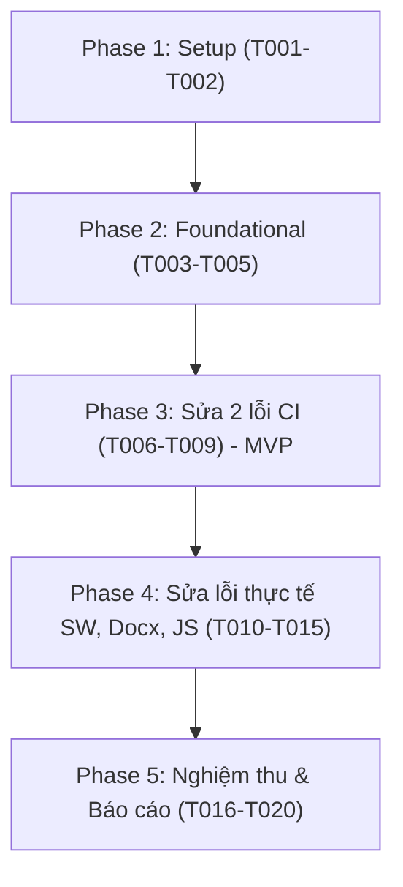

# Tasks: 021 — Sửa lỗi CI và hoàn thiện Web Client

**Input**: Design artifacts from `specs/021-ci-and-web-client-hardening/`
**Target Commit Convention**: "fix(ci): ... [CI]" (mỗi phần/mục một commit riêng)

---

## Phase 1: Setup & Environment Validation (Shared Infrastructure)

**Purpose**: Xác minh môi trường và công cụ cơ sở trước khi sửa code

- [x] T001 Kiểm tra môi trường Node, Python và trạng thái git sạch sẽ tại `d:\viet\app`
- [x] T002 Đăng ký marker `web` trong `pytest.ini` để phân lập các kiểm thử Web Client khỏi bộ test CPython lõi

---

## Phase 2: Foundational (Blocking Prerequisites)

**Purpose**: Chuẩn bị các cấu hình phụ thuộc dùng chung cho cả Phần A và Phần B

- [x] T003 Loại bỏ `[tool.pytest.ini_options]` khỏi `pyproject.toml` để triệt tiêu cảnh báo ignoring pytest config
- [x] T004 Loại bỏ `pyinstaller==6.12.0` khỏi `requirements-dev.txt` và thêm comment giải thích không hỗ trợ Python 3.14
- [x] T005 Cập nhật `README.md` trỏ sang `requirements-build.txt` cho mục đóng gói desktop binary

---

## Phase 3: User Story 1 — Sửa dứt điểm 2 lỗi CI đang đỏ (Phần A) (Priority: P1) 🎯 MVP

**Goal**: Sửa `scripts/build_web.py`, viết lại `tests/test_build_web.py`, cập nhật `.github/workflows/ci.yml` để 4/4 jobs CI xanh 100%.

**Independent Test**:
- Chạy `pip install -r requirements-dev.txt` trên Python 3.14 thành công.
- Chạy `pytest -m "not benchmark"` khi thiếu `node_modules` -> các test web được skip, 0 fail.
- Chạy với `REQUIRE_WEB_BUILD=1` khi thiếu `node_modules` -> test fail.
- Chạy với `REQUIRE_WEB_BUILD=1` khi có `node_modules` -> test pass, `webapp/dist` không bị đụng chạm.
- Chạy `build_web.py --dist <root>` -> SystemExit, repo an toàn.

### Implementation Tasks for User Story 1

- [x] T006 [US1] Cập nhật `scripts/build_web.py`:
  - Thêm `argparse` hỗ trợ `--dist <thư mục>`, mặc định `webapp/dist`, truyền `dist_dir` vào các hàm con;
  - Thêm `require_pyodide_runtime()` kiểm tra `node_modules/pyodide` TRƯỚC khi xoá dist cũ (thông báo ghi `npm ci`);
  - Thêm kiểm tra an toàn trong `prepare_dist_dir()`: raise SystemExit nếu `dist_dir` là `ROOT_DIR`, tổ tiên của `ROOT_DIR`, filesystem root (`/`, `C:\`), hoặc nằm trong `webapp/` (trừ `webapp/dist`);
  - Cập nhật `generate_version_json()`: đọc `pyodide_version` động từ `node_modules/pyodide/package.json`;
  - Cập nhật `ensure_vendor_wheels()`: tải bằng `urlopen(timeout=60)` kèm vòng lặp retry tối đa 3 lần cho lỗi mạng/HTTP 5xx, không retry HTTP 4xx.
- [x] T007 [P] [US1] Viết lại `tests/test_build_web.py`:
  - Gắn marker `@pytest.mark.web` và timeout 300s;
  - Viết fixture `built_dist(tmp_path_factory)` build vào thư mục tạm bằng `--dist`, assert returncode == 0 và assert `webapp/dist` không bị đổi mtime;
  - Tách các test kiểm tra: `version.json` khớp `package.json`, đủ 5 wheels, `chuviettay.zip` sạch (có bridge/app_controller/teach_geometry/bank, không có view/fidelity/gui.py/cli.py), `dist` không có file cấm;
  - Thêm test an toàn `test_prepare_dist_dir_safety(monkeypatch, tmp_path)` kiểm tra các đường dẫn cấm trên thư mục giả lập (tuyệt đối không trỏ repo thật);
  - Cấu hình skip khi thiếu `node_modules/pyodide` trừ khi `REQUIRE_WEB_BUILD=="1"` (thì phải fail).
- [x] T008 [US1] Cập nhật `.github/workflows/ci.yml`:
  - Trong job `web-client`: sau `npm ci`, thêm bước cài `pip install pytest pytest-timeout`; thêm bước chạy `REQUIRE_WEB_BUILD: '1'` `python -m pytest tests/test_build_web.py -vv --timeout=300 -p no:cacheprovider` TRƯỚC bước "Build Web Client Dist";
  - Trong job `test-python-314`: đổi `python-version` từ `'3.14-dev'` sang `'3.14'`.
- [x] T009 [US1] Chạy kiểm chứng nghiệm thu Phần A:
  - Kiểm tra `pip install -r requirements-dev.txt`;
  - Kiểm tra chạy test web khi có và không có `REQUIRE_WEB_BUILD`;
  - Kiểm tra `python scripts/build_web.py --dist .` từ chối an toàn.

---

## Phase 4: User Story 2 — Khắc phục các lỗi thực tế phát hiện khi rà soát (Phần B) (Priority: P2)

**Goal**: Sửa Service Worker tự động nhận bản mới, hỗ trợ mở `.docx` trong Pyodide, bổ sung test JS/Browser vào CI, tăng cường độ bền SW và khử hard-code version.

**Independent Test**:
- Playwright E2E: cập nhật app.js và build lại -> reload trang nhận nội dung mới.
- Playwright E2E: upload `tests/fixtures/sample.docx` -> văn bản hiển thị trong editor.
- Chạy `npm run test:unit` và `npm run test:browser` -> 100% pass trên mọi hệ điều hành.

### Implementation Tasks for User Story 2

- [x] T010 [US2] B1: Cập nhật cơ chế sinh Service Worker trong `scripts/build_web.py`:
  - Tính SHA-256 các file trong `dist_dir` (trừ `sw.js`), sinh chuỗi băm 12 ký tự cho `CACHE_NAME`;
  - Quét danh sách tệp thực tế trong `dist_dir` để sinh `PRECACHE_URLS` động (loại bỏ file không tồn tại);
  - Ghi đè template `webapp/sw.js` vào `dist_dir / "sw.js"`.
- [x] T011 [P] [US2] B1: Viết test hồi quy Playwright `tests/e2e/sw-update.spec.ts`:
  - Mở web -> chờ SW active -> đổi nội dung file trong dist và build lại với hash mới -> reload -> khẳng định trang nhận nội dung mới.
- [x] T012 [US2] B2: Bổ sung wheel `typing-extensions` và nạp `.docx` trong `webapp/js/worker/py-worker.js`:
  - Cập nhật `scripts/vendor_lock.json`: thêm `typing-extensions 4.15.0` (py3-none-any);
  - Cập nhật `py-worker.js`: trích xuất đường dẫn `site_packages` động bằng `site.getsitepackages()[0]`;
  - Trong nhánh `import_docx`: nạp wheel `typing_extensions` TRƯỚC `python_docx`.
- [x] T013 [P] [US2] B2: Viết test hồi quy Playwright `tests/e2e/docx-import.spec.ts`:
  - Mở web -> upload `tests/fixtures/sample.docx` qua `#input-open-file` -> khẳng định text hiển thị trong `#editor-text`.
- [x] T014 [US2] B3: Chuẩn hoá scripts kiểm thử JS và đưa vào CI:
  - Cập nhật `tests/js/zip.test.mjs`: xác định command python đa nền tảng (`py -3` hoặc `python3` hoặc `process.env.PYTHON`), dùng `execFileSync`;
  - Cập nhật `package.json`: thêm `"test:unit": "node --test 'tests/js/*.test.mjs'"` và `"test:browser": "node tests/browser/test_bridge_no_tkinter.mjs && node tests/browser/test_bank_merge_memfs.mjs"`;
  - Cập nhật `.github/workflows/ci.yml`: thêm bước chạy `npm run test:unit` và `npm run test:browser` trong job `web-client`.
- [x] T015 [US2] B4 & B5 & B6: Đồng bộ Node, tăng độ bền SW và khử hard-code:
  - B5: Trong `webapp/sw.js`, chỉnh sửa `install` event sao cho nếu tải bất kỳ core asset nào (wasm, stdlib, wheels, zip) thất bại thì promise phải reject;
  - B6: Khử hard-code `/lib/python3.14/site-packages` trong `scripts/test_golden_pyodide.mjs` bằng cách lấy động từ `site.getsitepackages()`;
  - B4: Khảo sát chạy thử toàn bộ bộ kiểm thử trên Node 24 (`.node-version`).

---

## Phase 5: Polish, Nghiệm thu Toàn diện & Báo cáo (Phần C)

**Purpose**: Chạy lại toàn bộ kiểm chứng và lập báo cáo chi tiết nghiệm thu

- [x] T016 [P] Chạy toàn bộ bộ kiểm thử CPython: `pytest tests/ -m "not benchmark"` (đạt 1.119 passed)
- [x] T017 [P] Chạy toàn bộ Golden Master Pyodide: `node scripts/test_golden_pyodide.mjs` (đạt 8/8 passed)
- [x] T018 [P] Chạy toàn bộ Playwright E2E: `npx playwright test --workers=2` (đạt 8/8 suites passed)
- [x] T019 [P] Chạy linter: `ruff check .`
- [x] T020 Lập báo cáo cuối cùng theo mục Phần C cho từng mục A1 đến B6 kèm lệnh và kết quả thật.

---

## Dependencies & Execution Order

---

## Parallel Opportunities

- **Trong Phase 2**: T003, T004, T005 có thể thực hiện song song (khác file).
- **Trong Phase 3**: T006 và T007 có thể viết song song; sau đó chạy T008 và T009.
- **Trong Phase 4**: T010 + T011 (SW), T012 + T013 (Docx), T014 (JS test) có thể thực hiện theo từng luồng độc lập.
- **Trong Phase 5**: T016, T017, T018, T019 có thể chạy song song.

---

## Implementation Strategy

1. **MVP First (Phần A)**:
   - Sửa `build_web.py`, viết lại `tests/test_build_web.py`, cập nhật `ci.yml` và dọn cấu hình.
   - Chạy nghiệm thu Phần A ngay để đảm bảo CI xanh trở lại 100%.
2. **Khắc phục Lỗi Thực tế (Phần B)**:
   - Thực hiện lần lượt từng mục B1 (SW cache), B2 (docx typing-extensions), B3 (JS tests CI), B5 (SW robust), B6 (khử hardcode).
   - Mỗi mục có regression test chạy thật.
3. **Nghiệm thu & Báo cáo (Phần C)**:
   - Chạy lại toàn bộ test suite và lập báo cáo.
