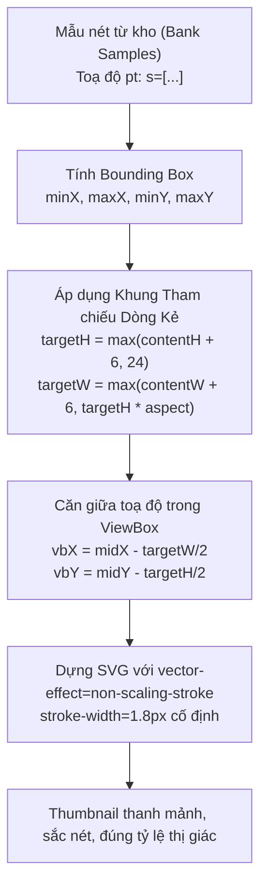

# Data Model: Bank Stroke Width Consistency

## Entities & View Representations

### 1. SVG Thumbnail Configuration (Client-side Presentation)

Mô hình tham số dựng hình cho hàm `createSvgFromStrokes`:

| Trường | Kiểu | Mô tả | Mặc định |
| :--- | :--- | :--- | :--- |
| `strokes` | `number[][]` | Danh sách các nét vẽ phẳng `[x0, y0, x1, y1, ...]` trong hệ toạ độ Bank (pt) | Bắt buộc |
| `width` | `number` | Chiều rộng mong muốn của thẻ SVG (px) | 100 |
| `height` | `number` | Chiều cao mong muốn của thẻ SVG (px) | 50 |
| `options.minVbHeight` | `number` | Chiều cao tham chiếu tối thiểu cho `viewBox` (pt) nhằm ngăn chặn zoom phóng đại nét các ký tự nhỏ | 24.0 |
| `options.strokeWidth` | `number` | Độ dày nét hiển thị (px trên màn hình khi dùng non-scaling-stroke) | 1.8 |
| `options.showBaseline` | `boolean` | Có hiển thị vạch chân chữ mờ (y=0 trong hệ toạ độ Bank) hay không | false |

### 2. ViewBox Dimension Logic

Cho một tập hợp các nét vẽ có:
- `minX`, `maxX`: toạ độ cực trị theo trục hoành (pt).
- `minY`, `maxY`: toạ độ cực trị theo trục tung (pt).
- `contentW = maxX - minX`, `contentH = maxY - minY`.
- `pad = 3.0` pt.

Quy tắc tính `viewBox`:
1. Chiều cao tối thiểu `targetH = Math.max(contentH + pad * 2, options.minVbHeight)`.
2. Tỷ lệ khung nhìn `aspect = width / height`.
3. Chiều rộng tối thiểu tương ứng tỷ lệ `targetW = Math.max(contentW + pad * 2, targetH * aspect)`.
4. Nếu `targetW / aspect > targetH`:
   - `targetH = targetW / aspect`.
5. Điểm gốc `vbX = (minX + maxX)/2 - targetW/2`.
6. Điểm gốc `vbY = (minY + maxY)/2 - targetH/2`.
7. `viewBox="${vbX} ${vbY} ${targetW} ${targetH}"`.

---

## State & Flow

