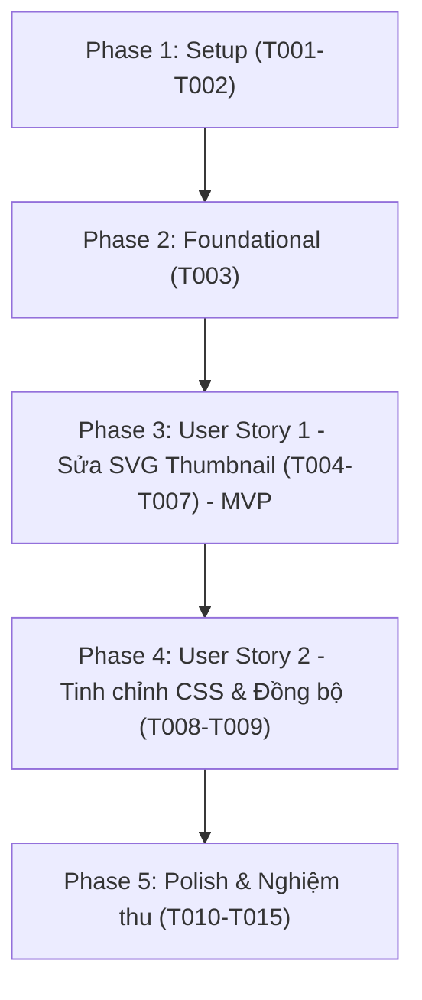

# Tasks: Đồng bộ độ dày nét hiển thị giữa Dạy chữ và Kho mẫu (Bank Stroke Width Consistency)

**Input**: Design artifacts from `specs/022-bank-stroke-width-consistency/`
**Target Commit Convention**: "fix(bank): ... [CI]"

---

## Phase 1: Setup (Shared Infrastructure)

**Purpose**: Chuẩn bị hạ tầng kiểm thử và môi trường xác minh độc lập

- [x] T001 Kiểm tra trạng thái git và môi trường Node/Python tại `d:\viet\app`
- [x] T002 [P] Tạo bộ test mẫu nét chuẩn (chữ số 2, dấu chấm, từ nhiều nét) trong `tests/js/thumbnail.test.mjs`

---

## Phase 2: Foundational (Blocking Prerequisites)

**Purpose**: Chuẩn bị cấu trúc hàm và export module cần thiết cho kiểm thử tự động

- [x] T003 Export hàm `createSvgFromStrokes` trong `webapp/js/bank.js` để có thể import và kiểm thử độc lập từ Node.js

---

## Phase 3: User Story 1 — Hiển thị nét mẫu trung thực và đúng tỷ lệ trong Kho mẫu (Priority: P1) 🎯 MVP

**Goal**: Sửa hàm `createSvgFromStrokes` trong `webapp/js/bank.js` để khắc phục lỗi nét chữ bị phóng đại thành nét siêu đậm ở các ký tự hẹp (như số "2")

**Independent Test**:
- Chạy unit test `node --test tests/js/thumbnail.test.mjs` kiểm tra SVG tạo ra có `vector-effect="non-scaling-stroke"` và `viewBox` cao tối thiểu 24pt.
- Chạy Playwright E2E: mở modal chi tiết mẫu số "2" và khẳng định thuộc tính SVG của thumbnail.

### Tests for User Story 1

- [x] T004 [P] [US1] Viết unit test cho `createSvgFromStrokes` trong `tests/js/thumbnail.test.mjs`:
  - Test trường hợp chữ số "2": khẳng định có `vector-effect="non-scaling-stroke"`, `viewBox` có chiều cao >= 24pt, `stroke-width` là 1.8.
  - Test trường hợp strokes rỗng: trả về chuỗi rỗng `""`.
  - Test trường hợp từ dài ("nghiên cứu"): `viewBox` mở rộng theo chiều ngang bảo toàn tỷ lệ khung hình.
- [x] T005 [P] [US1] Bổ sung kiểm tra Playwright E2E trong `tests/e2e/bank.spec.ts` kiểm tra SVG thumbnail trong `#modal-label-samples-grid`.

### Implementation for User Story 1

- [x] T006 [US1] Cập nhật hàm `createSvgFromStrokes` trong `webapp/js/bank.js`:
  - Bổ sung tham số tuỳ chọn `options = {}` (`minVbHeight = 24.0`, `strokeWidth = 1.8`, `showBaseline = false`);
  - Áp dụng khung tham chiếu chiều cao tối thiểu (`targetH = Math.max(contentH + pad*2, minVbHeight)`);
  - Căn giữa nét theo trục hoành (`vbX = midX - targetW/2`) và neo trục tung theo baseline (`y=0`);
  - Thêm `vector-effect="non-scaling-stroke"` vào thẻ `<polyline>`;
  - Nếu `options.showBaseline` bật, thêm đường kẻ mốc chân chữ mờ mảnh (`stroke="#e2e8f0" stroke-dasharray="2,2"`).
- [x] T007 [US1] Cập nhật các vị trí gọi `createSvgFromStrokes` trong `webapp/js/bank.js`:
  - Trong `loadThumbnailsLazy`: hiển thị thumbnail thẻ kho danh mục;
  - Trong `openLabelDetail`: kích hoạt `showBaseline: true` cho modal chi tiết biến thể mẫu.

---

## Phase 4: User Story 2 — Đồng bộ tuỳ chọn nét bút và tinh chỉnh CSS hiển thị (Priority: P2)

**Goal**: Đảm bảo hiển thị SVG thumbnail trên giao diện web không bị biến dạng tỷ lệ trong các thẻ card

**Independent Test**:
- Kiểm tra trực quan trên trình duyệt và kiểm thử tự động Playwright xác nhận thẻ `.sample-item-thumb` và `.bank-card-thumb` hiển thị sắc nét.

### Implementation for User Story 2

- [x] T008 [P] [US2] Cập nhật stylesheet `webapp/css/style.css` cho `.sample-item-thumb` và `.bank-card-thumb`:
  - Đảm bảo SVG hiển thị cân đối giữa khung hình, `overflow: hidden`, không bị co méo hoặc tràn viền.
- [x] T009 [US2] Tích hợp file test `tests/js/thumbnail.test.mjs` vào script `"test:unit"` trong `package.json`.

---

## Phase 5: Polish & Nghiệm thu Toàn diện

**Purpose**: Build lại bản dist, chạy toàn bộ các bộ kiểm thử và kiểm chứng trực quan

- [x] T010 Build lại web dist: `py -3.10 scripts/build_web.py`
- [x] T011 [P] Chạy unit test JS: `npm run test:unit`
- [x] T012 [P] Chạy kiểm thử E2E: `npx playwright test tests/e2e/bank.spec.ts`
- [x] T013 [P] Chạy kiểm thử Golden Master trong Pyodide: `node scripts/test_golden_pyodide.mjs`
- [x] T014 [P] Chạy linter: `py -3.10 -m ruff check .`
- [x] T015 Nghiệm thu tổng thể và kiểm chứng hình ảnh chữ số "2" không còn bị đậm đen.

---

## Dependencies & Execution Order

---

## Parallel Opportunities

- **Trong Phase 1 & 2**: T002 và T003 có thể viết đồng thời.
- **Trong Phase 3**: T004 (Unit test) và T005 (E2E test) có thể viết song song trước khi triển khai T006.
- **Trong Phase 5**: T011, T012, T013, T014 có thể chạy kiểm chứng song song.

---

## Implementation Strategy

1. **MVP First (User Story 1)**:
   - Viết test kiểm tra `createSvgFromStrokes` trong `tests/js/thumbnail.test.mjs`.
   - Sửa thuật toán `createSvgFromStrokes` trong `webapp/js/bank.js`.
   - Đảm bảo test pass ngay lập tức.
2. **CSS & Tích hợp (User Story 2)**:
   - Tinh chỉnh CSS `.sample-item-thumb` và cấu hình `package.json`.
3. **Nghiệm thu toàn diện**:
   - Rebuild dist, chạy toàn bộ suite test và bàn giao.
