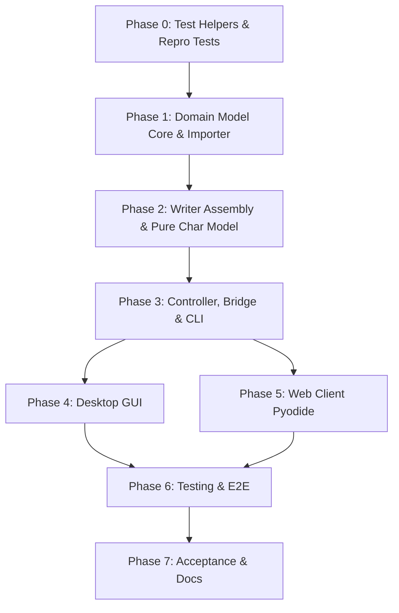

# Tasks: Thuần Ký Tự và Nạp Lưới Tạo Kho Mẫu

**Feature**: `specs/024-kho-ky-tu`  
**Input**: [spec.md](file:///d:/viet/app/specs/024-kho-ky-tu/spec.md), [plan.md](file:///d:/viet/app/specs/024-kho-ky-tu/plan.md), [research.md](file:///d:/viet/app/specs/024-kho-ky-tu/research.md), [data-model.md](file:///d:/viet/app/specs/024-kho-ky-tu/data-model.md), [contracts/char-bank-api.md](file:///d:/viet/app/specs/024-kho-ky-tu/contracts/char-bank-api.md)

---

## Quy tắc Thực hiện và Cam kết Git (Git Protocol)

- Triển khai theo thứ tự các pha P0 $\rightarrow$ P7.
- **Hết mỗi pha**: Chạy toàn bộ test suite (`pytest -q`), đảm bảo 100% test pass (xanh), sau đó tạo đúng **1 commit nhỏ** có tag pha chuẩn tiếng Việt (ví dụ: `feat(grid): ... [P1]`).
- Tuân thủ nghiêm ngặt mô hình MVC: `tests/test_architecture.py` không được có vi phạm.
- Không xoá dữ liệu `words` của kho cũ (D1).

---

## Phase 0: Test Helpers & Repro Failing Tests [P0]

**Mục tiêu**: Chuẩn bị công cụ sinh nét mực giả lập và viết các bài test kiểm tra lỗi hiện tại (đỏ trước khi sửa).

- [ ] T001 [P] [P0] Tạo helper `fill_grid_with_ink(grid_path, out_path, labels=None)` trong `tests/helpers.py` để giả lập người dùng viết nét mực vào các ô lưới
- [ ] T002 [P] [P0] Viết test tái hiện lỗi F2 (giãn chữ 10 lần do bearing mép ô) trong `tests/test_grid_import.py` (kỳ vọng FAIL trước khi sửa)
- [ ] T003 [P] [P0] Viết test kiểm tra phân loại ký tự `classify_char` và nhận diện `HW3_TONE_MAP` trong `tests/test_char_catalog.py` (kỳ vọng FAIL)
- [ ] T004 [P] [P0] Viết test kiểm tra chọn ký tự mốc calib `pick_calib_char` trong `tests/test_char_catalog.py` khi kho không có `words` (kỳ vọng FAIL)

*Checkpoint P0*: Chạy `pytest tests/test_grid_import.py tests/test_char_catalog.py` xác nhận các bài test tái hiện thất bại chính xác. Commit: `test(grid): add test helpers and repro failing tests [P0]`.

---

## Phase 1: Domain Model Core & Importer [P1]

**Mục tiêu**: Xây dựng module danh mục ký tự chuẩn, bộ phân loại, sửa lỗi bearing F2 và hoàn thiện importer lưới ký tự trả về `GridImportResult`.

- [ ] T005 [P1] Tạo module danh mục ký tự chuẩn `chuviettay/model/char_catalog.py` với các bộ `co_ban`, `toan_hy_lap`, `mo_rong`, `day_du` (D2)
- [ ] T006 [P1] Bổ sung hàm `classify_char(label)` trong `chuviettay/model/text_utils.py` hỗ trợ ký tự đơn và `HW3_TONE_MAP` (D3)
- [ ] T007 [P1] Sửa `chuviettay/model/xopp.py`: tính `lsb/rsb` theo bounding box nét vẽ/contour thay vì lề ô hw3, loại bỏ lỗi F2
- [ ] T008 [P1] Định nghĩa dataclass `GridImportResult` và cài đặt hàm `import_char_grid(bank, xopp_content_or_path)` trong `chuviettay/model/xopp.py` (hoặc `learning.py`) trả về báo cáo chi tiết (D8, D7)
- [ ] T009 [P1] Cập nhật `chuviettay/model/calibration.py`: bổ sung `pick_calib_char(bank)` ưu tiên các ký tự x-height chuẩn ('n', 'o', 'a', 'm', 'u') (D5)
- [ ] T010 [P1] Cập nhật `chuviettay/model/bank.py`: hỗ trợ lưu trữ mẫu ký tự mới, bảo toàn trường `words` của kho cũ và tombstone namespace (D1)
- [ ] T011 [P1] Đồng bộ `chuviettay/tao_luoi_day_du.py` sử dụng chung nguồn `char_catalog.py`

*Checkpoint P1*: Toàn bộ test T001–T004 chuyển sang XANH. Không vi phạm kiến trúc. Commit: `feat(grid): implement char catalog, classify_char, and grid importer [P1]`.

---

## Phase 2: Writer Assembly & Chuyển Đổi Thuần Ký Tự [P2]

**Mục tiêu**: Chuyển pipeline viết văn bản sang thuần ghép ký tự, loại bỏ phụ thuộc vào `bank.words` và cờ `--assemble`.

- [ ] T012 [P2] Cập nhật `chuviettay/model/writer.py`: mặc định luôn ghép từ ký tự (`assemble_word`), loại bỏ điều kiện kiểm tra cờ `self.assemble_letters`
- [ ] T013 [P2] Bổ sung cơ chế phòng vệ 2 lớp trong `Writer.assemble_word`: kẹp trần `lsb <= 0.3 * xh`, `rsb <= 0.3 * xh` (D4)
- [ ] T014 [P2] Cập nhật `Writer.get_letter_sample`: bỏ tra cứu fallback vào `bank.words` khi viết văn bản mới
- [ ] T015 [P2] Cập nhật `chuviettay/model/text_utils.py: missing_letters_ranked`: tính toán các ký tự còn thiếu trực tiếp từ `letters`, `marks`, `digits`, `punct`, `symbols` (bỏ `bank_words`)

*Checkpoint P2*: Test render văn bản luôn ghép từ ký tự thành công, không bị giãn chữ. Commit: `feat(writer): enforce letter assembly and remove word model [P2]`.

---

## Phase 3: Controller, Bridge & CLI Integration [P3]

**Mục tiêu**: Tích hợp luồng nạp lưới và quản lý danh mục ký tự vào `AppController`, `browser/bridge.py` và CLI `chuviettay.cli`.

- [ ] T016 [P3] Bổ sung các phương thức vào `chuviettay/controller/app_controller.py`: `import_grid(...)`, `teach_char(...)`, `get_char_catalog(...)`, `get_missing_chars(...)`
- [ ] T017 [P3] Cập nhật `chuviettay/browser/bridge.py`: thêm endpoint `import_grid`, `get_char_catalog`, `get_missing_chars`, chuẩn hoá qua `_clean_json()`
- [ ] T018 [P3] Cập nhật `chuviettay/cli.py`:
  - Lệnh `grid`: hỗ trợ `--set [co_ban|toan_hy_lap|day_du]`, `--with-clusters` (mặc định tắt cụm)
  - Lệnh `learn`: hỗ trợ `--grid file.xopp`, in báo cáo `GridImportResult` ra console
  - Lệnh `write`: loại bỏ cờ `--assemble` (hoặc giữ làm cờ no-op có cảnh báo deprecated)

*Checkpoint P3*: CLI `grid`, `learn`, `write` hoạt động trơn tru từ đầu đến cuối. `pytest` pass. Commit: `feat(controller): add char grid controller and bridge endpoints [P3]`.

---

## Phase 4: Desktop GUI (Tkinter) [P4]

**Mục tiêu**: Cập nhật giao diện desktop Tkinter sang mô hình thuần ký tự.

- [ ] T019 [P4] Cập nhật `chuviettay/view/teach_tab.py`: thay nút "Bộ tối thiểu" / "Từ thông dụng" bằng nút "Bộ ký tự…", thêm nút "Nạp file lưới (.xopp)…", xóa bảng nhập từ đơn lẻ
- [ ] T020 [P4] Cập nhật `chuviettay/view/bank_tab.py`: ẩn/xóa tab "Từ", chỉ hiển thị các tab "Chữ cái", "Chữ số", "Dấu câu", "Ký hiệu", "Dấu thanh"
- [ ] T021 [P4] Cập nhật `chuviettay/view/write_tab.py`: bỏ checkbox "Ghép chữ cái" (luôn tự động bật)

*Checkpoint P4*: GUI chạy ổn định, không lỗi import hay phá vỡ kiến trúc MVC. Commit: `feat(gui): update desktop gui to char-only model [P4]`.

---

## Phase 5: Web Client (Pyodide Worker & UI) [P5]

**Mục tiêu**: Cập nhật Web Client trên trình duyệt sang thuần ký tự và hỗ trợ nạp file lưới.

- [ ] T022 [P5] Cập nhật `webapp/index.html`: đổi nút "Bộ tối thiểu" và "Từ thông dụng" thành menu "Bộ ký tự…", thêm nút "Nạp file lưới (.xopp)…", cập nhật giao diện modal báo cáo
- [ ] T023 [P5] Cập nhật `webapp/js/worker/py-worker.js`: hỗ trợ chuyển tiếp các action `import_grid`, `get_char_catalog`, `teach_char`
- [ ] T024 [P5] Cập nhật `webapp/js/teach.js`: cài đặt xử lý chọn bộ ký tự, tải lên file `.xopp` và hiển thị modal kết quả `GridImportResult`
- [ ] T025 [P5] Cập nhật `webapp/js/bank.js`: chỉ hiển thị các danh mục ký tự, bỏ bảng quản lý từ `words`
- [ ] T026 [P5] Cập nhật `webapp/js/write.js`: loại bỏ các tùy chọn ghép chữ thừa, kiểm tra hiển thị không báo lỗi thiếu từ khi đã đủ chữ cái

*Checkpoint P5*: Giao diện Web hoạt động mượt mà, Pyodide nạp lưới thành công và hiển thị thống kê. Commit: `feat(web): update web client for char bank and grid upload [P5]`.

---

## Phase 6: Comprehensive Testing & E2E Verification [P6]

**Mục tiêu**: Cập nhật toàn bộ test suite và viết bài kiểm thử Playwright E2E.

- [ ] T027 [P6] Rà soát và cập nhật toàn bộ bài test cũ trong `tests/` bị ảnh hưởng do bỏ mô hình từ
- [ ] T028 [P6] Bổ sung test kiểm thử tính idempotent khi nạp lưới nhiều lần và xử lý ô trùng lặp
- [ ] T029 [P6] Tạo kịch bản Playwright E2E `tests/e2e/grid-import.spec.ts`: kiểm thử người dùng nạp file lưới `.xopp` trên giao diện web và viết chữ
- [ ] T030 [P6] Chạy toàn bộ test suite (`pytest` + `npm run test:e2e`), đảm bảo 100% pass

*Checkpoint P6*: Test suite tự động hoàn toàn xanh. Commit: `test: add comprehensive test suite for char bank [P6]`.

---

## Phase 7: Nghiệm Thu & Cập Nhật Tài Liệu [P7]

**Mục tiêu**: Nghiệm thu end-to-end độc lập và hoàn thiện tài liệu người dùng.

- [ ] T031 [P7] Tạo script nghiệm thu đầu cuối độc lập `tools/accept_char_bank.py` kiểm tra trọn vẹn chu trình (sinh lưới $\rightarrow$ viết mực $\rightarrow$ nạp kho $\rightarrow$ xuất văn bản)
- [ ] T032 [P7] Cập nhật `README.md` và `CHANGELOG.md`: mô tả luồng sử dụng mới (thuần ký tự, nạp lưới .xopp) và gỡ bỏ các hướng dẫn cũ liên quan đến dạy từ

*Checkpoint P7*: Chạy thành công script nghiệm thu. Commit: `docs: update documentation and acceptance report [P7]`.

---

## Dependencies & Execution Order

