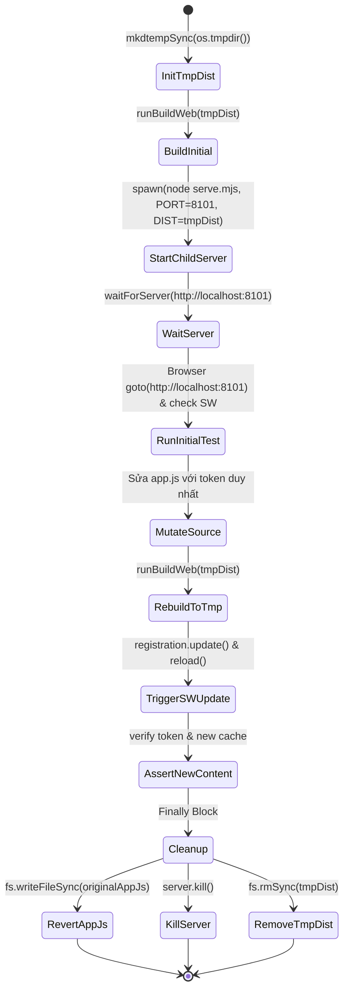
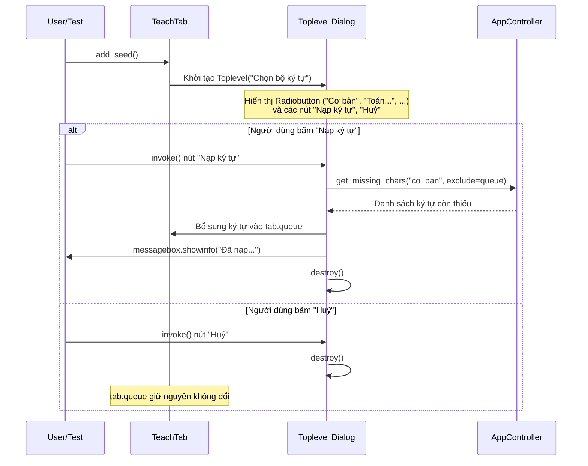

# Data Model & State Lifecycle: 025 — Sửa lỗi CI Kiểm Thử Tự Động

## 1. Mô hình Môi trường Phục vụ Kiểm thử Cách ly (E2E Test Environment)

### Các thuộc tính trạng thái:
- **`SW_PORT`**: Số cổng dành riêng cho test update SW, cố định là `8101`.
- **`SW_ORIGIN`**: `http://localhost:8101`.
- **`tmpDist`**: Đường dẫn thư mục tạm thời trên hệ thống tệp, được sinh bởi `fs.mkdtempSync("viet-sw-dist-")`.
- **`server`**: Thực thể tiến trình con `ChildProcess` chạy máy chủ `serve.mjs`.
- **`uniqueToken`**: Chuỗi bình luận duy nhất `/* SW_UPDATE_TEST_<timestamp> */` để xác nhận nội dung thực tế được tải lại qua mạng/SW.

---

## 2. Mô hình Tương tác Hộp thoại Chọn Bộ Ký tự (GUI Tkinter)

