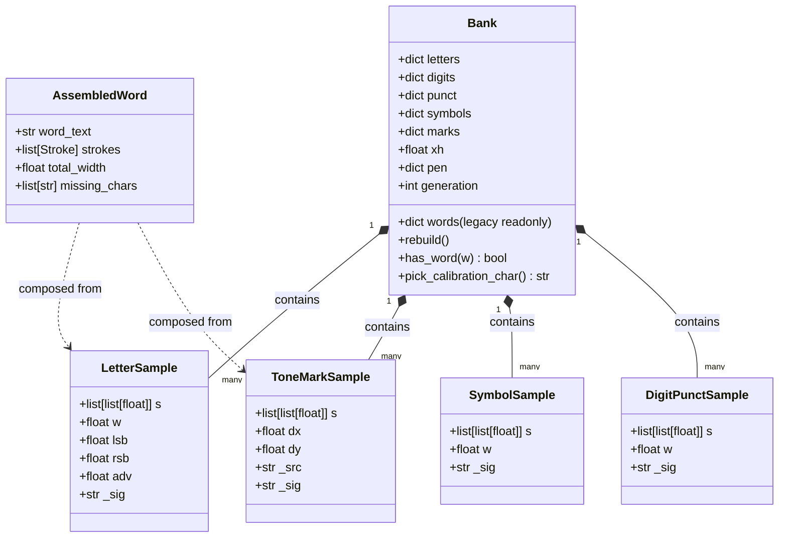

# Data Model: Thuần Ký Tự Mẫu & Loại Bỏ Từ Nguyên Khối

**Feature**: `026-remove-whole-words`
**Date**: 2026-10-06

## 1. Sơ đồ Thực thể và Quan hệ (Entity Relationship)



---

## 2. Chi tiết Cấu trúc Dữ liệu

### 2.1. Cấu trúc Kho mẫu trong Bộ nhớ (`Bank`)

| Thuộc tính | Kiểu dữ liệu | Vai trò | Trạng thái trong tính năng mới |
|---|---|---|---|
| `letters` | `dict[str, list[LetterSample]]` | Mẫu các chữ cái đơn lẻ (thường, hoa, có dấu/không dấu) | **Trọng tâm chính** cho bộ máy ghép từ (`assemble_word`) |
| `marks` | `dict[str, list[ToneMarkSample]]` | Mẫu các dấu thanh rời (`\u0301`, `\u0300`, `\u0309`, `\u0303`, `\u0323`) | **Trọng tâm chính** cho phân tách và ghép dấu thanh rời (Path 2) |
| `digits` | `dict[str, list[DigitPunctSample]]` | Mẫu các chữ số 0-9 | Dùng kết xuất số |
| `punct` | `dict[str, list[DigitPunctSample]]` | Mẫu các dấu câu thông dụng | Dùng kết xuất dấu câu |
| `symbols` | `dict[str, list[SymbolSample]]` | Mẫu các ký hiệu toán học / hy lạp | Dùng kết xuất ký hiệu và công thức |
| `words` | `dict[str, list[dict]]` | Mẫu từ nguyên khối (cũ) | **Legacy / Readonly**: Giữ trong file để không mất dữ liệu, nhưng **cô lập** khỏi mọi luồng ghép chữ, dạy chữ, báo thiếu |
| `tl` | `dict` | Chỉ mục thay thế thân từ cũ | **Bãi bỏ hoàn toàn** |

---

### 2.2. Đối tượng Ký tự Mốc Hiệu chỉnh (`CalibrationChar`)

```python
@dataclass(frozen=True)
class CalibrationCandidate:
    char: str              # Chữ cái mốc được chọn (ví dụ: 'o', 'a', 'e', 'n')
    sample_count: int      # Số mẫu hiện có (>= 3)
    mean_width: float      # Độ rộng trung bình (pt)
    stdev_width: float     # Độ lệch chuẩn độ rộng
    score: float           # Điểm số đánh giá độ ổn định
```

**Quy tắc lựa chọn (`pick_calibration_char`)**:
1. Tập ứng viên ưu tiên: `["o", "a", "e", "n", "u", "c", "m"]`.
2. Điều kiện hợp lệ: $N \ge 3$.
3. Điểm đánh giá: $\text{score} = N - 6 \times \frac{\sigma}{\mu}$.
4. Fallback 1: Chữ cái bất kỳ trong `bank.letters` có $N \ge 3$ và điểm cao nhất.
5. Fallback 2: Chữ cái bất kỳ trong `bank.letters` có $N = \max$.
6. Fallback 3: Trả về `None` nếu `bank.letters` rỗng.

---

### 2.3. Hàng đợi Dạy Ký tự (`CharQueue`)

```python
@dataclass
class CharQueueItem:
    label: str             # Ký tự đơn lẻ (hoặc mã dấu thanh)
    category: str          # 'letters' | 'digits' | 'punct' | 'symbols' | 'marks'
    is_calibration: bool   # True nếu là ký tự mốc đo cỡ tay phiên này
```

**Quy tắc phân rã văn bản đầu vào**:
- Khi người dùng gõ chuỗi $S$ vào ô thêm của hàng đợi:
  $$S_{\text{NFC}} = \text{unicodedata.normalize}('NFC', S)$$
  Tập ký tự trích xuất:
  $$C = \{ c \in S_{\text{NFC}} \mid c \text{ không phải khoảng trắng và không phải ký tự điều khiển} \}$$
- Với mỗi $c \in C$:
  - Phân loại bằng `classify_char(c)`.
  - Nếu $c$ chưa có mẫu trong kho hoặc số mẫu $< 3$, và chưa có trong hàng đợi hiện tại $\rightarrow$ đưa vào hàng đợi.

---

### 2.4. Kết quả Báo cáo Thiếu Mẫu (`MissingCharReport`)

Thay thế cho danh sách từ thiếu cũ (`missing_words: list[str]`):

```python
@dataclass
class MissingCharReport:
    missing_chars: list[tuple[str, int, list[str]]]
    # Danh sách: [(ký_tự, số_từ_chờ_mở_khóa, [từ_1, từ_2, ...])]
    # Sắp xếp giảm dần theo số_từ_chờ_mở_khóa
    total_missing_chars: int
    total_affected_words: int
```
