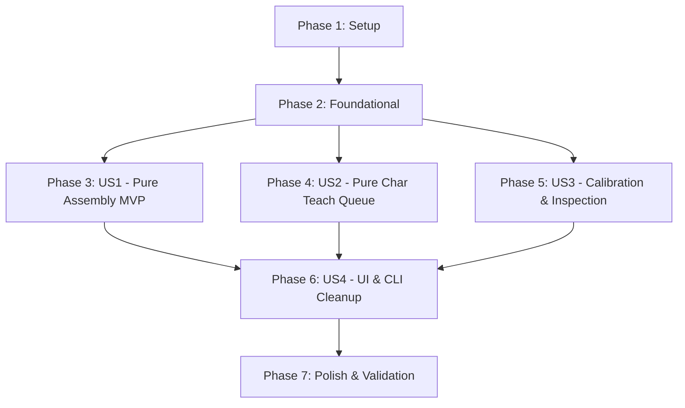

# Implementation Tasks: Loại Bỏ Từ Nguyên Khối, Chuyển Sang Thuần Ghép Ký Tự

**Feature**: `026-remove-whole-words` | **Branch**: `026-remove-whole-words`
**Specification**: [spec.md](./spec.md) | **Plan**: [plan.md](./plan.md)

---

## Phase 1: Setup (Shared Infrastructure)

**Purpose**: Xác lập môi trường và cấu hình kiểm thử trước khi thực hiện thay đổi

- [X] T001 Khảo sát toàn bộ các điểm kiểm thử liên quan đến `words` và `seed_words` trong `tests/`
- [X] T002 [P] Xác nhận trạng thái test baseline và chuẩn bị thư mục test fixtures nếu cần trong `tests/`

---

## Phase 2: Foundational (Blocking Prerequisites)

**Purpose**: Chuẩn hóa lớp mô hình dữ liệu lõi (`Bank` & `BankSchema`) để cô lập `words` và bảo đảm an toàn dữ liệu

- [X] T003 Loại bỏ việc duyệt `self.words` trong `Bank.rebuild()` và ngừng xây dựng chỉ mục `self.tl` trong `chuviettay/model/bank.py`
- [X] T004 Cập nhật `Bank.has_word(w)` để kiểm tra các ký tự thành phần trong `letters`, `marks`, `digits`, `punct`, `symbols` thay vì tra `self.words` và `self.tl` trong `chuviettay/model/bank.py`
- [X] T005 [P] Cập nhật `Bank.add_sample()` để mặc định phân loại token chữ cái vào `letters` thay vì `words` trong `chuviettay/model/bank.py`
- [X] T006 Đảm bảo cơ chế đọc và lưu file `.json.gz` giữ nguyên vẹn khóa `words` cũ mà không gây lỗi schema trong `chuviettay/model/bank_schema.py`

**Checkpoint**: Nền tảng mô hình kho mẫu đã sẵn sàng — `self.words` được cô lập hoàn toàn khỏi chỉ mục tra cứu.

---

## Phase 3: User Story 1 - Kết xuất thuần ghép ký tự & Báo cáo thiếu theo ký tự (Priority: P1) 🎯 MVP

**Goal**: Bộ máy kết xuất văn bản (`Writer` và `FidelityEngine`) 100% sử dụng thuật toán ghép từ ký tự mẫu đơn lẻ (`assemble_word`), loại bỏ fallback từ nguyên khối và phương thức `substitute()`. Báo cáo thiếu trả về chính xác danh sách ký tự đơn lẻ.

**Independent Test**: Kết xuất từ bất kỳ với kho chỉ chứa ký tự đơn; xác nhận `Writer` không truy vấn `bank.words`; khi thiếu ký tự, danh sách thiếu là ký tự đơn chứ không phải từ.

### Tests for User Story 1 🧪
- [X] T007 [P] [US1] Viết unit tests kiểm chứng `Writer.word()` và `Writer.token()` thuần ghép ký tự, không dùng `bank.words` trong `tests/test_writer.py`
- [X] T008 [P] [US1] Viết unit tests kiểm chứng `missing_letters_ranked` chỉ trả về ký tự đơn lẻ khi thiếu mẫu trong `tests/test_letter_assembly.py`

### Implementation for User Story 1
- [X] T009 [US1] Loại bỏ kiểm tra `c in self.b.words` và xóa bỏ phương thức `substitute()` trong `chuviettay/model/writer.py`
- [X] T010 [US1] Loại bỏ tra cứu `b.words` trong `get_letter_sample(char)` trong `chuviettay/model/writer.py`
- [X] T011 [US1] Loại bỏ tra cứu `tok in b.words` và `ch in b.words` trong `Writer.token(tok)` trong `chuviettay/model/writer.py`
- [X] T012 [US1] Cập nhật `missing_letters_ranked()` trong `chuviettay/model/text_utils.py` để không bỏ qua từ khi trùng khóa với `words_bank`
- [X] T013 [US1] Cập nhật `FidelityEngine` trong `chuviettay/fidelity/engine.py` để xuất lưới ô thiếu mẫu dựa trên danh sách ký tự đơn lẻ (`char_grid`) thay vì từ nguyên khối

**Checkpoint**: User Story 1 hoàn tất — Bộ máy kết xuất đã thuần ghép ký tự, MVP sẵn sàng kiểm thử độc lập!

---

## Phase 4: User Story 2 - Luồng dạy chữ & Hàng đợi chỉ tiếp nhận ký tự đơn (Priority: P1)

**Goal**: Giao diện và API dạy chữ chỉ tiếp nhận, bóc tách và lưu trữ các ký tự đơn lẻ (`letters`, `digits`, `punct`, `symbols`, `marks`), loại bỏ hoàn toàn chức năng dạy từ nguyên khối và nạp 700 từ thông dụng cũ.

**Independent Test**: Nhập chuỗi `"cà phê"` vào ô thêm của hàng đợi; xác nhận hàng đợi bóc tách thành các ký tự đơn lẻ `c`, `a`, `p`, `h`, `e`, dấu huyền, dấu ê; nhấn Lưu chỉ gọi `teach_char()`.

### Tests for User Story 2 🧪
- [X] T014 [P] [US2] Viết tests kiểm chứng bóc tách chuỗi văn bản thành danh sách ký tự đơn lẻ vào hàng đợi trong `tests/test_controller.py`
- [X] T015 [P] [US2] Viết tests kiểm chứng luồng `teach_char` lưu đúng danh mục ký tự trong `tests/test_controller.py`

### Implementation for User Story 2
- [X] T016 [US2] Cập nhật ô nhập và hàm `add_word()` trong `chuviettay/view/teach_tab.py` để tự động bóc tách chuỗi văn bản NFC thành các ký tự đơn lẻ còn thiếu
- [X] T017 [US2] Thay thế các lệnh gọi `ctl.teach_word()` bằng `ctl.teach_char()` trong `chuviettay/view/teach_tab.py`
- [X] T018 [US2] Cập nhật `webapp/js/teach.js` (hàm `addWordFromInput()` và `teachWordDirectly()`) để bóc tách chuỗi thành các ký tự đơn lẻ
- [X] T019 [US2] Cập nhật `webapp/js/teach.js` (hàm `saveWord()`) để luôn gọi action `teach_char` qua Worker thay vì `teach_sample` với category `words`
- [X] T020 [US2] Loại bỏ phương thức `teach_word()` trong `chuviettay/controller/app_controller.py` và `chuviettay/browser/bridge.py`
- [X] T021 [US2] Đánh dấu deprecated và thay thế các tham chiếu tới `chuviettay/model/seed_words.py` bằng `chuviettay/model/char_catalog.py`

**Checkpoint**: User Story 2 hoàn tất — Hàng đợi và luồng lưu nét hoàn toàn loại bỏ việc nạp từ nguyên khối.

---

## Phase 5: User Story 3 - Hiệu chỉnh cỡ tay & Xuất kiểm tra bằng ký tự mốc (Priority: P2)

**Goal**: Chuyển đổi 100% cơ chế đo cỡ tay sang sử dụng ký tự mốc ổn định (`pick_calibration_char`) và xuất file lưới kiểm tra kho (`export_check`) gồm toàn bộ các ký tự đã học thay vì từ nguyên khối.

**Independent Test**: Bấm "Hiệu chỉnh cỡ tay" khi kho có mẫu chữ cái; xác nhận hệ thống chọn một chữ cái mốc như `'o'`, `'a'`; chạy `check` xuất đủ các ký tự trong kho.

### Tests for User Story 3 🧪
- [X] T022 [P] [US3] Viết unit tests cho thuật toán `pick_calibration_char()` trong `tests/test_calibration.py`
- [X] T023 [P] [US3] Viết unit tests cho `ctl.export_check()` xuất lưới toàn bộ ký tự trong `tests/test_controller.py`

### Implementation for User Story 3
- [X] T024 [US3] Hiện thực thuật toán `pick_calibration_char(bank)` và loại bỏ `pick_calib_word()` trong `chuviettay/model/xopp.py`
- [X] T025 [US3] Cập nhật `AppController.pick_calibration_char()` và loại bỏ `pick_calibration_word()` trong `chuviettay/controller/app_controller.py`
- [X] T026 [US3] Cập nhật `AppController.export_check()` để xuất lưới tổng hợp các ký tự trong `letters`, `digits`, `punct`, `symbols`, `marks` trong `chuviettay/controller/app_controller.py`
- [X] T027 [US3] Cập nhật `Bridge.pick_calibration_char()` trong `chuviettay/browser/bridge.py` và ánh xạ trong `webapp/js/worker/py-worker.js`
- [X] T028 [US3] Cập nhật nút "Hiệu chỉnh cỡ tay" trong `chuviettay/view/teach_tab.py` và `webapp/js/teach.js` để gọi `pick_calibration_char()`

**Checkpoint**: User Story 3 hoàn tất — Đo cỡ tay và kiểm tra kho vận hành trơn tru trên nền tảng ký tự mốc.

---

## Phase 6: User Story 4 - Tinh gọn giao diện và cấu trúc quản lý kho (Priority: P3)

**Goal**: Loại bỏ danh mục "Từ vựng (words)" khỏi giao diện Web Client và Desktop GUI; chuẩn hóa thống kê kho mẫu theo số ký tự đơn và số mẫu nét; cập nhật CLI commands.

**Independent Test**: Mở tab Kho mẫu trên Web và Desktop; xác nhận không còn tab "Từ vựng"; số liệu hiển thị theo số chữ cái và mẫu nét; các lệnh CLI `check`, `stats`, `drop` phản ánh đúng thông tin ký tự.

### Tests for User Story 4 🧪
- [X] T029 [P] [US4] Viết tests cho `ctl.bank_size` và `ctl.get_stats()` theo cấu trúc thống kê ký tự mới trong `tests/test_controller.py`
- [X] T030 [P] [US4] Viết tests cho CLI `stats`, `drop`, `check` trong `tests/test_cli.py`

### Implementation for User Story 4
- [X] T031 [US4] Cập nhật thuộc tính `bank_size` trong `chuviettay/controller/app_controller.py` để tính tổng số ký tự đơn trong kho
- [X] T032 [US4] Cập nhật CLI commands (`_cmd_stats`, `_cmd_drop`, `_cmd_check`, `_cmd_seed`) trong `chuviettay/cli.py` sang mô hình ký tự
- [X] T033 [US4] Cập nhật `chuviettay/view/bank_tab.py` để hiển thị danh sách ký tự đơn thay vì `_all_words`
- [X] T034 [US4] Xóa nút lọc "Từ vựng (words)" trên `webapp/index.html` và chuyển danh mục mặc định sang `letters` trong `webapp/js/bank.js`
- [X] T035 [US4] Cập nhật hiển thị chuỗi thống kê trong `webapp/js/bank.js` và `webapp/js/i18n.js`

**Checkpoint**: User Story 4 hoàn tất — Toàn bộ giao diện và CLI đồng bộ 100% với mô hình thuần ký tự.

---

## Phase 7: Polish & Cross-Cutting Concerns

**Purpose**: Dọn dẹp mã nguồn thừa, cập nhật toàn bộ test suite và xác thực kịch bản tổng thể

- [X] T036 [P] Rà soát và cập nhật các assertions cũ liên quan đến `words` trong toàn bộ test suite `tests/`
- [X] T037 [P] Cập nhật tài liệu hướng dẫn `README.md` và `CHANGELOG.md` ghi nhận việc chuyển đổi sang thuần ký tự
- [X] T038 Chạy toàn bộ kịch bản kiểm thử trong `specs/026-remove-whole-words/quickstart.md`
- [X] T039 Chạy trọn vẹn bộ test `pytest` để đảm bảo không có bất kỳ regression nào

---

## Dependencies & Execution Order

### Phase Dependencies

- **Setup (Phase 1)**: Bắt đầu ngay, không có phụ thuộc.
- **Foundational (Phase 2)**: Phụ thuộc vào Setup — **BLOCKS** toàn bộ user stories.
- **User Story 1 (P1 - MVP)**: Triển khai ngay sau Foundational, không phụ thuộc US2 hay US3.
- **User Story 2 (P1)**: Có thể triển khai độc lập hoặc song song với US1 sau khi hoàn thành Foundational.
- **User Story 3 (P2)**: Triển khai độc lập sau khi hoàn tất Foundational.
- **User Story 4 (P3)**: Tích hợp và làm sạch UI/CLI sau khi các nghiệp vụ lõi (US1, US2, US3) hoàn thành.
- **Polish (Phase 7)**: Bước cuối cùng để chạy toàn bộ regression và quickstart.

---

## Parallel Opportunities

- **Trong Phase 2**: T005 (`Bank.add_sample`) có thể chạy song song với T003/T004.
- **Trong Phase 3 (US1)**: T007 và T008 (Tests) có thể viết song song; T010, T011 có thể làm song song sau T009.
- **Trong Phase 4 (US2)**: T016 (Desktop GUI) và T018/T019 (Web Client) có thể thực hiện hoàn toàn song song.
- **Trong Phase 5 (US3)**: T022 và T023 (Tests) viết song song; T024 (`xopp.py`) và T027 (`bridge.py`) có thể triển khai song song.
- **Trong Phase 6 (US4)**: T033 (`bank_tab.py`), T034 (`bank.js`), và T032 (`cli.py`) có thể thực hiện song song.

---

## Implementation Strategy

### MVP Scope (Chỉ User Story 1)
1. Hoàn thành Phase 1 (Setup) và Phase 2 (Foundational).
2. Hoàn thành Phase 3 (User Story 1): Bộ máy `Writer` loại bỏ triệt để `b.words` và `substitute()`, thuần ghép ký tự `assemble_word`.
3. Kiểm thử độc lập MVP với `pytest tests/test_writer.py tests/test_letter_assembly.py`.

### Giao Hàng Từng Phần (Incremental Delivery)
1. **MVP**: Bộ máy kết xuất thuần ký tự (US1).
2. **Increment 2**: Luồng dạy chữ và hàng đợi bóc tách ký tự (US2).
3. **Increment 3**: Hiệu chỉnh cỡ tay và kiểm tra kho bằng ký tự mốc (US3).
4. **Increment 4**: Dọn dẹp giao diện Desktop, Web Client và CLI (US4).
5. **Final Polish**: Kiểm tra hồi quy toàn diện 1126+ bài test và cập nhật tài liệu.
