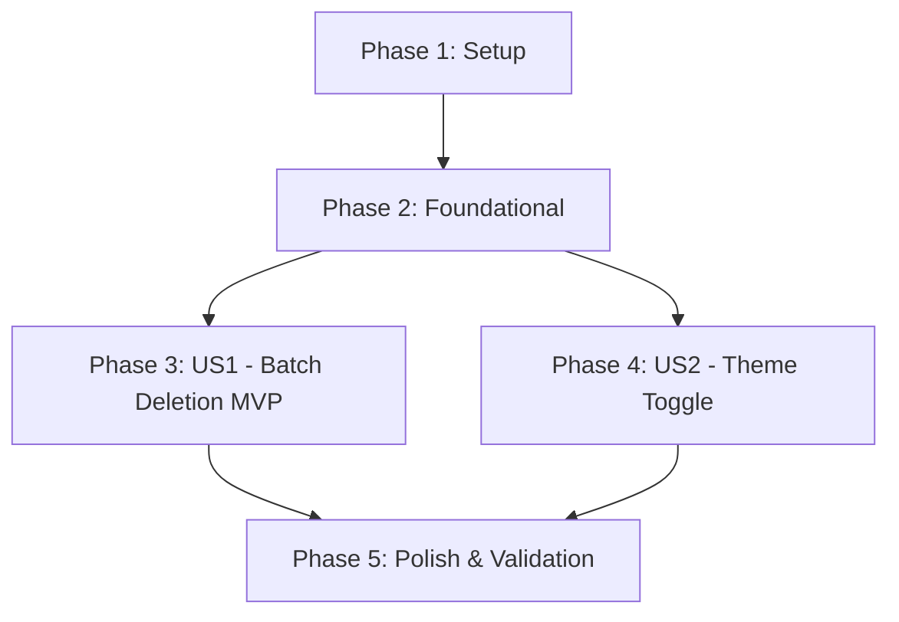

# Implementation Tasks: Xóa Hàng Loạt Kho Mẫu và Chuyển Đổi Giao Diện Sáng / Tối

**Feature**: `027-batch-delete-and-theme-toggle` | **Branch**: `specs/027-batch-delete-and-theme-toggle`
**Specification**: [spec.md](./spec.md) | **Plan**: [plan.md](./plan.md)

---

## Phase 1: Setup (Shared Infrastructure)

**Purpose**: Chuẩn bị cấu trúc và kiểm tra môi trường cho xóa hàng loạt và quản lý chủ đề giao diện

- [X] T001 Khảo sát hiện trạng tương tác danh sách và màu sắc giao diện trong `chuviettay/view/` và `webapp/`
- [X] T002 [P] Chuẩn bị test harness cho kiểm thử batch drop và theme preference trong `tests/`

---

## Phase 2: Foundational (Blocking Prerequisites)

**Purpose**: Nền tảng xử lý dữ liệu xóa hàng loạt an toàn và cơ chế lưu trữ tùy chọn người dùng

- [X] T003 Hiện thực phương thức `drop_batch()` trong `chuviettay/model/bank.py` thực thi trong 1 lock transaction và lưu 1 lần
- [X] T004 Hiện thực phương thức `drop_chars()` trong `chuviettay/controller/app_controller.py`
- [X] T005 [P] Thêm cơ chế đọc/ghi tệp cấu hình tùy chọn người dùng `user_config.json` trong `chuviettay/paths.py`

**Checkpoint**: Nền tảng dữ liệu đã sẵn sàng — có thể bắt đầu triển khai các User Story độc lập.

---

## Phase 3: User Story 1 - Xóa hàng loạt ký tự trong kho mẫu (Priority: P1) 🎯 MVP

**Goal**: Cho phép người dùng chọn nhiều hoặc tất cả ký tự trong kho mẫu và xóa hàng loạt cùng lúc, hiển thị hộp thoại xác nhận chi tiết số lượng mẫu bị xóa.

**Independent Test**: Mở tab Kho mẫu trên Web Client hoặc Desktop GUI; chọn nhiều ký tự; bấm "Xóa đã chọn"; xác nhận hộp thoại cảnh báo; toàn bộ ký tự đã chọn bị xóa và kho được lưu an toàn.

### Tests for User Story 1 🧪
- [X] T006 [P] [US1] Viết unit tests cho `Bank.drop_batch` và `AppController.drop_chars` trong `tests/test_controller.py`
- [X] T007 [P] [US1] Viết unit tests cho `BrowserBridge.drop_chars` trong `tests/test_bridge.py`

### Implementation for User Story 1
- [X] T008 [US1] Hiện thực phương thức `drop_chars()` trong `chuviettay/browser/bridge.py`
- [X] T009 [US1] Bổ sung bộ xử lý message action `drop_chars` trong `webapp/js/worker/py-worker.js`
- [X] T010 [US1] Nâng cấp `BankTab` trong `chuviettay/view/bank_tab.py` với `selectmode="extended"`, nút "Chọn tất cả", "Bỏ chọn", nút "Xóa đã chọn" kèm số lượng và popup xác nhận
- [X] T011 [US1] Thêm checkbox trên các thẻ ký tự, nút "Chọn tất cả", thanh công cụ "Xóa đã chọn" và modal xác nhận trong `webapp/index.html` và `webapp/js/bank.js`
- [X] T012 [US1] Bổ sung chuỗi i18n cho tính năng xóa hàng loạt trong `webapp/js/i18n.js`

**Checkpoint**: User Story 1 hoàn tất — Tính năng xóa hàng loạt hoạt động trơn tru trên cả Web Client và Desktop GUI!

---

## Phase 4: User Story 2 - Chuyển đổi giao diện Sáng / Tối (Priority: P2)

**Goal**: Tích hợp nút chuyển đổi chủ đề Sáng / Tối (☀️ / 🌙) trên thanh điều hướng Web và Desktop GUI, lưu giữ tùy chọn qua các phiên và tự động điều chỉnh màu tương phản cho khung vẽ nét chữ.

**Independent Test**: Nhấn nút chuyển đổi chủ đề trên Web Client hoặc Desktop GUI; toàn bộ giao diện đổi màu sang tối/sáng tức thì; khung canvas điều chỉnh màu đường kẻ mốc tương phản; tải lại ứng dụng vẫn giữ nguyên trạng thái.

### Tests for User Story 2 🧪
- [X] T013 [P] [US2] Viết unit tests cho module quản lý theme Desktop trong `tests/test_theme.py`

### Implementation for User Story 2
- [X] T014 [US2] Tạo module quản lý theme `chuviettay/view/theme.py` cung cấp bảng màu `THEME_PALETTES` và hàm `apply_theme` cho ttk/Tkinter
- [X] T015 [US2] Thêm nút chuyển đổi giao diện Sáng / Tối trên thanh tiêu đề/công cụ và gắn kết lưu cấu hình trong `chuviettay/gui.py`
- [X] T016 [US2] Cập nhật màu đường kẻ mốc tương phản theo theme cho `WordCanvas` trong `chuviettay/view/word_canvas.py`
- [X] T017 [US2] Khai báo CSS Design Tokens cho `[data-theme="light"]` và `[data-theme="dark"]` trong `webapp/css/style.css`
- [X] T018 [US2] Thêm nút chuyển đổi theme `btnThemeToggle` (☀️ / 🌙) trên thanh Header của `webapp/index.html`
- [X] T019 [US2] Tạo module `webapp/js/theme.js` quản lý toggle theme, `localStorage`, `prefers-color-scheme`, và phát sự kiện cập nhật theme
- [X] T020 [US2] Cập nhật khung vẽ canvas vẽ nét và preview thích ứng màu nền/đường kẻ tương phản khi đổi theme trong `webapp/js/teach.js` và `webapp/js/write.js`

**Checkpoint**: User Story 2 hoàn tất — Giao diện Sáng / Tối chuyển đổi mượt mà, lưu trữ bền vững và hiển thị nét vẽ chuẩn xác.

---

## Phase 5: Polish & Cross-Cutting Concerns

**Purpose**: Đóng gói kiểm thử toàn diện, kiểm tra linting và xác thực trải nghiệm người dùng

- [X] T021 [P] Đóng gói và kiểm thử lại static web client bằng `python scripts/build_web.py`
- [X] T022 [P] Chạy toàn bộ kịch bản kiểm thử thủ công và tự động trong `specs/027-batch-delete-and-theme-toggle/quickstart.md`
- [X] T023 Chạy toàn bộ bộ kiểm thử `pytest` và công cụ lint `ruff check .` bảo đảm 100% pass và không có regression

---

## Dependencies & Execution Order

### Phase Dependencies

- **Setup (Phase 1)**: Bắt đầu ngay, không có phụ thuộc.
- **Foundational (Phase 2)**: Phụ thuộc vào Setup — **BLOCKS** toàn bộ user stories.
- **User Story 1 (P1 - MVP)**: Triển khai ngay sau Foundational.
- **User Story 2 (P2)**: Triển khai độc lập hoặc song song sau khi hoàn thành Foundational.
- **Polish (Phase 5)**: Bước cuối cùng xác thực hồi quy toàn bộ hệ thống.

---

## Parallel Opportunities

- **Trong Phase 2**: T005 (`paths.py`) có thể làm song song với T003/T004 (`bank.py` / `app_controller.py`).
- **Trong Phase 3 (US1)**: T006 và T007 (Tests) viết song song; T010 (Desktop GUI) và T011 (Web Client) triển khai song song.
- **Trong Phase 4 (US2)**: T014-T016 (Desktop ttk Theme) và T017-T020 (Web CSS/JS Theme) có thể triển khai hoàn toàn độc lập và song song.
- **Trong Phase 5**: T021 và T022 có thể chạy song song.

---

## Implementation Strategy

### MVP Scope (Chỉ User Story 1)
1. Hoàn thành Phase 1 (Setup) và Phase 2 (Foundational).
2. Hoàn thành Phase 3 (User Story 1): Xóa hàng loạt an toàn trong kho mẫu trên cả Web và Desktop.
3. Xác minh độc lập MVP với `pytest tests/test_controller.py tests/test_bridge.py`.

### Giao Hàng Toàn Diện (Full Delivery)
1. Hoàn thành MVP (US1).
2. Bổ sung chuyển đổi chủ đề Sáng / Tối (US2) cho Web Client và Desktop GUI.
3. Đóng gói Web Client và chạy toàn bộ test suite.
