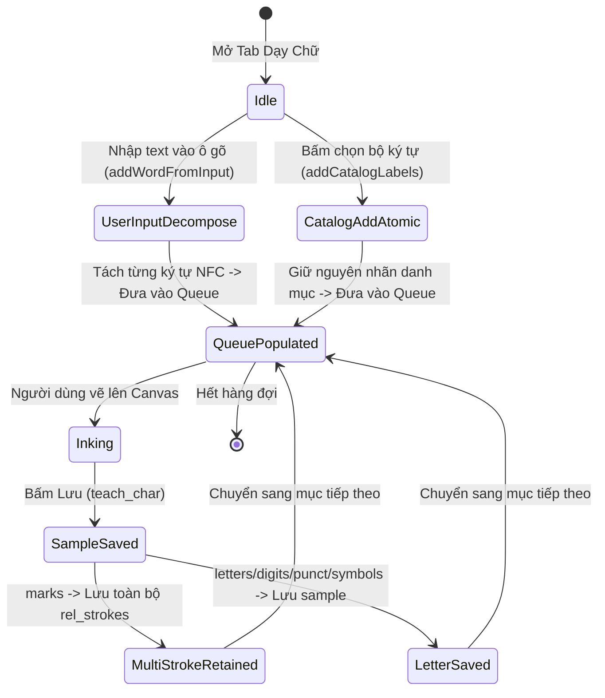
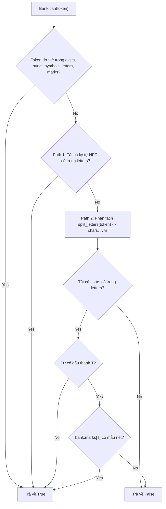

# Phase 1: Data Model

**Feature**: Đồng Bộ Mô Hình Char-First, Khắc Phục Dấu Thanh & Sửa Lỗi CI Toàn Diện  
**Branch**: `028-char-first-alignment-and-ci-repair`  
**Date**: 2026-10-07  

---

## 1. Entities & Data Structures

### 1.1 RenderReadinessResult
Đại diện cho kết quả kiểm tra tính khả thi kết xuất của một token, từ hoặc văn bản. Thống nhất giữa `Bank.can()`, `Writer.word()`, và `AppController.missing_letters_for_words()`.

| Trường | Kiểu dữ liệu | Mô tả |
| :--- | :--- | :--- |
| `token` | `str` | Từ hoặc token đang kiểm tra. |
| `can_render` | `bool` | `True` nếu đủ 100% mẫu ký tự cấu thành để ghép thành nét; `False` nếu thiếu ít nhất 1 thành phần. |
| `resolution_path` | `str` | Phương thức phân giải: `"token"` (ký tự/ký hiệu trực tiếp), `"path1"` (chữ nguyên khối NFC), `"path2"` (chữ thân + dấu thanh rời), hoặc `"none"` (thất bại). |
| `missing_letters` | `list[str]` | Danh sách các chữ cái còn thiếu mẫu trong `bank.letters`. |
| `missing_marks` | `list[str]` | Danh sách các dấu thanh còn thiếu mẫu trong `bank.marks`. |
| `missing_other` | `list[str]` | Chữ số, dấu câu hoặc ký hiệu toán học chưa có mẫu. |

**Quy tắc bất biến (Invariants)**:
- `can_render == True` $\iff$ `len(missing_letters) == 0 and len(missing_marks) == 0 and len(missing_other) == 0`.
- Không phụ thuộc vào `bank.words` hay `bank.tl` khi xác định `can_render`.

---

### 1.2 CatalogQueueItem
Mục trong hàng đợi dạy chữ (`TeachQueue`) trên Web Client và Desktop GUI.

| Trường | Kiểu dữ liệu | Mô tả |
| :--- | :--- | :--- |
| `label` | `str` | Nhãn nghiệp vụ định danh (ví dụ: `'a'`, `'1'`, `','`, `'dấu sắc'`). |
| `category` | `str` | Phân loại mục: `'letters'`, `'digits'`, `'punct'`, `'symbols'`, `'marks'`. |
| `source` | `str` | Nguồn gốc tạo ra mục: `'user_input'` (tách từ ô gõ văn bản) hoặc `'catalog'` (nạp từ danh mục). |
| `display_title` | `str` | Tiêu đề hiển thị trực quan trên giao diện (ví dụ: `'a'` hoặc `'Dấu sắc'`). |

**Quy tắc xác thực**:
- Khi `source == 'user_input'`: chuỗi đầu vào của người dùng bị phân rã thành các ký tự đơn lẻ (`code point`), loại bỏ khoảng trắng. Mỗi mục có độ dài 1 ký tự.
- Khi `source == 'catalog'`: nhãn giữ nguyên chuỗi nghiệp vụ (atomic label), không bị băm thành từng ký tự rời rạc.

---

### 1.3 ToneSampleData
Cấu trúc dữ liệu biểu diễn một biến thể mẫu nét của dấu thanh tiếng Việt trong kho lưu trữ.

| Trường | Kiểu dữ liệu | Mô tả |
| :--- | :--- | :--- |
| `tone_code` | `str` | Mã dấu thanh nội bộ (Unicode combining mark: `\u0300`, `\u0301`, `\u0309`, `\u0303`, `\u0323`). |
| `display_name` | `str` | Tên tiếng Việt: `"dấu huyền"`, `"dấu sắc"`, `"dấu hỏi"`, `"dấu ngã"`, `"dấu nặng"`. |
| `strokes` | `list[Stroke]` | Danh sách các nét tạo nên dấu thanh. Hỗ trợ đa nét ($N \ge 1$ nét). |
| `cx` | `float` | Trọng tâm ngang của toàn bộ tập nét (chuẩn hoá về $0.0$). |
| `cy` | `float` | Trọng tâm dọc của toàn bộ tập nét (chuẩn hoá về $0.0$). |
| `width` | `float` | Chiều rộng bao quanh ($w = x_{max} - x_{min}$). |
| `height` | `float` | Chiều cao bao quanh ($h = y_{max} - y_{min}$). |

**Quy tắc bất biến**:
- `len(strokes) >= 1`: không lưu trữ dấu thanh rỗng.
- Tất cả các nét trong `strokes` được tịnh tiến sao cho trọng tâm $(c_x, c_y)$ của tập hợp nét nằm tại gốc toạ độ $(0.0, 0.0)$.

---

### 1.4 Segment2D
Đoạn thẳng 2D phục vụ tính toán hình học khoảng cách và kiểm tra va chạm giữa các nét vẽ viết tay.

| Trường | Kiểu dữ liệu | Mô tả |
| :--- | :--- | :--- |
| `p1` | `tuple[float, float]` | Điểm đầu đoạn thẳng $(x_1, y_1)$. |
| `p2` | `tuple[float, float]` | Điểm cuối đoạn thẳng $(x_2, y_2)$. |
| `bbox` | `tuple[float, float, float, float]` | Hình chữ nhật bao quanh: $(min(x_1, x_2), min(y_1, y_2), max(x_1, x_2), max(y_1, y_2))$. |

**Phương thức hình học**:
- `distance_to_segment(other: Segment2D) -> float`: Tính khoảng cách ngắn nhất giữa hai đoạn thẳng trong mặt phẳng Euclid theo công thức tham số đóng $s \in [0, 1], t \in [0, 1]$.

---

### 1.5 StrokeClearanceMetric
Thông số đo lường khe hở an toàn chống dính mực giữa hai tập nét liền kề trong thuật toán ghép từ.

| Trường | Kiểu dữ liệu | Mô tả |
| :--- | :--- | :--- |
| `min_segment_distance`| `float` | Khoảng cách nhỏ nhất giữa các cặp đoạn nét của hai ký tự. |
| `clearance_floor` | `float` | Sàn khe hở vật lý bắt buộc: $c_{floor} = factor \cdot w_{pen}$ (mặc định $0.6 \cdot w_{pen}$). |
| `adjusted_shift_dx` | `float` | Độ dịch chuyển ngang bổ sung cần tịnh tiến nếu $min\_segment\_distance < clearance\_floor$. |
| `is_safe` | `bool` | `True` nếu khoảng cách thực tế $\ge clearance\_floor$. |

---

## 2. State Transitions & Lifecycle

### Vòng đời hàng đợi dạy chữ (Teach Queue Lifecycle)

### Vòng đời kiểm tra tính khả thi kết xuất (Render Readiness Check)

