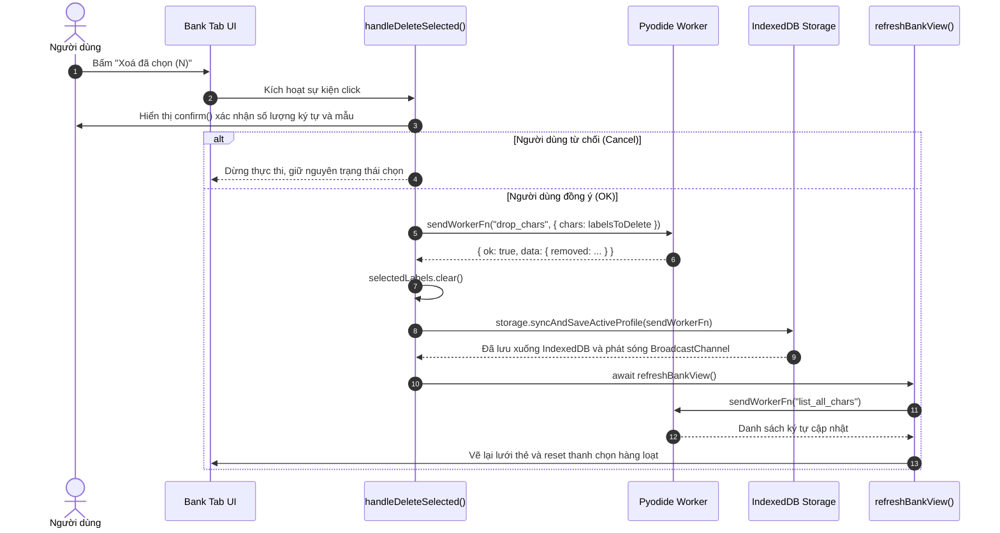

# Contract: Giao diện và Luồng Xóa Hàng Loạt trong Tab Kho Mẫu (Web Client)

**Mô-đun**: `webapp/js/bank.js`

## 1. Luồng Xóa Hàng Loạt (`handleDeleteSelected`)



## 2. Hợp đồng Định danh Hàm (Function Identifier Invariant)

- **Cấm hoàn toàn**: Gọi hàm không tồn tại `refreshBankTab()`.
- **Bắt buộc**: Sử dụng `refreshBankView()` trong toàn bộ các hàm xử lý sau biến đổi dữ liệu của `webapp/js/bank.js`.
- **Chữ ký hàm**:
  ```javascript
  export async function refreshBankView(): Promise<void>
  ```
- **Nhiệm vụ của `refreshBankView()`**:
  1. Yêu cầu worker liệt kê danh sách toàn bộ ký tự hiện có (`list_all_chars`).
  2. Cập nhật số lượng các thẻ phân loại (`updateCategoryCounts()`).
  3. Lọc danh sách theo từ khóa tìm kiếm và danh mục đang mở (`applyFiltersAndRender()`).
  4. Cập nhật lại thanh chọn hàng loạt (`updateBatchBar()`).
